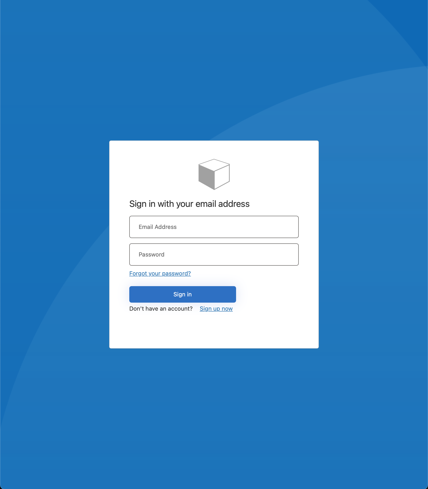
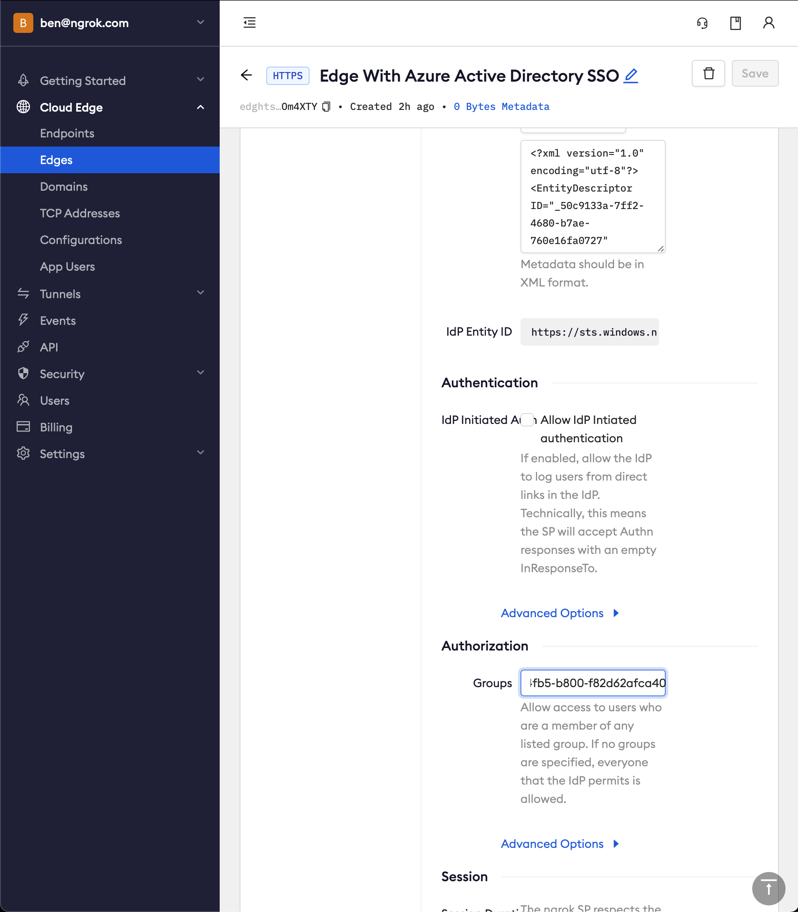

import Disclaimer from "/snippets/integrations/_endpoint-sso-disclaimer.mdx";

<Disclaimer />
<Tip>
**TL;DR**


To have ngrok enforce Single Sign-On using SAML with Microsoft Entra ID:

1. [Create an ngrok Edge](#create-edge)
1. [Create a Microsoft Entra ID application](#create-app)
1. [Update the ngrok Edge with the IdP metadata](#update-ngrok-edge)
1. [Test your integration](#test-integration)
1. [Bonus: configure ngrok to enforce authorization based on Azure groups](#bonus)
</Tip>

This article details how to configure Microsoft Entra ID as an Identity Provider for your ngrok Edge. By integrating Microsoft Entra ID with ngrok, you can:

- Restrict access to ngrok tunnels to only users who authenticated via Microsoft Entra ID
- Configure Microsoft Entra ID and ngrok to enforce user and group authorization
- Use Microsoft Entra ID's dashboard to facilitate access to ngrok applications

## Requirements

To configure ngrok tunnels with Microsoft Entra ID, you must have:

- an [ngrok Enterprise Account](https://ngrok.com/pricing) with an authtoken or admin access to configure edges with SAML
- a Microsoft Azure account with access to an Microsoft Entra ID tenant

## 1. Create an ngrok Edge 

1. Go to the [ngrok dashboard](https://dashboard.ngrok.com)
1. Click **Universal Gateway** > **Edges**
1. Create an Edge:
    1. Click **New Edge**
    1. Click **HTTPS Edge**
    1. Click the **Pencil Icon** next to "no description". Enter _Edge With Microsoft Entra ID SSO_ as the Edge name and click **Save**

1. Configure the SAML module for this Edge:
    1. On the Routes section, click **SAML**
    1. Click **Begin setup**
    1. In the Identity Provider section, copy the following XML as a placeholder into the input box

    ```xml
    <EntityDescriptor xmlns="urn:oasis:names:tc:SAML:2.0:metadata"></EntityDescriptor>
    ```

    
    1. Click **Save**

    1. Note that ngrok has now generated values for the fields in the Service Provider section. You will need to configure Microsoft Entra ID with these values later

## 2. Create a Microsoft Entra ID application 

1. Go to your [Microsoft Entra ID tenant in Azure](https://portal.azure.com/#view/Microsoft_AAD_IAM/ActiveDirectoryMenuBlade/~/Overview)

1. Create an enterprise application
   1. Starting from the sidebar, in the Manage section, click **Enterprise Applications** > **New application**
   1. Give your application a name (for example, `www` for a website client). Click **Create**

   

1. To assign users/groups for this application, in the Getting Started section, click **1. Assign users and groups** > **Add user/group**

1. Set up single sign on with SAML
   1. In the Getting Started section, click the box titled **2. Set up single sign on** > **SAML**
   1. Configure SAML. In the Basic SAML Configuration box click **Edit**

   
   1. Add Identifier (Entity ID) and Reply URL (Assertion Consumer Service URL) values using the previously the ngrok generated Entity ID and ACS URL

   
   1. Click **Save**
   1. Download the Metadata XML. In the SAML Certificates box > Token signing certificate section > click **Download** for the Federation Metadata XML

   

## 3. Update the ngrok Edge with the IdP metadata 

1. Back in the ngrok dashboard for your Edge's SAML configuration, upload the XML file generated by Microsoft Entra ID

   

1. Click **Save**

## 4. Test the integration 
<Note>
This step assumes you have an app running locally (for example, on `localhost:3000`) with the ngrok client installed.
</Note>

1. Launch a tunnel connected to your configured Edge

1. On your Edge's page, in the Routes section, click **Start a tunnel**

   

1. Copy the tunnel command

   

1. Launch a terminal and paste the command, replacing `http://localhost:80` with your local web app address (for example, `http://localhost:3000`)
1. Hit **Enter** to launch the tunnel

1. Confirm that the tunnel is connected to your edge
   1. Return to the ngrok dashboard
   1. Close the **Start a tunnel** and the **Tunnel group** drawers
   1. Refresh the Edge page
   1. In the Routes section > Traffic section you will see the message _You have 1 tunnel online. Start additional tunnels to begin load balancing._

   

1. Copy the ngrok URL on the Endpoints section

1. Access your Edge application
   1. In your browser, launch an incognito window
   1. Access your ngrok tunnel via your copied URL
   1. You should be prompted to log in with your Microsoft credentials
   1. After login, you should be able to see the application

## Bonus: Configure ngrok to enforce authorization based on Azure groups 

1. In Azure, configure the SAML response to include group claims. In the Attributes & Claims box click **Edit**

   

1. Click **Add a group claim** > **Advanced options** > Customize the name of the group claim
1. Set the name of the group claim to `groups`. This specific value is required for ngrok

   

1. Click **Save**
1. Go to your group page and copy the object Id (Microsoft Entra ID returns group object Ids in the group claim)

   

1. Configure ngrok to enforce group authorization. In ngrok on your Edge's page, in the Authorization section, update the groups input with your Azure group object Id (NOT group name) values

   

1. Access your Edge application
   1. In your browser, launch an incognito window
   1. Access your ngrok tunnel via your copied URL
   1. You should be prompted to log in with your Microsoft credentials
   1. Only users assigned to the authorized groups will have access to the application
