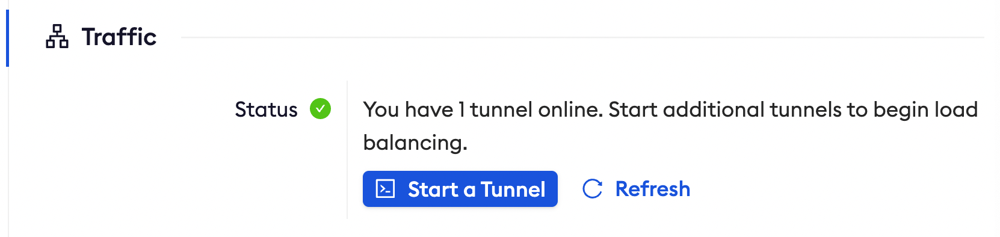

import Disclaimer from "/snippets/integrations/_endpoint-sso-disclaimer.mdx";

<Disclaimer />
<Tip>
**TL;DR**

To secure access to ngrok with Okta Single Sign-On using SAML:

1. [Configure Okta SSO](#configure-okta)
1. [Configure ngrok](#configure-ngrok)
1. [Test access to ngrok with Okta SSO](#test-sso)
</Tip>

This article details how to configure Okta as the primary Identity Provider for ngrok tunnels.
By integrating Okta SSO with ngrok, you can:

- **Restrict access to ngrok tunnels** only to users authenticated via Okta
- **Use Okta security policies, MFA authenticators** — including Okta Verify, FastPass, and FIDO2 — **and ThreatInsights to control access to ngrok tunnels**.
- **Use Okta's Dashboard to facilitate access to ngrok apps**.

## Requirements

To configure ngrok tunnels with Okta, you must have:

- an Okta account with administrative rights to create apps
- an [ngrok Enterprise Account](https://ngrok.com/pricing) with an authtoken or admin access to configure edges with SAML.

## Configuration Steps

To integrate ngrok with Okta SSO, you will need to:

1. Configure Okta with the ngrok app
1. Configure ngrok with the SSO settings provided by Okta

## **Step 1**: Configure Okta 

### Add the ngrok App in Okta

1. Access your Okta Dashboard as an administrator and then click **Admin**.
1. Click **Application** > **Applications** .
1. Click **Create App Integration**,
1. Select _SAML 2.0_, and then click **Next**.
1. Enter the **Application label** — this is the app name that will be displayed in the okta dashboard for end users — and click **Next**.
1. Enter in temporary values for "Single sign on URL" and "Audience URI" and select "EmailAddress" for "Name ID format" and then click "Next".
   1. **Single sign-on URL**: https://temporary
   1. **Audience URI (SP Entity ID)**: https://temporary
   1. **Name ID format**: Email
1. Select **I’m an Okta customer adding an internal app** and click **Finish**.
1. Click **Done**.
1. Under the **Sign On** tab of the ngrok application, **copy the Client ID and Client Secret**. These values will be used at ngrok to complete the configuration.

### Download the IdP metadata

1. Navigate to the **Sign On** Tab on the new app and click on **Actions** under the Active SHA-2 certificate and select **View IdP metadata**. The metadata will open in a new tab.
   
1. In the new tab, Select **Save As** from the File menu to save your metadata.xml file for uploading into ngrok in a later step.
   

### Grant access to Okta people and groups

Okta allows administrators to restrict access to SSO apps — such as ngrok — via assignments. By default, apps created in Okta have no assignments — in other words, nobody can use Okta SSO to access ngrok until you assign them to the app. To assign Okta users and groups to the ngrok app:

1. Navigate to the **Assignments** Tab.
1. Use the **Assign** button to associate groups and users with the ngrok app. **To test the SSO with ngrok, make sure you're assigned to the app**.

## **Step 2**: Configure ngrok 

### ngrok Edge

To configure an edge with Okta:

1. Go to dashboard.ngrok.com.
1. Click **Universal Gateway** > **Edges**
1. If you don't have an edge already set to add Okta SSO, create a test edge:
   - Click **New Edge**
   - Click **HTTPS Edge**
   - Click the **pencil icon** next to "no description". Enter _Edge with Okta SSO_ as the edge name and click **Save**.
1. On the edge settings, click **SAML**.
1. Click **Begin setup** and click on **Upload XML** beside **IdP Metadata** under **Identity Provider** and select your metadata file saved from the steps above:

   

1. Click **Save** at the top.
1. After you save, the SP Metadata will appear. Copy these values into the Okta where temporary values were placed above:
   
1. Save the changes in Okta.
1. Launch a tunnel connected to your Okta edge:
<Tip>
**Note**

For this step, we assume you have an app running locally (i.e. on localhost:3000) with the ngrok client installed.
</Tip>

1.  Click **Start a tunnel**.
1.  Click the **copy icon** next to the tunnel command.

    

1.  Launch a tunnel:
    - Launch a terminal
    - Paste the command. Replace http://localhost:80 with your local web app addess (i.e., http://localhost:3000)
    - hit **Enter**. an ngrok tunnel associated to your edge configuration is launched.
1.  To confirm that the tunnel is connected to your edge:
    - Return to the ngrok dashboard
    - Close the **Start a tunnel** and the **Tunnel group** tabs
    - Refresh the test edge page. Under traffic, You will see the message _You have 1 tunnel online. Start additional tunnels to begin load balancing_

    

1.  In the test edge, copy the **endpoint URL**. (you will use this url to test the Okta Authentication)
    

## Step 3: Test the integration 

1. In your browser, launch an incognito window.
1. Access your ngrok tunnel (i.e., https://okta-sso-test.ngrok.app or using a copied URL).
1. You should be prompted to log in with your Okta credentials.
1. After login, you should be able to see your web app.
