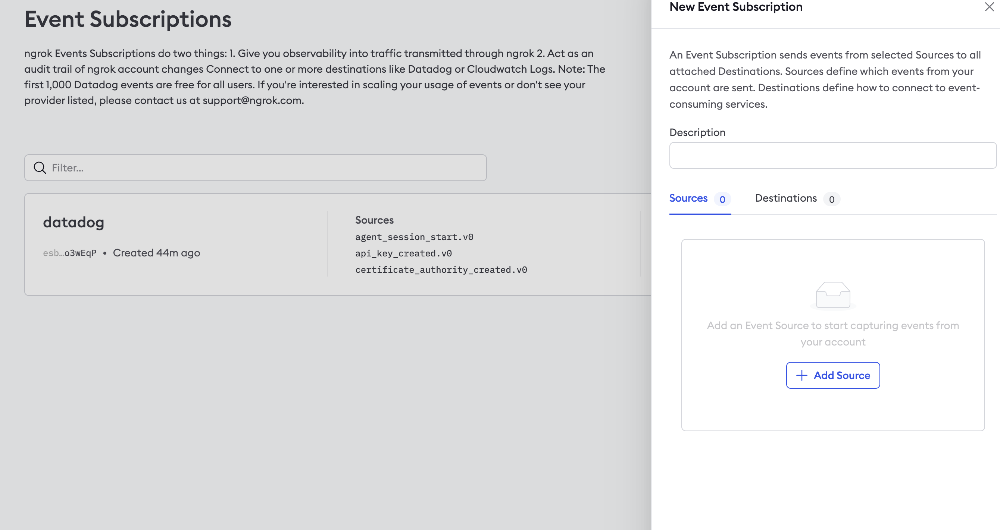
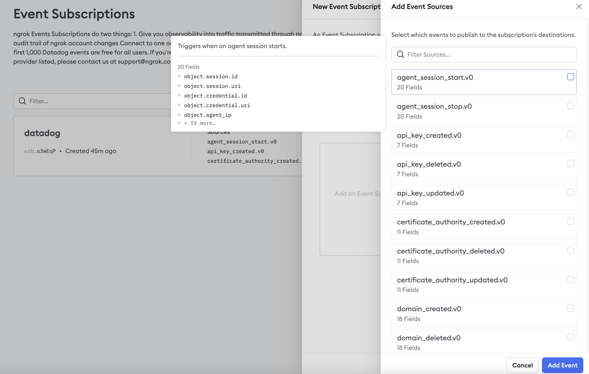
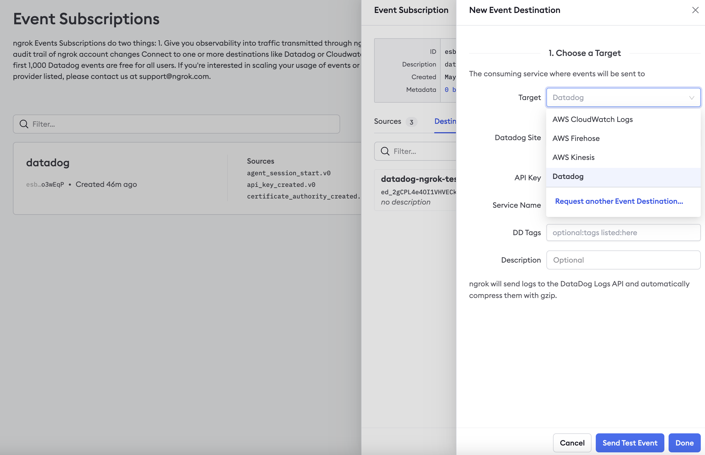
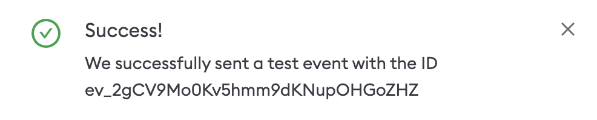

<Tip>
**TL;DR**

To send ngrok events to CloudWatch:

1. [Obtain CloudWatch log group ARN](#obtain-cloudwatch-arn)
1. [Create Log Export](#create-log-export)
1. [Create Event Destination](#create-destination)
</Tip>

This guide covers how to send ngrok events including network traffic logs into AWS CloudWatch.
You may want to keep an audit log of configuration changes within your ngrok
account, record all traffic to your endpoints for active monitoring/troubleshooting, or
you may use AWS CloudWatch as a SIEM and want to use it for security inspections.

By integrating ngrok with CloudWatch, you can:

- **Quickly identify application issues** in real-time using ngrok request events using CloudWatch visibility.
- **Historically audit changes occurring within an account**. Be able to historically audit changes within an account.
- **Profile usage of your service** by using CloudWatch queries and analytic charts.
- **Identify security issues** by using ngrok events.

## **Step 1**: Obtain CloudWatch Log Group ARN 

For ngrok to successfully send events into CloudWatch we'll require a log group ARN. To
either create or retrieve the ARN, reference the following [AWS CloudWatch
Guide](https://docs.aws.amazon.com/AmazonCloudWatch/latest/logs/Working-with-log-groups-and-streams.html#Create-Log-Group).
You may also reference the [AWS Log role
documentation](https://docs.aws.amazon.com/AWSCloudFormation/latest/UserGuide/aws-resource-logs-loggroup.html).

## **Step 2**: Create a Log Export 

1. Using a browser, go to the [ngrok dashboard](https://dashboard.ngrok.com) and navigate to **Events Stream** under the **Traffic Observability** section on the left hand navigation and select **Create Subscription**.

   

2. Within the Log Exporting configuration, provide a description for the export and within the sources tab select **Add Source** to choose which events you would like to send to CloudWatch.

Once complete, select **Add Event Sources** to confirm your selections.

## **Step 3**: Create Event Destination 

To send the events to CloudWatch we'll need to assign an Event Destination to the Log Export.

1. Within the Log Exporting configuration Destination Tab, select **Add Destination.**

2. Choose AWS CloudWatch Logs as the target and fill in the correct information.
   - **Log Group ARN**
   - **Description** - Optional

3. **Create IAM Role** - An IAM role is required to allow ngrok to stream logs into
   CloudWatch. Using the information provided by your preferred method of creation, either
   **API** or **CLI Script**, create the IAM role and provide the role ARN. For the
   fastest integration or proof of concept, we recommend using the **CLI Script**.
<Note>
**SECURITY BEST PRACTICE**

If configuring your IAM role manually, ensure that you configure the Trust Policy with a
condition that includes the ExternalId. This will ensure that the only data allowed to
ingested by AWS will be from your ngrok account. If you configure the IAM role with the
CLI script, this will be done automatically.
</Note>

4. Once all required inputs have values, select **Send Test Event** and you should be presented with a Success message. Select **Done** and the CloudWatch Event Destination setup is complete.

