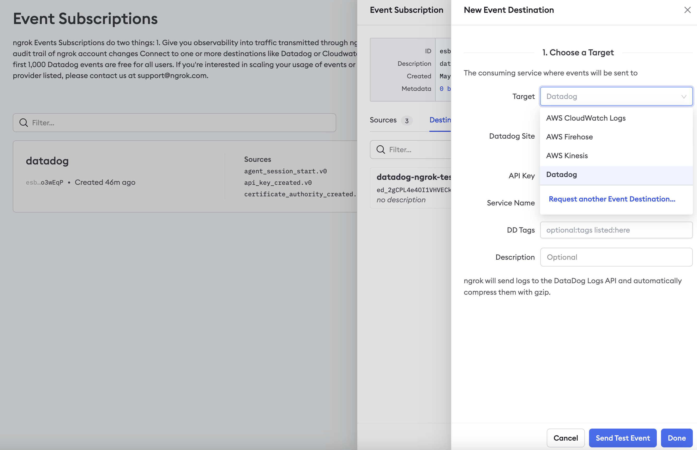

<Tip>
**TL;DR**

To send ngrok events to Firehose:

1. [Obtain Firehose Delivery Stream ARN](#obtain-firehose-arn)
1. [Create Log Export](#create-log-export)
1. [Create Event Destination](#create-destination)
</Tip>

This guide covers how to send ngrok events including network traffic logs into AWS Firehose.
You may want to keep an audit log of configuration changes within your ngrok
account, record all traffic to your endpoints for active monitoring/troubleshooting, or
you may use AWS Firehose as a SIEM and want to use it for security inspections.

By integrating ngrok with AWS Firehose, you can:

- **Quickly identify application issues** in real-time using ngrok request events using Firehose data processing.
- **Historically audit changes occurring within an account**. Be able to historically audit changes within an account.
- **Profile usage of your service** by using Firehose queries and real-time data analytics.
- **Identify security issues** by using ngrok events.

## **Step 1**: Obtain Firehose Delivery Stream ARN 

For ngrok to successfully send events into AWS Firehose we'll require a delivery stream
ARN. To create the ARN, you can follow [this AWS
guide](https://docs.aws.amazon.com/firehose/latest/dev/basic-create.html).

ngrok is a **Direct PUT** Source type, and you can choose any Firehose destination you
wish. For testing, it may be easiest to create a S3 bucket as the destination.

Once you've created your AWS Firehose, keep the Delivery Stream ARN handy for **[Step 3](#create-destination)**.

## **Step 2**: Create a Log Export 

1. Using a browser, go to the [ngrok dashboard](https://dashboard.ngrok.com) and under **Traffic Observability** navigate to **Events Stream** on the left hand navigation and select **Create Subscription**.

   

2. Within the Log Exporting configuration, provide a description for the export and within the sources tab select **Add Source** to choose which events you would like to send to Firehose.

For information about the events, see the [ngrok event documentation](/obs/events/reference/).

Once complete, select **Add Event Sources** to confirm your selections.

## **Step 3**: Create Event Destination 

To send the events to Firehose we'll need to assign an Event Destination to the Log Export.

1. Within the Log Exporting configuration Destination Tab, select **Add Destination.**

1. Choose AWS Firehose Logs as the target and fill in the correct information.
   - **Delivery Stream ARN**
   - **Description** - Optional

1. **Create IAM Role** - An IAM role is required to allow ngrok to stream logs into
   Firehose. Using the information provided by your preferred method of creation, either
   **API** or **CLI Script**, create the IAM role and provide the role ARN. For the
   fastest integration or proof of concept, we recommend using the **CLI Script**.
<Note>
**SECURITY BEST PRACTICE**

If configuring your IAM role manually, ensure that you configure the Trust Policy with a
condition that includes the ExternalId. This will ensure that the only data allowed to
ingested by AWS will be from your ngrok account. If you configure the IAM role with the
CLI script, this will be done automatically.
</Note>

4. Once all required inputs have values, select **Send Test Event** and you should be presented with a Success message. Select **Done** and the Firehose Event Destination setup is complete.

