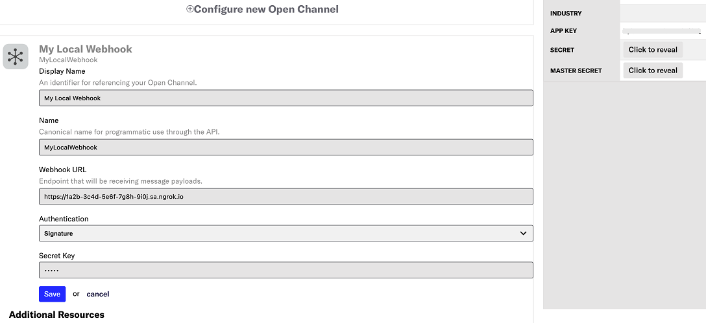

import InspectingRequests from "/snippets/integrations/_inspecting-requests.mdx";
import ReplayingRequests from "/snippets/integrations/_replaying-requests.mdx";

<Tip>
**TL;DR**


To integrate Airship webhooks with ngrok:

1. [Launch your local webhook.](#start-your-app) `npm start`
1. [Launch ngrok.](#start-ngrok) `ngrok http 3000`
1. [Configure Airship webhooks with your ngrok URL.](#setup-webhook)
1. [Secure your webhook requests with verification.](#security)
</Tip>

This guide covers how to use ngrok to integrate your localhost app with Airship by using Webhooks.
You can configure an open channel to deliver notifications to any device through webhooks.

By integrating ngrok with Airship, you can:

- **Develop and test Airship webhooks locally**, eliminating the time in deploying your development code to a public environment and setting it up in HTTPS.
- **Inspect and troubleshoot requests from Airship** in real-time via the inspection UI and API.
- **Modify and Replay Airship Webhook requests** with a single click and without spending time reproducing events manually in your Airship account.
- **Secure your app with Airship validation provided by ngrok**. Invalid requests are blocked by ngrok before reaching your app.

## 1. Start your app 

For this tutorial, you can use the [sample Node.js app available on GitHub](https://github.com/ngrok/ngrok-webhook-nodejs-sample).

To install this sample, run the following commands in a terminal:

```bash
git clone https://github.com/ngrok/ngrok-webhook-nodejs-sample.git
cd ngrok-webhook-nodejs-sample
npm install
```

This will get the project installed locally.

Now you can launch the app by running the following command:

```bash
npm start
```

The app runs by default on port 3000.

You can validate that the app is up and running by visiting http://localhost:3000. The application logs request headers and body in the terminal and responds with a message in the browser.

## 2. Launch ngrok 

Once your app is running locally, you're ready to put it online securely using ngrok.

1. If you're not an ngrok user yet, just [sign up for ngrok for free](https://ngrok.com/signup).

1. [Download the ngrok agent](https://download.ngrok.com).

1. Go to the [ngrok dashboard](https://dashboard.ngrok.com) and copy your Authtoken. <br />
   **Tip:** The ngrok agent uses the auth token to log into your account when you start a tunnel.
1. Start ngrok by running the following command:

   ```bash
   ngrok http 3000
   ```

1. ngrok will display a URL where your localhost application is exposed to the internet (copy this URL for use with Airship).
   

## 3. Integrate Airship 

To register a webhook on your Airship account follow the instructions below:

1. Access [Airship](https://www.airship.com/) and sign in using your Airship account.

1. On the **App Projects** page, click one of your projects.

1. On the top menu, click **Settings**, click **Open Channels** under the **Channels** section, and then click **Configure new Open Channel**.

1. Enter `My Local Webhook` in the **Display Name** field, enter `MyLocalWebhook` in the **Name** field, and enter the URL provided by the ngrok agent to expose your application to the internet in the **Webhook URL** field (for example, `https://1a2b-3c4d-5e6f-7g8h-9i0j.ngrok.app`).
   

1. Click **Save**.

### Run webhooks with Airship and ngrok

Airship sends different request body contents depending on the event that is being triggered.
You can trigger new calls from Airship to your application by following the instructions below.

1. Access your Airship application from the [Applications](https://go.airship.com/apps/) page.

1. On the top menu, click **Messages**, click **Messages Overview**, and then click the **+** icon on the top right corner of the page.

1. On the **What would you like to create** page, click the **Message** tile.

1. On the **Who will receive your message** page, select **My Local Webhook** as the channel and select the users.

1. Click **Content** on the top menu, click **Custom Message**, and enter any text in the **Alert Text** field.

1. Click **Delivery** on the top menu and click **Send now**.

1. Click **Review & Send** on the top menu and click **Send Message**.

   Confirm your localhost app receives event notifications and logs both headers and body in the terminal.

<InspectingRequests />

<ReplayingRequests />

## Secure webhook requests 

The ngrok signature webhook verification feature allows ngrok to assert that requests from your Airship webhook are the only traffic allowed to make calls to your localhost app.

**Note:** This ngrok feature is limited to 500 validations per month on free ngrok accounts. For unlimited, upgrade to Pro or Enterprise.

This is a quick step to add extra protection to your application.

1. Access your Airship application from the [Applications](https://go.airship.com/apps/) page.

1. On the top menu, click **Settings**, click **Open Channels** under the **Channels** section, and then click **Edit** in the **My Local Webhook** tile.

1. Select **Signature** in the **Authentication** field, enter `12345` in the **Secret Key** field, and then click **Update**.

1. Create a traffic policy file named `airship_policy.yml`, replacing `{your webhook secret}` with the value of the **Secret Key** field:

   ```yaml
   on_http_request:
     - actions:
         - type: verify-webhook
           config:
             provider: airship
             secret: "{your webhook secret}"
   ```

1. Restart your ngrok agent by running the command:

   ```bash
   ngrok http 3000 --traffic-policy-file airship_policy.yml
   ```

1. Access your [Airship](https://www.airship.com) application and create a new message.

Verify that your local application receives the request and logs information to the terminal.
