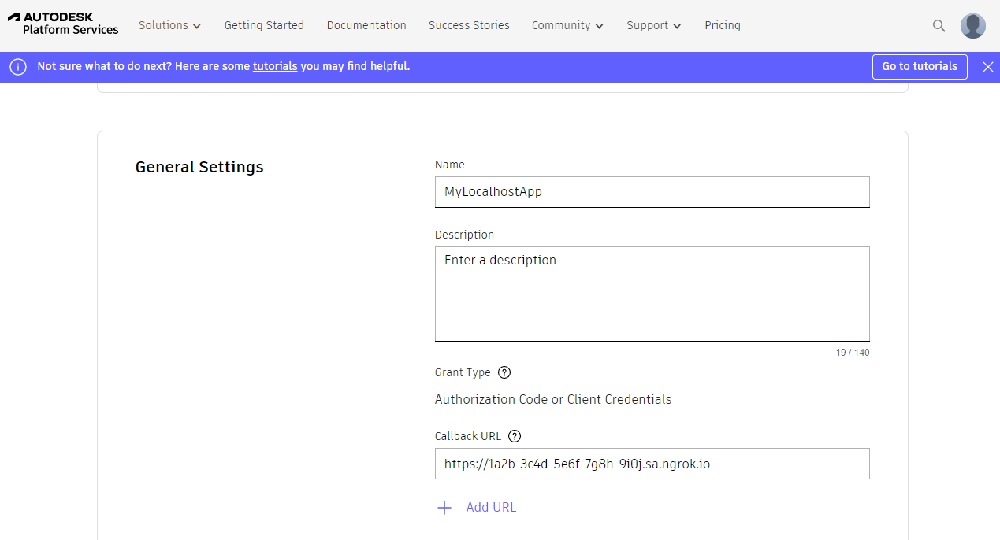

import InspectingRequests from "/snippets/integrations/_inspecting-requests.mdx";
import ReplayingRequests from "/snippets/integrations/_replaying-requests.mdx";

<Tip>
**TL;DR**


To integrate Autodesk Platform Services webhooks with ngrok:

1. [Launch your local webhook.](#start-your-app) `npm start`
1. [Launch ngrok.](#start-ngrok) `ngrok http 3000`
1. [Configure Autodesk webhooks with your ngrok URL.](#setup-webhook)
1. [Secure your webhook requests with verification.](#security)
</Tip>

This guide covers how to use ngrok to integrate your localhost app with Autodesk Platform Services by using Webhooks.
Autodesk Platform Services webhooks can be used to notify an external application whenever specific events occur in your Autodesk account.

By integrating ngrok with Autodesk, you can:

- **Develop and test Autodesk webhooks locally**, eliminating the time in deploying your development code to a public environment and setting it up in HTTPS.
- **Inspect and troubleshoot requests from Autodesk** in real-time via the inspection UI and API.
- **Modify and Replay Autodesk Webhook requests** with a single click and without spending time reproducing events manually in your Autodesk account.
- **Secure your app with Autodesk validation provided by ngrok**. Invalid requests are blocked by ngrok before reaching your app.

## 1. Start your app 

For this tutorial, you can use the [sample Node.js app available on GitHub](https://github.com/ngrok/ngrok-webhook-nodejs-sample).

To install this sample, run the following commands in a terminal:

```bash
git clone https://github.com/ngrok/ngrok-webhook-nodejs-sample.git
cd ngrok-webhook-nodejs-sample
npm install
```

This will get the project installed locally.

Now you can launch the app by running the following command:

```bash
npm start
```

The app runs by default on port 3000.

You can validate that the app is up and running by visiting http://localhost:3000. The application logs request headers and body in the terminal and responds with a message in the browser.

## 2. Launch ngrok 

Once your app is running locally, you're ready to put it online securely using ngrok.

1. If you're not an ngrok user yet, just [sign up for ngrok for free](https://ngrok.com/signup).

1. [Download the ngrok agent](https://download.ngrok.com).

1. Go to the [ngrok dashboard](https://dashboard.ngrok.com) and copy your Authtoken. <br />
   **Tip:** The ngrok agent uses the auth token to log into your account when you start a tunnel.
1. Start ngrok by running the following command:

   ```bash
   ngrok http 3000
   ```

1. ngrok will display a URL where your localhost application is exposed to the internet (copy this URL for use with Autodesk).
   

## 3. Integrate Autodesk 

To register a webhook on your Autodesk account follow the instructions below:

1. Access [Autodesk Platform Services](https://aps.autodesk.com/) and sign in using your Autodesk account.

1. On the **Platform Services** page, click your avatar icon on the top-right corner of the page, click **Applications**, click **Create Application**, enter a name in the **Name** field, and then click **Create**.

1. In the **Client Credentials** section of your application page, copy the values of the **Client ID** and the **Client Secret** fields for later use.<br/>
   **Tip**: Click the eye icon to reveal the **Client Secret** value to copy or click the copy icon.

1. In the **General Settings** section, enter the URL provided by the ngrok agent to expose your application to the internet in the **Callback URL** field (for example, `https://1a2b-3c4d-5e6f-7g8h-9i0j.ngrok.app`).
   

1. In the **API Access** section, select the **Data Management API** and the **Webhooks API** from the list, and then click **Save changes**.<br/>
   **Tip**: This tutorial uses the **Data Management** service as an example. Select other APIs for use with other Autodesk Platform Services.

1. In a terminal window, run the following command to obtain an access token:
   ```bash
   curl -v 'https://developer.api.autodesk.com/authentication/v1/authenticate'
   -X 'POST'
   -H 'Content-Type: application/x-www-form-urlencoded'
   -d '
       client_id=CLIENT_ID&
       client_secret=CLIENT_SECRET&
       grant_type=client_credentials&
       scope=data:read
   '
   ```
1. Copy the value of the **access_token** attribute from the response json.

1. Run the following command to register a webhook to Autodesk Data Management:

   ```bash
   curl -X 'POST'\
    -v 'https://developer.api.autodesk.com/webhooks/v1/systems/data/events/dm.*/hooks'\
    -H 'Content-Type: application/json'\
    -H 'authorization: Bearer ACCESS_TOKEN'\
    -d '{
           "callbackUrl": "CALLBACK_URL",
           "scope": {
                "folder": "FOLDER_URN"
           },
           "hookAttribute": {
                "projectId": "PROJECT_ID",
           },
           "filter": "$[?(@.ext=='txt')]"
     }'
   ```

   **Note**: Replace the following with the corresponding values:
   - ACCESS_TOKEN: the access token copied on previous steps.
   - CALLBACK_URL: the URL provided by the ngrok agent to expose your application to the internet (for example, `https://1a2b-3c4d-5e6f-7g8h-9i0j.ngrok.app`).
   - FOLDER_URN: Your Autodesk Data Management folder URN
   - PROJECT_ID: Your Autodesk Data Management project ID.

1. Make sure the response from the above command is `HTTP/1.1 201`.

### Run webhooks with Autodesk and ngrok

Autodesk Platform Services sends a different request to your webhook endpoint depending on the event being triggered.
For example, you can trigger new calls from Autodesk to your application whenever you add a file to a folder in Data Management.

1. On your desktop start menu, select **Autodesk Data Management**, click **Autodesk Data Management Server Console** and sign in using your username and password.

1. Access the folder you assigned to your webhook, upload a text file, and confirm your localhost app receives a notification and logs both headers and body in the terminal.

<InspectingRequests />

<ReplayingRequests />
## Secure webhook requests 

The ngrok signature webhook verification feature allows ngrok to assert that requests from your Autodesk webhook are the only traffic allowed to make calls to your localhost app.

**Note:** This ngrok feature is limited to 500 validations per month on free ngrok accounts. For unlimited, upgrade to Pro or Enterprise.

This is a quick step to add extra protection to your application.

1. Run the following command to register a webhook secret to your webhook:

   ```bash
   curl -X 'POST'\
    -v 'https://developer.api.autodesk.com/webhooks/v1/tokens'\
    -H 'Content-Type: application/json'\
    -H 'authorization: Bearer ACCESS_TOKEN'\
    -d '{
           "token": "YOUR_WEBHOOK_SECRET"
     }'
   ```

   **Note**: Replace the following with the corresponding values:
   - ACCESS_TOKEN: the access token copied on previous steps.
   - YOUR_WEBHOOK_SECRET: a value to sign each webhook request.

1. Make sure the response from the above command is `HTTP/1.1 200`.

1. Create a Traffic Policy file named `autodesk_policy.yml`, replacing `{your client secret}` with the value you copied before:

   ```yaml
   on_http_request:
     - actions:
         - type: verify-webhook
           config:
             provider: autodesk
             secret: "{your client secret}"
   ```

1. Restart your ngrok agent by running the command:

   ```bash
   ngrok http 3000 --traffic-policy-file autodesk_policy.yml
   ```

1. Access the folder you assigned to your webhook, upload a text file, and confirm your localhost app receives a notification and logs both headers and body in the terminal.
