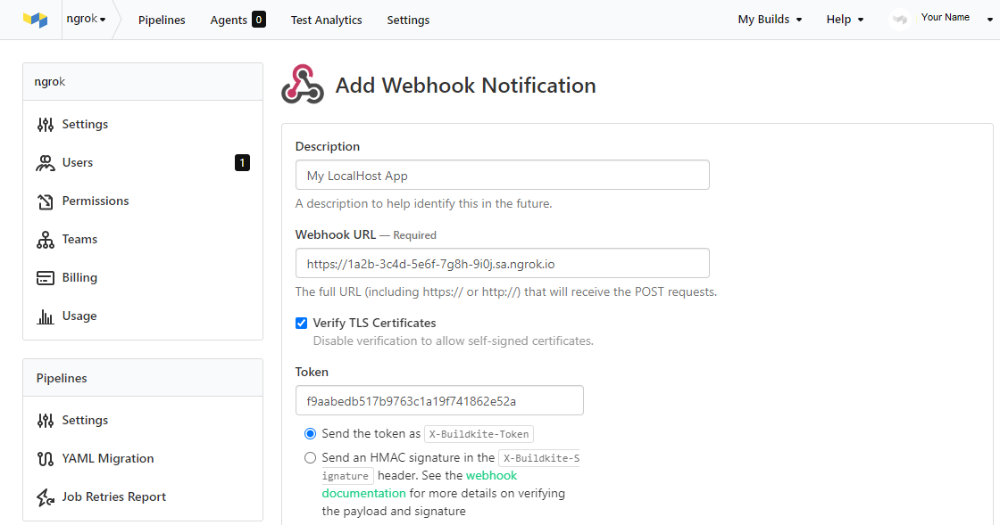
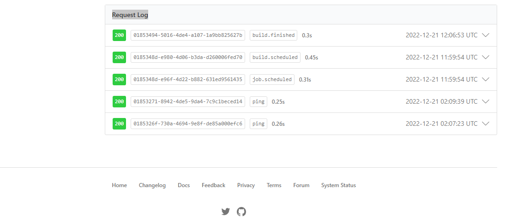

import InspectingRequests from "/snippets/integrations/_inspecting-requests.mdx";
import ReplayingRequests from "/snippets/integrations/_replaying-requests.mdx";

<Tip>
**TL;DR**


To integrate Buildkite webhooks with ngrok:

1. [Launch your local webhook.](#start-your-app) `npm start`
1. [Launch ngrok.](#start-ngrok) `ngrok http 3000`
1. [Configure Buildkite webhooks with your ngrok URL.](#setup-webhook)
1. [Secure your webhook requests with verification.](#security)
</Tip>

This guide covers how to use ngrok to integrate your localhost app with Buildkite by using Webhooks.
Buildkite webhooks can be used to notify an external application whenever specific events occur in your Buildkite account.

By integrating ngrok with Buildkite, you can:

- **Develop and test Buildkite webhooks locally**, eliminating the time in deploying your development code to a public environment and setting it up in HTTPS.
- **Inspect and troubleshoot requests from Buildkite** in real-time via the inspection UI and API.
- **Modify and Replay Buildkite Webhook requests** with a single click and without spending time reproducing events manually in your Buildkite account.
- **Secure your app with Buildkite validation provided by ngrok**. Invalid requests are blocked by ngrok before reaching your app.

## 1. Start your app 

For this tutorial, we'll use the [sample NodeJS app available on GitHub](https://github.com/ngrok/ngrok-webhook-nodejs-sample).

To install this sample, run the following commands in a terminal:

```bash
git clone https://github.com/ngrok/ngrok-webhook-nodejs-sample.git
cd ngrok-webhook-nodejs-sample
npm install
```

This will get the project installed locally.

Now you can launch the app by running the following command:

```bash
npm start
```

The app runs by default on port 3000.

You can validate that the app is up and running by visiting http://localhost:3000. The application logs request headers and body in the terminal and responds with a message in the browser.

## 2. Launch ngrok 

Once your app is running successfully on localhost, let's get it on the internet securely using ngrok!

1. If you're not an ngrok user yet, just [sign up for ngrok for free](https://ngrok.com/signup).

1. [Download the ngrok agent](https://download.ngrok.com).

1. Go to the [ngrok dashboard](https://dashboard.ngrok.com) and copy your Authtoken. <br />
   **Tip:** The ngrok agent uses the auth token to log into your account when you start a tunnel.
1. Start ngrok by running the following command:

   ```bash
   ngrok http 3000
   ```

1. ngrok will display a URL where your localhost application is exposed to the internet (copy this URL for use with Buildkite).
   

## 3. Integrate Buildkite 

To register a webhook on your Buildkite account follow the instructions below:

1. Access [Buildkite](https://buildkite.com/) and sign in using your Buildkite account.

1. On the welcome page, click **Settings** on the top menu and click **Notification Services** on the left menu.

1. On the **Notification Services** page, click **Add** for the **Webhook** line.

1. On the **Add Webhook Notification** page, enter `My LocalHost App` in the **Description** field and enter the URL provided by the ngrok agent to expose your application to the internet in the **Webhook URL** field (i.e. `https://1a2b-3c4d-5e6f-7g8h-9i0j.ngrok.app`).
   

1. In the **Events** section, select all events.

1. In the **Pipelines** section, select **All Pipelines**, and then click **Add Webhook Notification**.

### Run Webhooks with Buildkite and ngrok

Buildkite sends different request body contents depending on the event that is being triggered.
You can trigger new calls from Buildkite to your application by following the instructions below.

1. On the welcome page, click **Pipelines** on the top menu and then click one of your pipelines.
   **Note**: Create a pipeline if you don't have one by clicking **Create your first pipeline** and following the instructions on the screen.

1. On your pipeline page, click **New Build**, enter a message in the **Message** field, and then click **Create Build**.

   Confirm your localhost app receives event notifications and logs both headers and body in the terminal.

Alternatively, you can verify the log of the webhook call in Buildkite:

1. Click **Settings** on the top menu, click **Notification Services** on the left menu, click the **My LocalHost App** webhook tile, scroll down to the **Request Log** section, and then click one of the logs:
   

<InspectingRequests />

<ReplayingRequests />
## Secure webhook requests 

The ngrok signature webhook verification feature allows ngrok to assert that requests from your Buildkite webhook are the only traffic allowed to make calls to your localhost app.

**Note:** This ngrok feature is limited to 500 validations per month on free ngrok accounts. For unlimited, upgrade to Pro or Enterprise.

This is a quick step to add extra protection to your application.

1. Access [Buildkite](https://buildkite.com/) and sign in using your Buildkite account.

1. On the organization page, click **Settings** on the top menu and click **Notification Services** on the left menu.

1. On the **Notification Services** page, click the **My LocalHost App** webhook tile, copy the value of the **Token** field, select **Send an HMAC signature**, and then click **Save Webhook Settings**.

1. Create a traffic policy file named `buildkite_policy.yml`, replacing `{your token}` with the value you have copied before:

   ```yaml
   on_http_request:
     - actions:
         - type: verify-webhook
           config:
             provider: buildkite
             secret: "{your token}"
   ```

1. Restart your ngrok agent by running the command:

   ```bash
   ngrok http 3000 --traffic-policy-file buildkite_policy.yml
   ```

1. Click **Pipelines** on the top menu, select one of your pipelines and create a new build.

Verify that your local application receives the request and logs information to the terminal.
