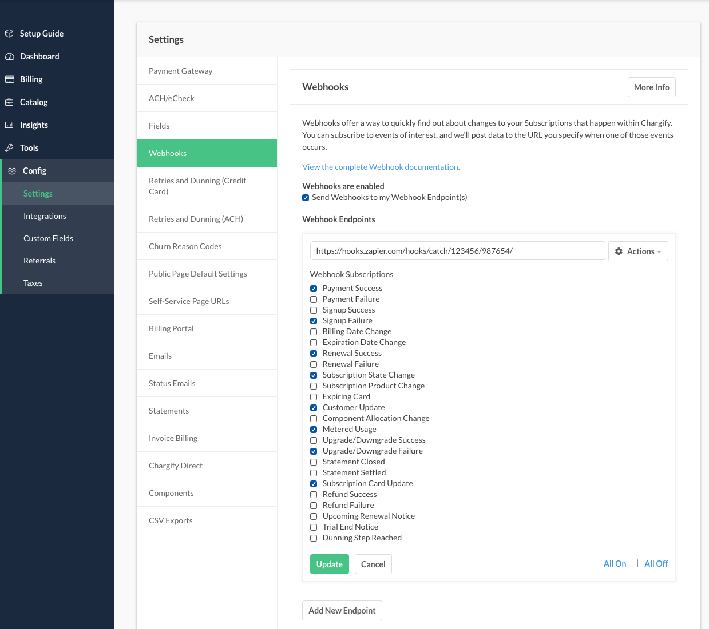
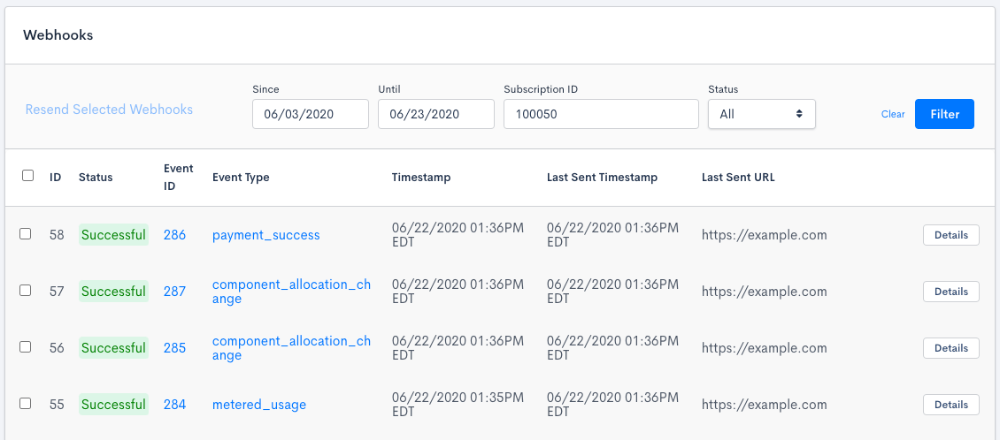

import InspectingRequests from "/snippets/integrations/_inspecting-requests.mdx";
import ReplayingRequests from "/snippets/integrations/_replaying-requests.mdx";

<Tip>
**TL;DR**


To integrate Chargify webhooks with ngrok:

1. [Launch your local webhook.](#start-your-app) `npm start`
1. [Launch ngrok.](#start-ngrok) `ngrok http 3000`
1. [Configure Chargify webhooks with your ngrok URL.](#setup-webhook)
1. [Secure your webhook requests with verification.](#security)
</Tip>

This guide covers how to use ngrok to integrate your localhost app with Chargify by using Webhooks.
Chargify webhooks can be used to notify an external application whenever specific events occur in your Chargify account.

By integrating ngrok with Chargify, you can:

- **Develop and test Chargify webhooks locally**, eliminating the time in deploying your development code to a public environment and setting it up in HTTPS.
- **Inspect and troubleshoot requests from Chargify** in real-time via the inspection UI and API.
- **Modify and Replay Chargify Webhook requests** with a single click and without spending time reproducing events manually in your Chargify account.
- **Secure your app with Chargify validation provided by ngrok**. Invalid requests are blocked by ngrok before reaching your app.

## 1. Start your app 

For this tutorial, you can use the [sample Node.js app available on GitHub](https://github.com/ngrok/ngrok-webhook-nodejs-sample).

To install this sample, run the following commands in a terminal:

```bash
git clone https://github.com/ngrok/ngrok-webhook-nodejs-sample.git
cd ngrok-webhook-nodejs-sample
npm install
```

This will get the project installed locally.

Now you can launch the app by running the following command:

```bash
npm start
```

The app runs by default on port 3000.

You can validate that the app is up and running by visiting http://localhost:3000. The application logs request headers and body in the terminal and responds with a message in the browser.

## 2. Launch ngrok 

Once your app is running locally, you're ready to put it online securely using ngrok.

1. If you're not an ngrok user yet, just [sign up for ngrok for free](https://ngrok.com/signup).

1. [Download the ngrok agent](https://download.ngrok.com).

1. Go to the [ngrok dashboard](https://dashboard.ngrok.com) and copy your Authtoken. <br />
   **Tip:** The ngrok agent uses the auth token to log into your account when you start a tunnel.
1. Start ngrok by running the following command:

   ```bash
   ngrok http 3000
   ```

1. ngrok will display a URL where your localhost application is exposed to the internet (copy this URL for use with Chargify).
   

## 3. Integrate Chargify 

To register a webhook on your Chargify account follow the instructions below:

1. Access [Chargify](https://www.chargify.com/) and sign in using your Chargify account.

1. On the home page, select a site from the **Site** dropdown on the top of the page.

1. On the site page, click **Config**, click **Settings**, and then click **Webhooks**.

1. On the **Webhooks** page, click **Add New Endpoint**.

1. On the **Add New Endpoint** page, enter the URL provided by the ngrok agent to expose your application to the internet in the **Webhook URL** field (for example, `https://1a2b-3c4d-5e6f-7g8h-9i0j.ngrok.app`).
   

1. Select the **Events** you want to subscribe this webhook. For this tutorial, select all.

1. Click **Add**.

### Run webhooks with Chargify and ngrok

Chargify sends different request body contents depending on the event that is being triggered.
Follow the instructions below to test connectivity between Chargify and your local application using the webhook you created.

1. Access your Chargfy's site home page, click **Tools** on the left menu and then click **Webhook Testing**.

1. On the **Webhook Testing** page, select one of the events you subscribed the webhook, select the webhook, and then click **Send**.

   Confirm your localhost app receives the create-project event notification and logs both headers and body in the terminal.

Optionally, you can verify the log of the webhook call in Chargify:

1. On the left menu, click **Tools** and then click **Webhook Panel**.

1. On the **Webhooks** page, click **Details** to see details of the webhook call.
   

<InspectingRequests />

<ReplayingRequests />
## Secure webhook requests 

The ngrok signature webhook verification feature allows ngrok to assert that requests from your Chargify webhook are the only traffic allowed to make calls to your localhost app.

**Note:** This ngrok feature is limited to 500 validations per month on free ngrok accounts. For unlimited, upgrade to Pro or Enterprise.

This is a quick step to add extra protection to your application.

1. Access your Chargfy's site home page and click **Edit current Site** from the Site dropdown menu on top of the page.

1. On the **Site** page, copy the value of the **Site Shared Key**.

1. Create a Traffic Policy file named `chargify_policy.yml`:

   ```yaml
   on_http_request:
     - actions:
         - type: verify-webhook
           config:
             provider: chargify
             secret: {your site shared key}
   ```

   **Note**: Replace `{your site shared key}` with the value you copied before.

1. Restart your ngrok agent by running the command:

   ```bash
   ngrok http 3000 --traffic-policy-file chargify_policy.yml
   ```

1. Access the **Webhook Testing** page and send a new test notification to your webhook.

Verify that your local application receives the request and logs information to the terminal.
