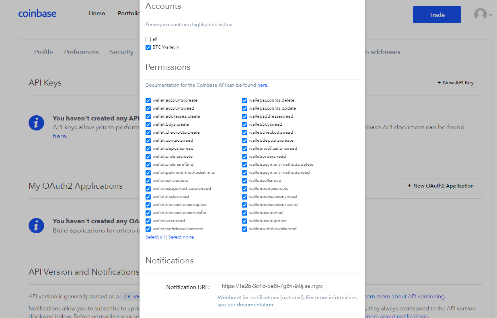

import InspectingRequests from "/snippets/integrations/_inspecting-requests.mdx";
import ReplayingRequests from "/snippets/integrations/_replaying-requests.mdx";

<Tip>
**TL;DR**


To integrate Coinbase webhooks with ngrok:

1. [Launch your local webhook.](#start-your-app) `npm start`
1. [Launch ngrok.](#start-ngrok) `ngrok http 3000`
1. [Configure Coinbase webhooks with your ngrok URL.](#setup-webhook)
1. [Secure your webhook requests with verification.](#security)
</Tip>

This guide covers how to use ngrok to integrate your localhost app with Coinbase by using Webhooks.
Coinbase webhooks can be used to notify an external application whenever specific events occur in your Coinbase account.

By integrating ngrok with Coinbase, you can:

- **Develop and test Coinbase webhooks locally**, eliminating the time in deploying your development code to a public environment and setting it up in HTTPS.
- **Inspect and troubleshoot requests from Coinbase** in real-time via the inspection UI and API.
- **Modify and Replay Coinbase Webhook requests** with a single click and without spending time reproducing events manually in your Coinbase account.
- **Secure your app with Coinbase validation provided by ngrok**. Invalid requests are blocked by ngrok before reaching your app.

## 1. Start your app 

For this tutorial, you can use the [sample Node.js app available on GitHub](https://github.com/ngrok/ngrok-webhook-nodejs-sample).

To install this sample, run the following commands in a terminal:

```bash
git clone https://github.com/ngrok/ngrok-webhook-nodejs-sample.git
cd ngrok-webhook-nodejs-sample
npm install
```

This will get the project installed locally.

Now you can launch the app by running the following command:

```bash
npm start
```

The app runs by default on port 3000.

You can validate that the app is up and running by visiting http://localhost:3000. The application logs request headers and body in the terminal and responds with a message in the browser.

## 2. Launch ngrok 

Once your app is running locally, you're ready to put it online securely using ngrok.

1. If you're not an ngrok user yet, just [sign up for ngrok for free](https://ngrok.com/signup).

1. [Download the ngrok agent](https://download.ngrok.com).

1. Go to the [ngrok dashboard](https://dashboard.ngrok.com) and copy your Authtoken. <br />
   **Tip:** The ngrok agent uses the auth token to log into your account when you start a tunnel.
1. Start ngrok by running the following command:

   ```bash
   ngrok http 3000
   ```

1. ngrok will display a URL where your localhost application is exposed to the internet (copy this URL for use with Coinbase).
   

## 3. Integrate Coinbase 

To register a webhook on your Coinbase account follow the instructions below:

1. Access the [Coinbase homepage](https://www.coinbase.com/) and sign in using your Coinbase account.

1. On the **Home** page, click your avatar icon on the top right corner of the page and then click **Settings**.

1. On the **Settings** page, click the **API** tab and then click **New API Key**.

1. On the **New API Key** popup, click **all** under the **Accounts** section, click **Select all** under the **Permissions** section, and enter the URL provided by the ngrok agent to expose your application to the internet in the **Notification URL** field (for example, `https://1a2b-3c4d-5e6f-7g8h-9i0j.ngrok.app`).
   

1. Cilck **Create**, and then copy the value of the **API Key** and **API Secret** that appear on the **API Key details** popup.

### Run webhooks with Coinbase and ngrok

Coinbase sends different request body contents depending on the event that is being triggered.
You can trigger new calls from Coinbase to your application by following the instructions below.

1. Access the [Coinbase homepage](https://www.coinbase.com/), sign in using your Coinbase account, and then click **Trade** on the left menu.

1. On the **Trade** page, click **Simple** on the top menu, and then click **Buy** to buy one of the assets that appear on the screen.

1. On the **Buy** popup, enter the monetary amount, click **Preview Buy**, and then click **Buy now**.

   Confirm your localhost app receives the create-project event notification and logs both headers and body in the terminal.

<InspectingRequests />

<ReplayingRequests />
## Secure webhook requests 

The ngrok signature webhook verification feature allows ngrok to assert that requests from your Coinbase webhook are the only traffic allowed to make calls to your localhost app.

**Note:** This ngrok feature is limited to 500 validations per month on free ngrok accounts. For unlimited, upgrade to Pro or Enterprise.

This is a quick step to add extra protection to your application.

1. Create a traffic policy file named `coinbase_policy.yml`:

   ```yaml
   on_http_request:
     - actions:
         - type: verify-webhook
           config:
             provider: coinbase
             secret: {your api secret}
   ```

   **Note**: Replace `{your api secret}` with the value you copied during the webhook registration.

1. Restart your ngrok agent by running the following command:

   ```bash
   ngrok http 3000 --traffic-policy-file coinbase_policy.yml
   ```

1. Access [Coinbase](https://www.coinbase.com/) and buy an asset.

Verify that your local application receives the request and logs information to the terminal.
