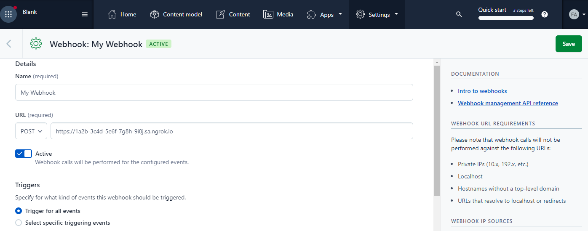
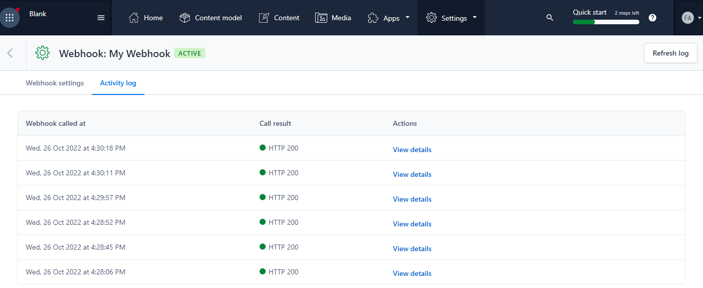

import InspectingRequests from "/snippets/integrations/_inspecting-requests.mdx";
import ReplayingRequests from "/snippets/integrations/_replaying-requests.mdx";

<Tip>
**TL;DR**


To integrate Contentful webhooks with ngrok:

1. [Launch your local app that will process Contentful webhook requests](#start-your-app) `npm start`
1. [Launch ngrok](#start-ngrok) `ngrok http 3000`
1. [Configure Contentful webhooks with your ngrok URL](#setup-webhook)
</Tip>

This guide covers how to use ngrok to route Contentful Webhooks to your localhost app for development and integration testing.
Contentful webhooks can be used to notify an external application whenever specific events occur in your Contentful account.

By integrating ngrok with Contentful, you can:

- **Develop and test Contentful webhooks locally**, eliminating the time in deploying your development code to a public environment and setting it up in HTTPS.
- **Inspect and troubleshoot requests from Contentful** in real-time via the inspection UI and API.
- **Modify and Replay Contentful webhook requests** with a single click and without spending time reproducing events manually in your Contentful account.
- **Verify signed Contentful webhook requests** at the edge using ngrok's traffic policy with webhook verification

## 1. Start your app 

For this tutorial, you can use the [sample Node.js app available on GitHub](https://github.com/ngrok/ngrok-webhook-nodejs-sample).

To install this sample, run the following commands in a terminal:

```bash
git clone https://github.com/ngrok/ngrok-webhook-nodejs-sample.git
cd ngrok-webhook-nodejs-sample
npm install
```

This will get the project installed locally.

Now you can launch the app by running the following command:

```bash
npm start
```

The app runs by default on port 3000.

You can validate that the app is up and running by visiting http://localhost:3000. The application logs request headers and body in the terminal and responds with a message in the browser.

## 2. Launch ngrok 

Once your app is running locally, you're ready to put it online securely using ngrok.

1. If you're not an ngrok user yet, just [sign up for ngrok for free](https://ngrok.com/signup).

1. [Download the ngrok agent](https://download.ngrok.com).

1. Go to the [ngrok dashboard](https://dashboard.ngrok.com) and copy your Authtoken. <br />
   **Tip:** The ngrok agent uses the auth token to log into your account when you start a tunnel.
1. Start ngrok by running the following command:

   ```bash
   ngrok http 3000
   ```

   Or with Contentful [Webhook Request Verification](https://www.contentful.com/developers/docs/webhooks/request-verification/) enabled:
   1. Create a traffic policy file named `contentful_policy.yml`:

      ```yaml
      on_http_request:
        - actions:
            - type: verify-webhook
              config:
                provider: contentful
                secret: "<webhook signing secret>"
      ```

   1. Start ngrok with traffic policy:

      ```bash
      ngrok http 3000 --traffic-policy-file contentful_policy.yml
      ```

1. ngrok will display a URL where your localhost application is exposed to the internet (copy this URL for use with Contentful).
   

## 3. Integrate Contentful 

To register a webhook on your Contentful account follow the instructions below:

1. Access the [Contentful site](https://contentful.com/) and sign in using your Contentful account.

1. On the home page, click **Settings** on the top meu, click **Webhooks**, and then click **Add Webhook**.

1. On the **Webhook** page, enter a name in the **Name** field and enter the URL provided by the ngrok agent to expose your application to the internet in the **URL** field (for example, `https://1a2b-3c4d-5e6f-7g8h-9i0j.ngrok.app`).
   

1. Make sure the **Active** switch is selected and **Trigger for all events** is selected under the **Triggers** section.

1. Select **application/json** as the **Content type** value and then click **Save**.

### Run webhooks with Contentful and ngrok

Contentful sends different request body contents depending on the event that is being triggered.
You can select specific triggering events during the webhook configuration.

To trigger Contentful calls to your application follow the instructions below:

1. Access the [Contentful site](https://contentful.com/) and sign in using your Contentful account.

1. On the home page, click **Media** on the top meu, click **Add Asset**, and then click **Single asset**.

1. On the **Asset** page, drag and drop an image from your desktop to the **File** area, and then click **Publish**.

   Confirm your localhost app receives two event notifications and logs both headers and body in the terminal.

Optionally, you can verify the log of the webhook call in Contentful:

1. On the home page the [Contentful site](https://contentful.com/), click **Settings** on the top meu, click **Webhooks**, click the name of your webhook, and then click the **Activity log** tab.

   

<InspectingRequests />

<ReplayingRequests />
