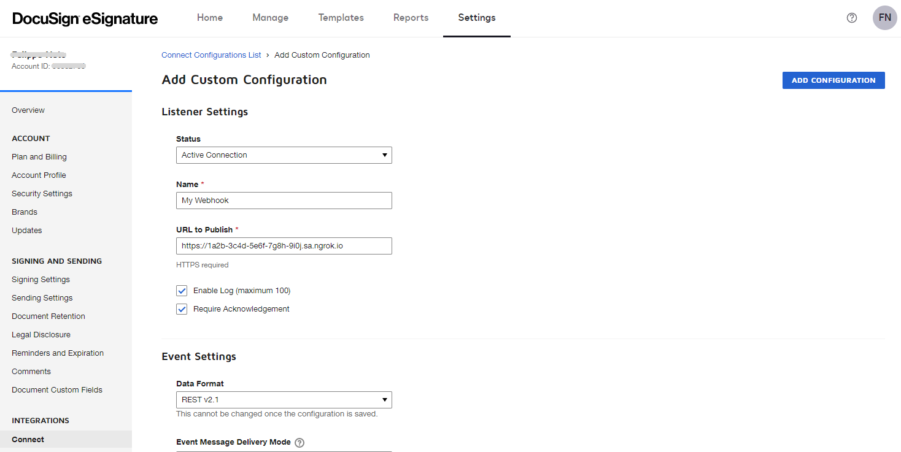
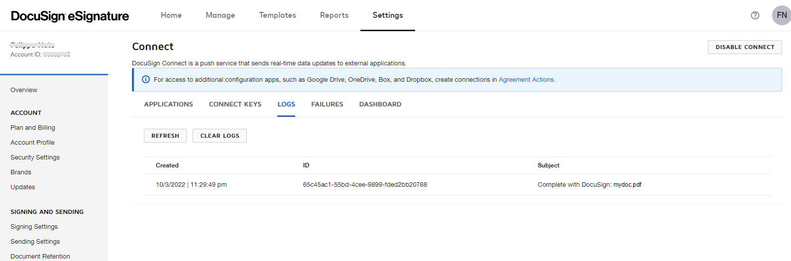

import InspectingRequests from "/snippets/integrations/_inspecting-requests.mdx";
import ReplayingRequests from "/snippets/integrations/_replaying-requests.mdx";

<Tip>
**TL;DR**


To integrate DocuSign webhooks with ngrok:

1. [Launch your local webhook.](#start-your-app) `npm start`
1. [Launch ngrok.](#start-ngrok) `ngrok http 3000`
1. [Configure DocuSign webhooks with your ngrok URL.](#setup-webhook)
1. [Secure your webhook requests with verification.](#security)
</Tip>

This guide covers how to use ngrok to integrate your localhost app with DocuSign by using Webhooks.
DocuSign webhooks can be used to notify an external application whenever specific events occur in your DocuSign account.

By integrating ngrok with DocuSign, you can:

- **Develop and test DocuSign webhooks locally**, eliminating the time in deploying your development code to a public environment and setting it up in HTTPS.
- **Inspect and troubleshoot requests from DocuSign** in real-time via the inspection UI and API.
- **Modify and Replay DocuSign Webhook requests** with a single click and without spending time reproducing events manually in your DocuSign account.
- **Secure your app with DocuSign validation provided by ngrok**. Invalid requests are blocked by ngrok before reaching your app.

## 1. Start your app 

For this tutorial, you can use the [sample Node.js app available on GitHub](https://github.com/ngrok/ngrok-webhook-nodejs-sample).

To install this sample, run the following commands in a terminal:

```bash
git clone https://github.com/ngrok/ngrok-webhook-nodejs-sample.git
cd ngrok-webhook-nodejs-sample
npm install
```

This will get the project installed locally.

Now you can launch the app by running the following command:

```bash
npm start
```

The app runs by default on port 3000.

You can validate that the app is up and running by visiting http://localhost:3000. The application logs request headers and body in the terminal and responds with a message in the browser.

## 2. Launch ngrok 

Once your app is running locally, you're ready to put it online securely using ngrok.

1. If you're not an ngrok user yet, just [sign up for ngrok for free](https://ngrok.com/signup).

1. [Download the ngrok agent](https://download.ngrok.com).

1. Go to the [ngrok dashboard](https://dashboard.ngrok.com) and copy your Authtoken. <br />
   **Tip:** The ngrok agent uses the auth token to log into your account when you start a tunnel.
1. Start ngrok by running the following command:

   ```bash
   ngrok http 3000
   ```

1. ngrok will display a URL where your localhost application is exposed to the internet (copy this URL for use with DocuSign).
   

## 3. Integrate DocuSign 

To register a webhook on your DocuSign account follow the instructions below:

1. Access [DocuSign](https://docusign.com/) and sign in using your DocuSign account.

1. In the top menu, click **Settings** and then click **Connect** under the **INTEGRATIONS** section of the left menu.

1. In the **Connect** page, click **ADD CONFIGURATION** and then click **Custom**.

1. On the **Add Custom Configuration** page, enter a name in the **Name** field, and in the **URL to Publish** field enter the URL provided by the ngrok agent to expose your application to the internet (for example, `https://1a2b-3c4d-5e6f-7g8h-9i0j.ngrok.app`).
   

1. In the **Trigger Events** sections, expand **Envelope and Recipients**, click **Envelope Sent**, and then click **ADD CONFIGURATION** at the bottom of the page.

### Run webhooks with DocuSign and ngrok

DocuSign sends different request body contents depending on the event that is being triggered.
You can trigger new calls from DocuSign to your application by following the instructions below.

1. In the same browser, access your DocuSign inbox by clicking **Manage** on the top menu and then clicking **START NOW**.

1. In the **Upload a Document and Add Envelope Recipients** page, click **UPLOAD** and then click **Desktop**.

1. Select a document from your desktop, expand the **Add recipients** section and then click **I'm the only signer**.
   **Tip**: Optionally, you can select a user from the **Name** list.

1. Click **SIGN** at the bottom right of the page.

   Confirm your localhost app receives the create-envelop event notification and logs both headers and body in the terminal.

Optionally, you can verify the log of the webhook call in DocuSign:

1. Access your DocuSign account home page, and click **Settings** on the top menu.

1. On the left menu, click **Connect**, click the **LOGS** tab, and then click the most recent entry in the log list.
   

<InspectingRequests />

<ReplayingRequests />
## Secure webhook requests 

The ngrok signature webhook verification feature allows ngrok to assert that requests from your DocuSign webhook are the only traffic allowed to make calls to your localhost app.

**Note:** This ngrok feature is limited to 500 validations per month on free ngrok accounts. For unlimited, upgrade to Pro or Enterprise.

This is a quick step to add extra protection to your application.

1. Access your DocuSign account home page and click **Settings** on the top menu.

1. On the left menu, click **Connect**, click the **CONNECT KEYS** tab, click **ADD SECRET KEY**, and then copy the key value generated by DocuSign.

1. In the **Connect** page, click the **APPLICATIONS** tab, click your webhook, and then in the **Integration and Security Settings** section click **Include HMAC Signature**.

1. Create a traffic policy file named `docusign_policy.yml`, replacing `{your connect key}` with the value you copied before:

   ```yaml
   on_http_request:
     - actions:
         - type: verify-webhook
           config:
             provider: docusign
             secret: "{your connect key}"
   ```

1. Restart your ngrok agent by running the command:

   ```bash
   ngrok http 3000 --traffic-policy-file docusign_policy.yml
   ```

1. Access [DocuSign](https://app.docusign.com/home) and create a new envelope.

   Verify that your local application receives the request and logs information to the terminal.
