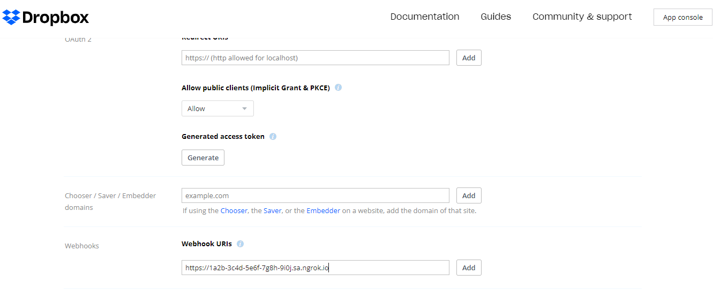

import InspectingRequests from "/snippets/integrations/_inspecting-requests.mdx";
import ReplayingRequests from "/snippets/integrations/_replaying-requests.mdx";

<Tip>
**TL;DR**


To integrate Dropbox webhooks with ngrok:

1. [Launch your local webhook.](#start-your-app) `npm start`
1. [Launch ngrok.](#start-ngrok) `ngrok http 3000`
1. [Configure Dropbox webhooks with your ngrok URL.](#setup-webhook)
1. [Secure your webhook requests with verification.](#security)
</Tip>

This guide covers how to use ngrok to integrate your localhost app with Dropbox by using Webhooks.
Dropbox webhooks can be used to notify an external application whenever specific events occur in your Dropbox account.

By integrating ngrok with Dropbox, you can:

- **Develop and test Dropbox webhooks locally**, eliminating the time in deploying your development code to a public environment and setting it up in HTTPS.
- **Inspect and troubleshoot requests from Dropbox** in real-time via the inspection UI and API.
- **Modify and Replay Dropbox Webhook requests** with a single click and without spending time reproducing events manually in your Dropbox account.
- **Secure your app with Dropbox validation provided by ngrok**. Invalid requests are blocked by ngrok before reaching your app.

## 1. Start your app 

For this tutorial, you can use the [sample Node.js app available on GitHub](https://github.com/ngrok/ngrok-webhook-nodejs-sample).

To install this sample, run the following commands in a terminal:

```bash
git clone https://github.com/ngrok/ngrok-webhook-nodejs-sample.git
cd ngrok-webhook-nodejs-sample
npm install
```

This will get the project installed locally.

Now you can launch the app by running the following command:

```bash
npm startDropbox
```

The app runs by default on port 3000.

You can validate that the app is up and running by visiting http://localhost:3000. The application logs request headers and body in the terminal and responds with a message in the browser.

## 2. Launch ngrok 

Once your app is running locally, you're ready to put it online securely using ngrok.

1. If you're not an ngrok user yet, just [sign up for ngrok for free](https://ngrok.com/signup).

1. [Download the ngrok agent](https://download.ngrok.com).

1. Go to the [ngrok dashboard](https://dashboard.ngrok.com) and copy your Authtoken. <br />
   **Tip:** The ngrok agent uses the auth token to log into your account when you start a tunnel.
1. Start ngrok by running the following command:

   ```bash
   ngrok http 3000
   ```

1. ngrok will display a URL where your localhost application is exposed to the internet (copy this URL for use with Dropbox).
   

## 3. Integrate Dropbox 

To register a webhook on your Dropbox account follow the instructions below:

1. Access the [Dropbox site](https://dropbox.com/), sign in using your Dropbox account, and then access the [Dropbox developer site](https://www.dropbox.com/developers/apps).

1. On the **My apps** page, click **Create app**.

1. On the **Create a new app** page, click **Scoped access**, click **App folder** under the **Choose the type of access you need** section, enter a name for your app in the **App name** field, click the **terms and condition** checkbox, and then click **Create app**.

1. On your app page, enter the URL provided by the ngrok agent to expose your application to the internet in the **Webhook URIs** field (that is, `https://1a2b-3c4d-5e6f-7g8h-9i0j.ngrok.app`) and click **Add** in the **Webhooks** section.

   

   Confirm your localhost app receives a one-time call from Dropbox and logs the query challenge parameter in the terminal.

1. Confirm your webhook appears in the **Webhooks** section of the app page with the **Enabled** status.

### Run webhooks with Dropbox and ngrok

Because you registered your app with the **App folder** type of access, Dropbox creates a new folder with the name of your app under the **Apps** folder.

**Tip**: You can create a new app with **Scoped access** as **Full Dropbox** which will trigger notifications on any folder on your dropbox account.

Every time you upload a file to the app folder or modify a file inside this folder, Dropbox sends a notification to your application whenever you upload files to a folder. To upload a file follow the steps below:

1. Access the [Dropbox site](https://dropbox.com/), sign in using your Dropbox account, and click **Apps** under the **All files** section on the left menu.

1. The name of your app appears as a folder in the list, click this folder and then upload a file from your desktop by dragging and dropping it into the folder area of the browser.

After the file upload process is completed, Dropbox sends a post request to your application.

**Note**: The payload of this post request doesn't include any actual file/folder changes. It only informs your app of which users have changes. To gather information about the file uploaded your app will need to call Dropbox API to get the latest changes for each user in the notification.

<InspectingRequests />

<ReplayingRequests />
## Secure webhook requests 

The ngrok signature webhook verification feature allows ngrok to assert that requests from your Dropbox webhook are the only traffic allowed to make calls to your localhost app.

**Note:** This ngrok feature is limited to 500 validations per month on free ngrok accounts. For unlimited, upgrade to Pro or Enterprise.

This is a quick step to add extra protection to your application.

1. Access the [Dropbox developer site](https://www.dropbox.com/developers/apps), click the name of the app you created in the [Integrate Dropbox](#setup-webhook) step, click **Show** for the **App secret** field of the **Settings** tab, and then copy the value that appears on the page.

1. Create a traffic policy file named `dropbox_policy.yml`, replacing `{your app secret}` with the value you have copied before:

   ```yaml
   on_http_request:
     - actions:
         - type: verify-webhook
           config:
             provider: dropbox
             secret: "{your app secret}"
   ```

1. Restart your ngrok agent by running the command:

   ```bash
   ngrok http 3000 --traffic-policy-file dropbox_policy.yml
   ```

1. Access the [Dropbox site](https://dropbox.com/), sign in using your Dropbox account, and then upload a new file to the app folder.

   Verify that your local application receives the post request and logs information to the terminal.
