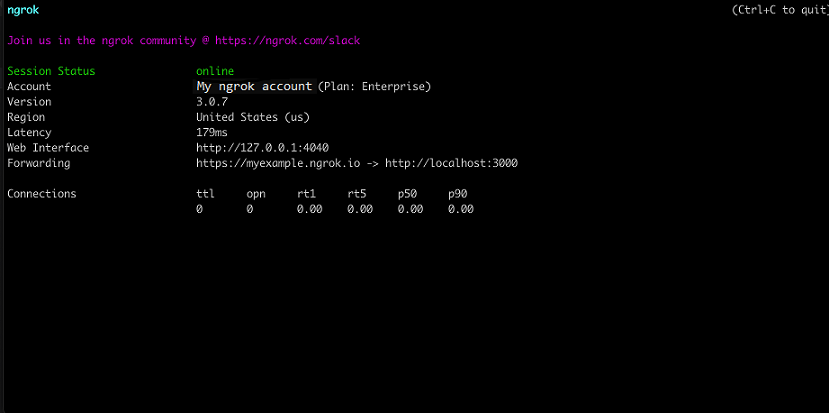

import InspectingRequests from "/snippets/integrations/_inspecting-requests.mdx";
import ReplayingRequests from "/snippets/integrations/_replaying-requests.mdx";

This guide covers how to use ngrok to integrate your localhost app with Facebook by using Webhooks.
Facebook webhooks can be used to notify an external application whenever page or account events occur in your Facebook account.

By integrating ngrok with Facebook, you can:

- **Develop and test Facebook webhooks locally**, eliminating the time in deploying your development code to a public environment and setting it up in HTTPS.
- **Inspect and troubleshoot requests from Facebook** in real-time via the inspection UI and API.
- **Modify and Replay Facebook Webhook requests** with a single click and without spending time reproducing events manually in your Facebook account.
- **Secure your app with Facebook validation provided by ngrok**. Invalid requests are blocked by ngrok before reaching your app.

## 1. Start your app

For this tutorial, you can use the [sample Node.js app available on GitHub](https://github.com/ngrok/ngrok-webhook-nodejs-sample).

To install this sample, run the following commands in a terminal:

```bash
git clone https://github.com/ngrok/ngrok-webhook-nodejs-sample.git
cd ngrok-webhook-nodejs-sample
npm install
```

This will get the project installed locally.

Now you can launch the app by running the following command:

```bash
npm run startFacebook
```

The app runs by default on port 3000.

You can validate that the app is up and running by visiting http://localhost:3000. The application logs request headers and body in the terminal and responds with a message in the browser.

## 2. Launch ngrok

Once your app is running locally, you're ready to put it online securely using ngrok.

**Note:** This integration requires an ngrok Pro or Enterprise license because Facebook validates your ngrok domain and certificate.

1. If you're not an ngrok user yet, just [sign up for ngrok for free](https://ngrok.com/signup).

1. [Download the ngrok agent](https://download.ngrok.com).

1. Go to the [ngrok dashboard](https://dashboard.ngrok.com), click **Your Authtoken**, and copy your Authtoken. <br />
   **Tip:** The ngrok agent uses the auth token to log into your account when you start a tunnel.

1. On the left menu, expand **Universal Gateway** and then click **Domains**.
   **Tip:** If you don't have an ngrok Pro or Enterprise license, sign up for one by clicking **Update Subscription** and follow the subscribe procedure.

1. On the **Domains** page, click **+ Create Domain** or **+ New Domain**.

1. In the **Domain** pane, provide a value for the **Domain** field (that is, `myexample.ngrok.app`), and then click **Continue**.
   
   **Tip**: Make sure your domain is available.

1. Close the **Start a Tunnel** pane and then close the **Domain** pane.

1. Start ngrok by running the following command in a terminal on your local desktop:

   ```bash
   ngrok http 3000 --url myexample.ngrok.app
   ```

1. ngrok will display a URL where your localhost application is exposed to the internet (copy this URL for use with Facebook).
   

## 3. Integrate Facebook

To register a webhook on your Facebook account follow the instructions below:

**Requirements**: You'll need a Facebook page and a Facebook app associated with your Facebook page. Create one before following the rest of these steps.

1. Access the [Meta for Developers](https://developers.facebook.com/) page, and Log in using your Facebook account.

1. On the Developers page, click **My Apps** and then click your app.
1. On the app dashboard, click **Add Product** on the left menu, and then click **Set up** inside the **Webhooks** tile.

1. On the **Webhooks** page, select **Page** from the combo box and then click **Subscribe to this object**.

1. In the **Edit User subscription** popup, enter the URL provided by the ngrok agent to expose your application to the internet in the **Callback URL** field, with `/webhooks` at the end (that is, `https://myexample.ngrok.app/webhooks`).
   

1. Enter `12345` in the **Verify token** field, click **No** on the **Include values** slider to turn it to **Yes**, and then click **Verify and save**.

1. After you add a webhook to Facebook, Facebook will submit a validation post request to your application through ngrok. Confirm your localhost app receives the validation get request and logs `WEBHOOK_VERIFIED` in the terminal.

1. Back to the **Webhooks** page, click **Subscribe** for the **feed** field.
   **Tip**: You can subscribe to multiple fields within the **Page** object, as well as select other objects to subscribe to. For each of them, you provide the same URL.

1. Click **Test** for the **feed** field, click **Send to My Server**, and confirm your localhost app receives the test post request.

1. On the top of your app's page, make sure **App Mode** is **Live**.

### Run webhooks with Facebook and ngrok

Depending on the object and the field you subscribe to, Facebook sends different request body contents.

Because you selected the **feed** action, you can test the integration by creating a post on your page or by clicking "like" on a post of your page:

1. Access your Facebook account and then under **Your Pages and profiles** click your page.

1. On the **Manage Page** for your page, click **Create post**, write something and then click **Post**.

Confirm your localhost app receives the feed message and logs both headers and body in the terminal.

<InspectingRequests />

<ReplayingRequests />
## Secure webhook requests

The ngrok signature webhook verification feature allows ngrok to assert that requests from your Facebook webhook are the only traffic allowed to make calls to your localhost app.

**Note:** This ngrok feature is limited to 500 validations per month on free ngrok accounts. For unlimited, upgrade to Pro or Enterprise.

This is a quick step to add extra protection to your application.

1. Access the [Meta for Developers](https://developers.facebook.com/) page, log in using your Facebook account, and then click **My Apps** in the top right corner.

1. On the Developers page, expand **Settings** on the left menu and then click **Basic**.

1. In the **Basic Settings** page, click **Show** to reveal the **App secret** value and copy this value.

1. Create a Traffic Policy file named `facebook_policy.yml`, replacing `{your app secret}` with the value you have copied before:

   ```yaml
   on_http_request:
     - name: "Facebook Webhooks"
       actions:
         - type: "webhook-validation"
           config:
             provider: "facebook_graph_api"
             secret: "{your app secret}"
   ```

1. Restart your ngrok agent by running the command:

   ```bash
   ngrok http 3000 --traffic-policy-file facebook_policy.yml
   ```

1. Access the Facebook page you have assigned to your webhook and send a message to another Facebook user.

   Verify that your local application receives the request and logs information to the terminal.
