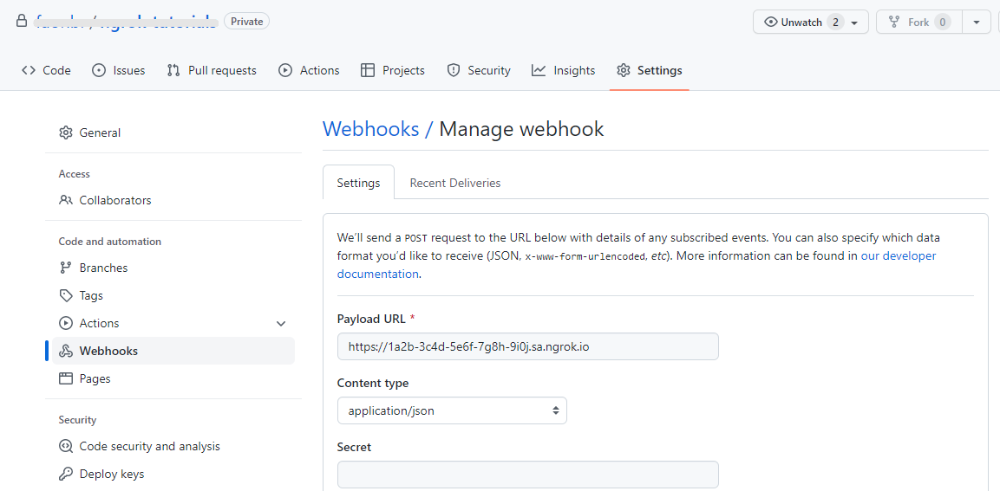
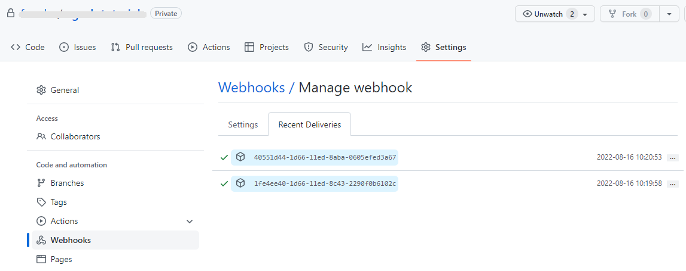

import InspectingRequests from "/snippets/integrations/_inspecting-requests.mdx";
import ReplayingRequests from "/snippets/integrations/_replaying-requests.mdx";

This guide covers how to use ngrok to integrate your localhost app with GitHub to allow GitHub to send notifications to your localhost app anytime an event takes place in a GitHub repository.

By integrating ngrok with GitHub, you can:

- **Develop and test GitHub webhooks locally**, eliminating the time in deploying your development code to a public environment and setting it up in HTTPS.
- **Inspect and troubleshoot requests from GitHub** in real-time via the inspection UI and API
- **Modify and Replay GitHub Webhook requests** with a single click and without spending time reproducing events manually in GitHub
- **Secure your app with GitHub webhook validation provided by ngrok**. Invalid requests are blocked by ngrok before reaching your app

## 1. Start your app

For this tutorial, you can use the [sample Node.js app available on GitHub](https://github.com/ngrok/ngrok-webhook-nodejs-sample).

To install this sample, run the following commands in a terminal:

```bash
git clone https://github.com/ngrok/ngrok-webhook-nodejs-sample.git
cd ngrok-webhook-nodejs-sample
npm install
```

This will get the project installed locally.

Now you can launch the app by running the following command:

```bash
npm start
```

The app runs by default on port 3000.

You can validate that the app is up and running by visiting http://localhost:3000. The application logs request headers and body in the terminal and a message in the browser.

## 2. Launch ngrok

Once your app is running locally, you're ready to put it online securely using ngrok.

1. If you're not an ngrok user yet, just [sign up for ngrok for free](https://ngrok.com/signup).

1. [Download the ngrok agent](https://download.ngrok.com).

1. Go to the [ngrok dashboard](https://dashboard.ngrok.com) and copy your Authtoken. <br />
   **Tip:** The ngrok agent uses the auth token to log into your account when you start a tunnel.
1. Start ngrok by running the following command:

   ```bash
   ngrok http 3000
   ```

1. ngrok will display a URL where your localhost application is exposed to the internet (copy this URL for use with GitHub).
   

## 3. Integrate GitHub

GitHub can trigger webhook calls to external applications whenever events happen in a repository. To register for such events, follow the instructions below:

1. Sign in to [GitHub](https://github.com).

1. Select a repository from **Your Repository** list.
   **Tip:** If you don't have a repository, create a new empty one.

1. In the repository page, click **Settings** and then select **Webhooks** from the left menu.

1. Add a new webhook by clicking **Add webhook**.

1. In the **Payload URL**, use the URL provided by the ngrok agent to expose your application to the internet (for example, `https://1a2b-3c4d-5e6f-7g8h-9i0j.ngrok.app`).
   

1. Select the **Content type** of the data submitted from GitHub to your application as `application/json`.

1. Choose which events you would like to trigger this webhook. For this example, select **Just the push event**.

1. Make sure your webhook is active, and then click **Add webhook**.

### Run webhooks with GitHub and ngrok

After you add a webhook to your GitHub repository, GitHub will submit a post request to your application through ngrok.

To review the content of this request on GitHub:

1. Select the webhook you've just created.

1. Click the **Recent Deliveries** tab.

1. Select the ID of the delivery.

Compare the headers and the body of this delivery with the information received by your application, and then confirm they contain the same data.

**Note:** Different messages are sent to your application depending on the trigger event you choose.

Because you've selected **Just the push event** in this example, to trigger new calls from GitHub to your application, you need to push content to your GitHub repository.
To resend any request, click **Redeliver** in the **Recent Deliveries**' tab of your GitHub **Manage webhook** page.



<InspectingRequests />

<ReplayingRequests />

## Secure webhook requests

The ngrok signature webhook verification feature allows ngrok to assert that requests from your GitHub webhook are the only traffic allowed to make calls to your localhost app.

**Note:** This ngrok feature is limited to 500 validations per month on free ngrok accounts. For unlimited, upgrade to Pro or Enterprise.

This is a quick step to add extra protection to your application.

1. Create a Traffic Policy file named `github_policy.yml`, replacing `{your secret}` with your **Secret** from GitHub:

   ```yaml
   on_http_request:
     - actions:
         - type: verify-webhook
           config:
             provider: github
             secret: "{your secret}"
   ```

1. Restart your ngrok agent by running the command:

   ```bash
   ngrok http 3000 --traffic-policy-file github_policy.yml
   ```

1. Resend one of the messages from your GitHub webhook.

Verify that your local application receives the request and logs information to the terminal.
