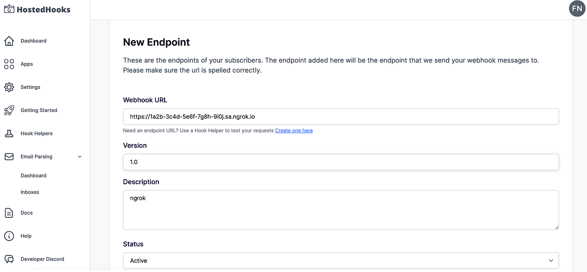
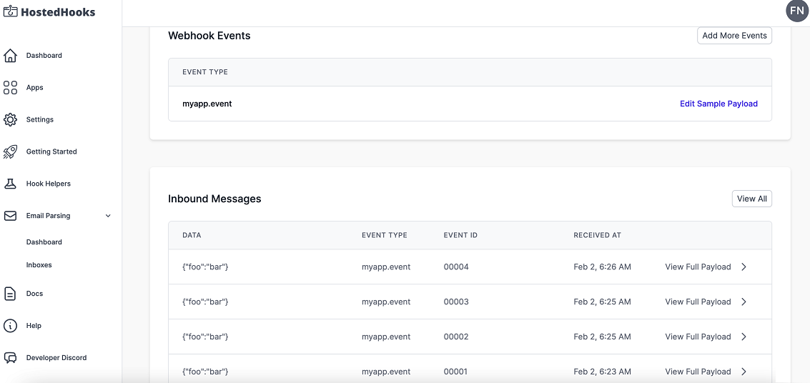

import InspectingRequests from "/snippets/integrations/_inspecting-requests.mdx";
import ReplayingRequests from "/snippets/integrations/_replaying-requests.mdx";

<Tip>
**TL;DR**


To integrate HostedHooks webhooks with ngrok:

1. [Launch your local webhook.](#start-your-app) `npm start`
1. [Launch ngrok.](#start-ngrok) `ngrok http 3000`
1. [Configure HostedHooks webhooks with your ngrok URL.](#setup-webhook)
1. [Secure your webhook requests with verification.](#security)
</Tip>

This guide covers how to use ngrok to integrate your localhost app with HostedHooks by using Webhooks.
HostedHooks webhooks can be used to route requests to HostedHooks servers to your localhost app.

By integrating ngrok with HostedHooks, you can:

- **Develop and test HostedHooks webhooks locally**, eliminating the time in deploying your development code to a public environment and setting it up in HTTPS.
- **Inspect and troubleshoot requests from HostedHooks** in real-time via the inspection UI and API.
- **Modify and Replay HostedHooks Webhook requests** with a single click and without spending time reproducing events manually in your HostedHooks account.
- **Secure your app with HostedHooks validation provided by ngrok**. Invalid requests are blocked by ngrok before reaching your app.

## 1. Start your app 

For this tutorial, you can use the [sample Node.js app available on GitHub](https://github.com/ngrok/ngrok-webhook-nodejs-sample).

To install this sample, run the following commands in a terminal:

```bash
git clone https://github.com/ngrok/ngrok-webhook-nodejs-sample.git
cd ngrok-webhook-nodejs-sample
npm install
```

This will get the project installed locally.

Now you can launch the app by running the following command:

```bash
npm start
```

The app runs by default on port 3000.

You can validate that the app is up and running by visiting http://localhost:3000. The application logs request headers and body in the terminal and responds with a message in the browser.

## 2. Launch ngrok 

Once your app is running locally, you're ready to put it online securely using ngrok.

1. If you're not an ngrok user yet, just [sign up for ngrok for free](https://ngrok.com/signup).

1. [Download the ngrok agent](https://download.ngrok.com).

1. Go to the [ngrok dashboard](https://dashboard.ngrok.com) and copy your Authtoken. <br />
   **Tip:** The ngrok agent uses the auth token to log into your account when you start a tunnel.
1. Start ngrok by running the following command:

   ```bash
   ngrok http 3000
   ```

1. ngrok will display a URL where your localhost application is exposed to the internet (copy this URL for use with HostedHooks).
   

## 3. Integrate HostedHooks 

To register a webhook on your HostedHooks account follow the instructions below:

1. Access [HostedHooks](https://www.hostedhooks.com/) and sign in using your HostedHooks account.

1. Click **Apps** on the left menu, and then click **Setup New App**.

1. On the **Setup Your Application** page, enter `My App` in the **App Name** field and then click **Save App**.

1. On the app page, click **Create Your Webhook Event** (Step 1), enter `myapp.event` in the **Event Type** field, and then click **Save Webhook Event**.

1. On the app page, click **Create your first Subscriber** (Step 2), enter `My Localhost App` in the **Subscription Name** field, and then click **Save Subscription**.

1. On the **My Localhost App Subscription** page, click **+ New Endpoint**.

1. On the **New Endpoint** page, enter the URL provided by the ngrok agent to expose your application to the internet in the **Webhook URL** field (for example, `https://1a2b-3c4d-5e6f-7g8h-9i0j.ngrok.app`).
   

1. Enter `1.0` in the **Version** field, enter `ngrok` in the **Description** field, and then click **Save Endpoint**.

1. Click the left arrow to go back to the app page and then click **Subscribe to a webhook event** (Step 4).

1. On the **Details** page, select **myapp.event** in the **Subscribed Events** selector and then click **Add Event**.

1. Click the left arrow twice to go back to the app page and then click **Send a test webhook message**.

   Confirm your localhost app receives the **myapp.event** event notification and logs both headers and body in the terminal.

### Run webhooks with HostedHooks and ngrok 

Whenever you post a message to the HostedHooks message endpoint using the value **myapp.event** as the event type inside the body of the request, HostedHooks routes this message to your localhost app through your ngrok URL.
You can trigger new calls from HostedHooks to your application by following the instructions below.

1. Open a terminal window and run the following command:

   ```bash
   curl --request POST --url https://hostedhooks.com/api/v1/apps/APP_ID/messages
   \
   --header 'Authorization: Bearer API_KEY' \
   --header 'Content-Type: application/json' --data '{
       "data": {
           "foo": "bar"
       },
       "event_type": "myapp.event",
       "version": "1.0",
       "event_id": "00001"
   }'
   ```

   **Note**: Replace the following with the corresponding values:
   - APP_ID: The ID of your application. Copy the value from your app page on HostedHooks, in the **My App** section.
   - API_KEY: The **API Key** value from the **Settings** page on HostedHooks.

   Confirm your localhost app receives the event notification and logs both headers and body in the terminal.

Alternatively, you can verify the log of the webhook call in HostedHooks:

1. Access the [HostedHooks Dashboard](https://www.hostedhooks.com/), click **Apps** on the left menu, and then click your app tile.

1. On your app page, scroll down to the **Inbound Messages** section and verify the messages sent to your app.
   

<InspectingRequests />

<ReplayingRequests />
## Secure webhook requests 

The ngrok signature webhook verification feature allows ngrok to assert that requests from your HostedHooks webhook are the only traffic allowed to make calls to your localhost app.

**Note:** This ngrok feature is limited to 500 validations per month on free ngrok accounts. For unlimited, upgrade to Pro or Enterprise.

This is a quick step to add extra protection to your application.

1. Access the [HostedHooks Dashboard](https://www.hostedhooks.com/), click **Apps** on the left menu, and then click your app tile.

1. On the app page, click **View** in the **Subscribers** section and click **View** in the **Endpoints** section.

1. On the **Endpoint** page, click **Reveal** in the **Signing Secret** field and copy the value that appears.

1. Create a traffic policy file named `hostedhooks_policy.yml`, replacing `{app sign secret}` with the value you copied before:

   ```yaml
   on_http_request:
     - name: "Verify HostedHooks requests"
       actions:
         - type: verify-webhook
           config:
             provider: "hostedhooks"
             secret: "{app sign secret}"
   ```

1. Restart your ngrok agent by running the command:

   ```bash
   ngrok http 3000 --traffic-policy-file hostedhooks_policy.yml
   ```

1. Post a new message to the message endpoint of HostedHooks by following the same procedure as the [Run Webhooks with HostedHooks and ngrok](#run-webhook) section.
   **Tip**: Modify the value of the **event_id** field in the JSON body. This value must be unique per app.

Verify that your local application receives the request and logs information to the terminal.
