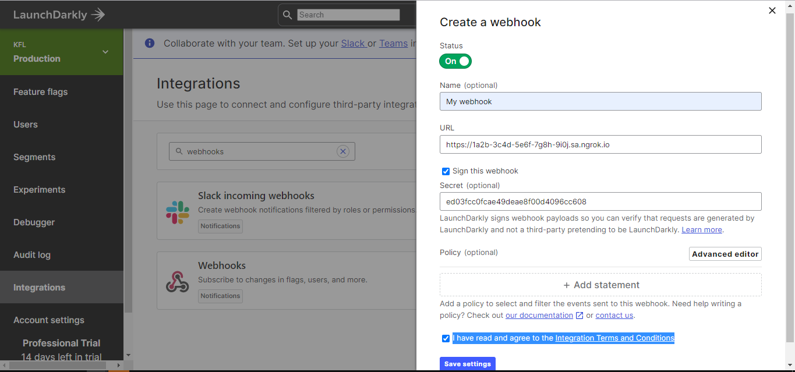

import InspectingRequests from "/snippets/integrations/_inspecting-requests.mdx";
import ReplayingRequests from "/snippets/integrations/_replaying-requests.mdx";

<Tip>
**TL;DR**


To integrate LaunchDarkly webhooks with ngrok:

1. [Launch your local webhook.](#start-your-app) `npm start`
1. [Launch ngrok.](#start-ngrok) `ngrok http 3000`
1. [Configure LaunchDarkly webhooks with your ngrok URL.](#setup-webhook)
1. [Secure your webhook requests with verification.](#security)
</Tip>

This guide covers how to use ngrok to integrate your localhost app with LaunchDarkly by using Webhooks.
LaunchDarkly webhooks can be used to notify an external application whenever specific events occur in your LaunchDarkly account.

By integrating ngrok with LaunchDarkly, you can:

- **Develop and test LaunchDarkly webhooks locally**, eliminating the time in deploying your development code to a public environment and setting it up in HTTPS.
- **Inspect and troubleshoot requests from LaunchDarkly** in real-time via the inspection UI and API.
- **Modify and Replay LaunchDarkly Webhook requests** with a single click and without spending time reproducing events manually in your LaunchDarkly account.
- **Secure your app with LaunchDarkly validation provided by ngrok**. Invalid requests are blocked by ngrok before reaching your app.

## 1. Start your app 

For this tutorial, you can use the [sample Node.js app available on GitHub](https://github.com/ngrok/ngrok-webhook-nodejs-sample).

To install this sample, run the following commands in a terminal:

```bash
git clone https://github.com/ngrok/ngrok-webhook-nodejs-sample.git
cd ngrok-webhook-nodejs-sample
npm install
```

This will get the project installed locally.

Now you can launch the app by running the following command:

```bash
npm start
```

The app runs by default on port 3000.

You can validate that the app is up and running by visiting http://localhost:3000. The application logs request headers and body in the terminal and responds with a message in the browser.

## 2. Launch ngrok 

Once your app is running locally, you're ready to put it online securely using ngrok.

1. If you're not an ngrok user yet, just [sign up for ngrok for free](https://ngrok.com/signup).

1. [Download the ngrok agent](https://download.ngrok.com).

1. Go to the [ngrok dashboard](https://dashboard.ngrok.com) and copy your Authtoken. <br />
   **Tip:** The ngrok agent uses the auth token to log into your account when you start a tunnel.
1. Start ngrok by running the following command:

   ```bash
   ngrok http 3000
   ```

1. ngrok will display a URL where your localhost application is exposed to the internet (copy this URL for use with LaunchDarkly).
   

## 3. Integrate LaunchDarkly 

To register a webhook on your LaunchDarkly account follow the instructions below:

1. Access the [LaunchDarkly App](https://app.launchdarkly.com/) and sign in using your LaunchDarkly account.

1. On the left menu, click **Integrations**.

1. On the **Integrations** page, search for `webhooks` and then click **Add integration** for the **Webhooks** tile.

1. On the **Create a new webhook** popup, enter a name in the **NAME** field, and enter the URL provided by the ngrok agent to expose your application to the internet in the **URL** field (for example, `https://1a2b-3c4d-5e6f-7g8h-9i0j.ngrok.app`).
   

1. On the **Create a new webhook** popup, click **Sign this webhook** and copy the value of the **Secret** provided by LaunchDarkly.
   **Tip**: You will use the **Secret** value later to add more security to your webhook calls. See [Secure webhook requests](#security).

1. Click the **I have read and agree to the Integration Terms and Conditions** checkbox, and then click **Save settings**.

After you save the webhook, LaunchDarkly sends a request to your application. Confirm your localhost app receives the POST notification and logs both headers and body in the terminal.

### Run webhooks with LaunchDarkly and ngrok

LaunchDarkly sends different request body contents depending on the event that is being triggered.
You can trigger new calls from LaunchDarkly to your application by following the instructions below.

1. On the LaunchDarkly dashboard, click **Segments** on the left menu and then click **Create segment**.

1. On the **Create a segment** popup, enter a **Name** for the segment, and then click **Save segment**.

   Confirm your localhost app receives the create-project event notification and logs both headers and body in the terminal.

<InspectingRequests />

<ReplayingRequests />
## Secure webhook requests 

The ngrok signature webhook verification feature allows ngrok to assert that requests from your LaunchDarkly webhook are the only traffic allowed to make calls to your localhost app.

**Note:** This ngrok feature is limited to 500 validations per month on free ngrok accounts. For unlimited, upgrade to Pro or Enterprise.

This is a quick step to add extra protection to your application.

1. Create a Traffic Policy file named `launchdarkly_policy.yml`, replacing `{your webhook secret}` with the value you have copied before (See [Integrate ngrok and LaunchDarkly.](#setup-webhook)):

   ```yaml
   on_http_request:
     - actions:
         - type: verify-webhook
           config:
             provider: launch_darkly
             secret: "{your webhook secret}"
   ```

1. Restart your ngrok agent by running the command:

   ```bash
   ngrok http 3000 --traffic-policy-file launchdarkly_policy.yml
   ```

1. Access the [LaunchDarkly App](https://app.launchdarkly.com/) and create a new segment.

Verify that your local application receives the request and logs information to the terminal.
