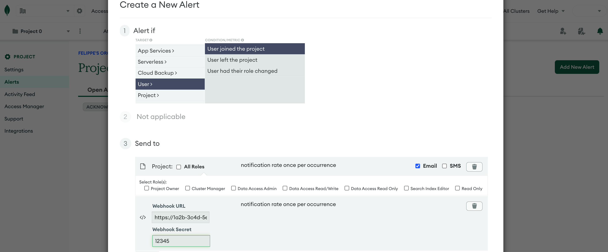

import InspectingRequests from "/snippets/integrations/_inspecting-requests.mdx";
import ReplayingRequests from "/snippets/integrations/_replaying-requests.mdx";

<Tip>
**TL;DR**


To integrate MongoDB webhooks with ngrok:

1. [Launch your local webhook.](#start-your-app) `npm start`
1. [Launch ngrok.](#start-ngrok) `ngrok http 3000`
1. [Configure MongoDB webhooks with your ngrok URL.](#setup-webhook)
1. [Secure your webhook requests with verification.](#security)
</Tip>

This guide covers how to use ngrok to integrate your localhost app with MongoDB Atlas by using Webhooks.
MongoDB webhooks can be used to notify an external application whenever specific events occur in your MongoDB account.

By integrating ngrok with MongoDB, you can:

- **Develop and test MongoDB webhooks locally**, eliminating the time in deploying your development code to a public environment and setting it up in HTTPS.
- **Inspect and troubleshoot requests from MongoDB** in real-time via the inspection UI and API.
- **Modify and Replay MongoDB Webhook requests** with a single click and without spending time reproducing events manually in your MongoDB account.
- **Secure your app with MongoDB validation provided by ngrok**. Invalid requests are blocked by ngrok before reaching your app.

## 1. Start your app 

For this tutorial, you can use the [sample Node.js app available on GitHub](https://github.com/ngrok/ngrok-webhook-nodejs-sample).

To install this sample, run the following commands in a terminal:

```bash
git clone https://github.com/ngrok/ngrok-webhook-nodejs-sample.git
cd ngrok-webhook-nodejs-sample
npm install
```

This will get the project installed locally.

Now you can launch the app by running the following command:

```bash
npm start
```

The app runs by default on port 3000.

You can validate that the app is up and running by visiting http://localhost:3000. The application logs request headers and body in the terminal and responds with a message in the browser.

## 2. Launch ngrok 

Once your app is running locally, you're ready to put it online securely using ngrok.

1. If you're not an ngrok user yet, just [sign up for ngrok for free](https://ngrok.com/signup).

1. [Download the ngrok agent](https://download.ngrok.com).

1. Go to the [ngrok dashboard](https://dashboard.ngrok.com) and copy your Authtoken. <br />
   **Tip:** The ngrok agent uses the auth token to log into your account when you start a tunnel.
1. Start ngrok by running the following command:

   ```bash
   ngrok http 3000
   ```

1. ngrok will display a URL where your localhost application is exposed to the internet (copy this URL for use with MongoDB).
   

## 3. Integrate MongoDB 

To register a webhook on your MongoDB account follow the instructions below:

1. Access the [MongoDB console](https://cloud.mongodb.com/) and sign in using your MongoDB account.

1. On your project home page, click the bell icon below your name at the top-right corner to view the project alerts.
   **Note**: If you don't have a project, create one before continuing.

1. On the **Project Alerts** page, click **Add New Alert** and then click **Webhooks**.

1. On the **Create a New Alert** popup, under **Alert if**, click **User** as the target, and then click **User joined the project** as the condition.

1. Click **Add**, click **Webhook**, and enter the URL provided by the ngrok agent to expose your application to the internet in the **Webhook URL** field (for example, `https://1a2b-3c4d-5e6f-7g8h-9i0j.ngrok.app`).
   

1. Enter the value `12345` in the **Webhook Secret** field. This value is used to provide more security to your webhook call. (See [Secure webhook requests](#security)).

1. Click **Save**.

### Run webhooks with MongoDB and ngrok

MongoDB sends different request body contents depending on the event that is being triggered.
You can trigger new calls from MongoDB to your application by following the instructions below.

1. On your project home page, click the person icon to invite to the project.

1. In the **invite new users via email address** field, enter an email to invite to your project.

1. The new user receives an email and is required to register to MongoDB Atlas. After registration, confirm your localhost app receives an event notification and logs both headers and body in the terminal.

<InspectingRequests />

<ReplayingRequests />
## Secure webhook requests 

The ngrok signature webhook verification feature allows ngrok to assert that requests from your MongoDB webhook are the only traffic allowed to make calls to your localhost app.

**Note:** This ngrok feature is limited to 500 validations per month on free ngrok accounts. For unlimited, upgrade to Pro or Enterprise.

This is a quick step to add extra protection to your application.

1. Create a Traffic Policy file named `mongodb_policy.yml`, replacing `{your webhook secret}` with the value of the **Webhook Secret** field you copied during the webhook registration (See [Integrate ngrok and MongoDB.](#setup-webhook)):

   ```yaml
   on_http_request:
     - name: "Verify MongoDB requests"
       actions:
         - type: verify-webhook
           config:
             provider: "mongodb"
             secret: "{your webhook secret}"
   ```

1. Restart your ngrok agent by running the command:

   ```bash
   ngrok http 3000 --traffic-policy-file mongodb_policy.yml
   ```

1. Access your project home page and invite a new person to your project.

Verify that your local application receives the request and logs information to the terminal.
