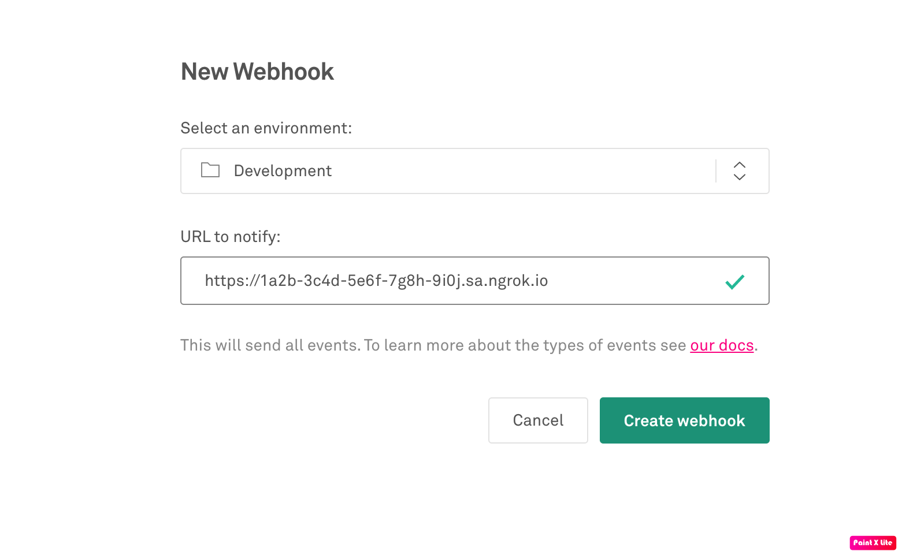

import InspectingRequests from "/snippets/integrations/_inspecting-requests.mdx";
import ReplayingRequests from "/snippets/integrations/_replaying-requests.mdx";

<Tip>
**TL;DR**


To integrate Mux webhooks with ngrok:

1. [Launch your local webhook.](#start-your-app) `npm start`
1. [Launch ngrok.](#start-ngrok) `ngrok http 3000`
1. [Configure Mux webhooks with your ngrok URL.](#setup-webhook)
1. [Secure your webhook requests with verification.](#security)
</Tip>

This guide covers how to use ngrok to integrate your localhost app with Mux by using Webhooks.
Mux webhooks can be used to notify an external application whenever specific events occur in your Mux account.

By integrating ngrok with Mux, you can:

- **Develop and test Mux webhooks locally**, eliminating the time in deploying your development code to a public environment and setting it up in HTTPS.
- **Inspect and troubleshoot requests from Mux** in real-time via the inspection UI and API.
- **Modify and Replay Mux Webhook requests** with a single click and without spending time reproducing events manually in your Mux account.
- **Secure your app with Mux validation provided by ngrok**. Invalid requests are blocked by ngrok before reaching your app.

## 1. Start your app 

For this tutorial, you can use the [sample Node.js app available on GitHub](https://github.com/ngrok/ngrok-webhook-nodejs-sample).

To install this sample, run the following commands in a terminal:

```bash
git clone https://github.com/ngrok/ngrok-webhook-nodejs-sample.git
cd ngrok-webhook-nodejs-sample
npm install
```

This will get the project installed locally.

Now you can launch the app by running the following command:

```bash
npm start
```

The app runs by default on port 3000.

You can validate that the app is up and running by visiting http://localhost:3000. The application logs request headers and body in the terminal and responds with a message in the browser.

## 2. Launch ngrok 

Once your app is running locally, you're ready to put it online securely using ngrok.

1. If you're not an ngrok user yet, just [sign up for ngrok for free](https://ngrok.com/signup).

1. [Download the ngrok agent](https://download.ngrok.com).

1. Go to the [ngrok dashboard](https://dashboard.ngrok.com) and copy your Authtoken. <br />
   **Tip:** The ngrok agent uses the auth token to log into your account when you start a tunnel.
1. Start ngrok by running the following command:

   ```bash
   ngrok http 3000
   ```

1. ngrok will display a URL where your localhost application is exposed to the internet (copy this URL for use with Mux).
   

## 3. Integrate Mux 

To register a webhook on your Mux account follow the instructions below:

1. Access [Mux](https://www.mux.com/) and sign in using your Mux account.

1. On the Mux dashboard, click **Settings on the left menu, and then click **Webhooks\*\*.

1. On the **Webhooks** tab of the **Settings** page, click **Create new webhook**.

1. Select your environment, and enter the URL provided by the ngrok agent to expose your application to the internet in the **URL to notify** field (for example, `https://1a2b-3c4d-5e6f-7g8h-9i0j.ngrok.app`).
   

1. Click **Create Webhook**.

### Run webhooks with Mux and ngrok

Mux sends different request body contents depending on the event that is being triggered.
You can trigger new calls from Mux to your application by following the instructions below.

1. On the Mux dashboard, click **Assets** on the left menu and then click **Create New Asset**.

1. On the **Create a new asset** popup, click **Run Request**.

   Confirm your localhost app receives event notifications and logs both headers and body in the terminal.

<InspectingRequests />

<ReplayingRequests />
## Secure webhook requests 

The ngrok signature webhook verification feature allows ngrok to assert that requests from your Mux webhook are the only traffic allowed to make calls to your localhost app.

**Note:** This ngrok feature is limited to 500 validations per month on free ngrok accounts. For unlimited, upgrade to Pro or Enterprise.

This is a quick step to add extra protection to your application.

1. Access [Mux](https://www.mux.com/) and sign in using your Mux account.

1. On the Mux dashboard, click **Settings** on the left menu, and then click **Webhooks**.

1. On the **Webhooks** tab of the **Settings** page, click **Show Signing Secret** for your webhook and copy the value of the signing secret.

1. Create a traffic policy file named `mux_policy.yml`, replacing `{your signing secret}` with the value you have copied before (See [Integrate ngrok and Mux.](#setup-webhook)):

   ```yaml
   on_http_request:
     - name: "Verify Mux requests"
       actions:
         - type: verify-webhook
           config:
             provider: "mux"
             secret: "{your signing secret}"
   ```

1. Restart the ngrok agent by running the command:

   ```bash
   ngrok http 3000 --traffic-policy-file mux_policy.yml
   ```

1. Access [Mux](https://www.mux.com/), sign in, and create a new asset.

Verify that your local application receives the request and logs information to the terminal.
