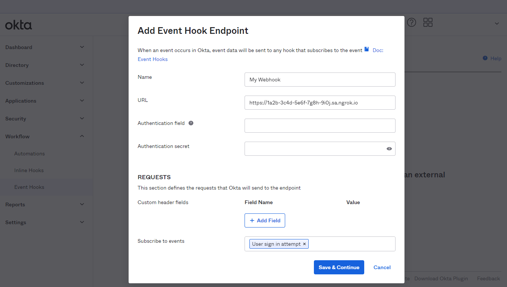

import InspectingRequests from "/snippets/integrations/_inspecting-requests.mdx";
import ReplayingRequests from "/snippets/integrations/_replaying-requests.mdx";

<Tip>
**TL;DR**


To integrate Okta webhooks with ngrok:

1. [Launch your local webhook.](#start-your-app) `npm start`
1. [Launch ngrok.](#start-ngrok) `ngrok http 3000`
1. [Configure Okta webhooks with your ngrok URL.](#setup-webhook)
</Tip>

This guide covers how to use ngrok to integrate your localhost app with Okta by using Webhooks.
Okta webhooks can be used to notify an external application whenever specific events occur in your Okta account.

By integrating ngrok with Okta, you can:

- **Develop and test Okta webhooks locally**, eliminating the time in deploying your development code to a public environment and setting it up in HTTPS.
- **Inspect and troubleshoot requests from Okta** in real-time via the inspection UI and API.
- **Modify and Replay Okta Webhook requests** with a single click and without spending time reproducing events manually in your Okta account.
- **Secure your app with Okta validation provided by ngrok**. Invalid requests are blocked by ngrok before reaching your app.

## 1. Start your app 

For this tutorial, you can use the [sample Node.js app available on GitHub](https://github.com/ngrok/ngrok-webhook-nodejs-sample).

To install this sample, run the following commands in a terminal:

```bash
git clone https://github.com/ngrok/ngrok-webhook-nodejs-sample.git
cd ngrok-webhook-nodejs-sample
npm install
```

This will get the project installed locally.

Now you can launch the app by running the following command:

```bash
npm run startOkta
```

The app runs by default on port `3000`.

You can validate that the app is up and running by visiting http://localhost:3000. The application logs request headers and body in the terminal and responds with a message in the browser.

## 2. Launch ngrok 

Once your app is running locally, you're ready to put it online securely using ngrok.

1. If you're not an ngrok user yet, just [sign up for ngrok for free](https://ngrok.com/signup).

1. [Download the ngrok agent](https://download.ngrok.com).

1. Go to the [ngrok dashboard](https://dashboard.ngrok.com) and copy your Authtoken. <br />
   **Tip:** The ngrok agent uses the auth token to log into your account when you start a tunnel.
1. Start ngrok by running the following command:

   ```bash
   ngrok http 3000
   ```

1. ngrok will display a URL where your localhost application is exposed to the internet (copy this URL for use with Okta).
   

## 3. Integrate Okta 

To register a webhook on your Okta account follow the instructions below:

1. Access yout Okta tentant (that is, `https://mytenant.okta.com/`) and sign in using your Okta account.

1. On the left menu, click **Workflow**, click **Event Hooks**, and then click **Create Event Hook**.

1. On the **Add Event Hook Endpoint** page, enter `My Webhook` in the **Name** field, and in the **URL** field enter the URL provided by the ngrok agent to expose your application to the internet (for example, `https://1a2b-3c4d-5e6f-7g8h-9i0j.ngrok.app`).
   

1. In the **Subscribe to events** field select **User sign in attempt** and then click **Save & Continue**.

1. On the **Verification** page, click **Verify** to confirme Okta can contact your localhost through ngrok.

### Run webhooks with Okta and ngrok

Okta sends different request body contents depending on the event that is being triggered.
You can test your webhook by following the steps below.

1. On the **Event Hooks** page, click **Actions** for your webhook and then click **Preview**.

1. On the **Preview** page, select the **Event Type** from the list of event types and then click **Deliver Request**.

   Confirm your localhost app receives an event notification and logs both headers and body in the terminal.

Optionally, You can trigger new calls from Okta to your application by signing out from Okta console, signing in again, and then clicking **Admin** to enter the administrative console.

    Confirm your localhost app receives an event notification and logs both headers and body in the terminal.

<InspectingRequests />

<ReplayingRequests />
