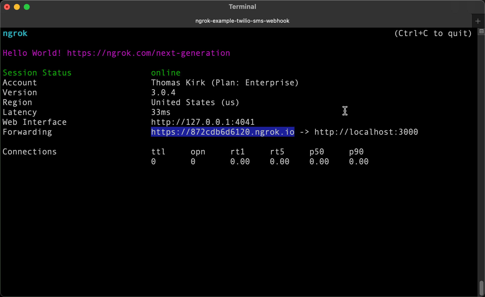
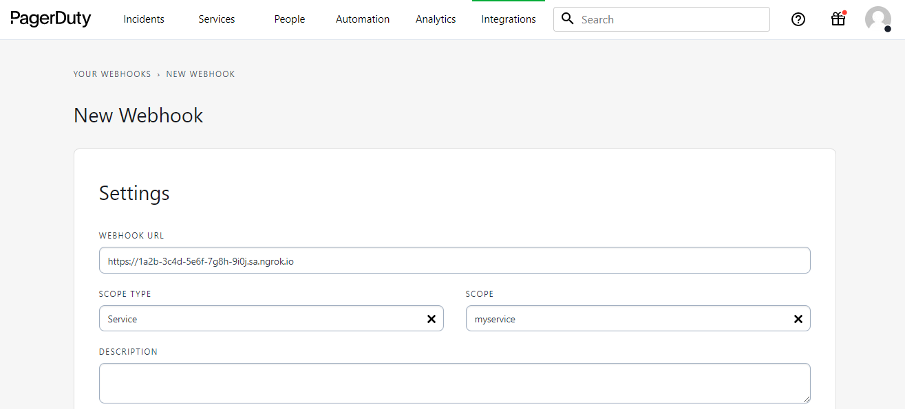

import InspectingRequests from "/snippets/integrations/_inspecting-requests.mdx";
import ReplayingRequests from "/snippets/integrations/_replaying-requests.mdx";

<Tip>
**TL;DR**


To integrate PagerDuty webhooks with ngrok:

1. [Launch your local webhook.](#start-your-app) `npm start`
1. [Launch ngrok.](#start-ngrok) `ngrok http 3000`
1. [Configure PagerDuty webhooks with your ngrok URL.](#setup-webhook)
1. [Secure your webhook requests with verification.](#security)
</Tip>

This guide covers how to use ngrok to integrate your localhost app with PagerDuty by using Webhooks.
PagerDuty webhooks can be used to notify an external application whenever specific events occur in your PagerDuty account.

By integrating ngrok with PagerDuty, you can:

- **Develop and test PagerDuty webhooks locally**, eliminating the time in deploying your development code to a public environment and setting it up in HTTPS.
- **Inspect and troubleshoot requests from PagerDuty** in real-time via the inspection UI and API.
- **Modify and Replay PagerDuty Webhook requests** with a single click and without spending time reproducing events manually in your PagerDuty account.
- **Secure your app with PagerDuty validation provided by ngrok**. Invalid requests are blocked by ngrok before reaching your app.

## **Step 1**: Start your app 

For this tutorial, we'll use the [sample NodeJS app available on GitHub](https://github.com/ngrok/ngrok-webhook-nodejs-sample).

To install this sample, run the following commands in a terminal:

```bash
git clone https://github.com/ngrok/ngrok-webhook-nodejs-sample.git
cd ngrok-webhook-nodejs-sample
npm install
```

This will get the project installed locally.

Now you can launch the app by running the following command:

```bash
npm start
```

The app runs by default on port 3000.

You can validate that the app is up and running by visiting http://localhost:3000. The application logs request headers and body in the terminal and responds with a message in the browser.

## **Step 2**: Launch ngrok 

Once your app is running successfully on localhost, let's get it on the internet securely using ngrok!

1. If you're not an ngrok user yet, just [sign up for ngrok for free](https://ngrok.com/signup).

1. [Download the ngrok agent](https://download.ngrok.com).

1. Go to the [ngrok dashboard](https://dashboard.ngrok.com) and copy your Authtoken. <br />
   **Tip:** The ngrok agent uses the auth token to log into your account when you start a tunnel.
1. Start ngrok by running the following command:

   ```bash
   ngrok http 3000
   ```

1. ngrok will display a URL where your localhost application is exposed to the internet (copy this URL for use with PagerDuty).
   

## **Step 3**: Integrate PagerDuty 

To register a webhook on your PagerDuty account follow the instructions below:

1. Access [PagerDuty](https://www.pagerduty.com/), and sign in using your PagerDuty account.

1. Click **Integrations** on the top menu and then click **Generic Webhooks**.

1. On the **Your Webhooks** page, click **+New Webook** for your application.

1. On the **New Webhook** page, in the **WEBHOOK URL** field enter the URL provided by the ngrok agent to expose your application to the internet (i.e. `https://1a2b-3c4d-5e6f-7g8h-9i0j.ngrok.app`).
   

1. On the same page, select **Service** as **SCOPE TYPE**, select one of your service for **SCOPE**, click **Select all** under **EVENT SUBSCRIPTION**, and then click **Add Webhook**.

1. In the **Webhook subscription created** popup, click **OK**.
   **Tip**: Click **Copy** to copy the **webhook payload signing** code for later usage. See [Secure your webhook requests with verification](#security).

1. In the **Your Webhooks** page, click the webhook you have just created.

1. In your webhook's settings page, scroll down until the **Test** section, click **Send Test Event**, and then click **Yes, Send Event**.
   Confirm your localhost app receives the test event notification and logs both headers and body in the terminal.

### Run Webhooks with PagerDuty and ngrok

PagerDuty sends different request body contents depending on the event that is being triggered.
You can trigger new calls from PagerDuty to your application by following the instructions below.

1. In the same browser, access your PagerDuty company page, click **Services** on the top menu, and then click the **Service Directory**.

1. On the **Service Directory** page, click **+ New Service**.

1. In the **Create a Service** page, enter your service **Name** and then click **Next** until the **Integrations** step appears.

1. In the **Integrations** step, click **Create service without an integration**.

1. On your service page, click **New Incident**, select your service for **Create an incident on the following service**, provide a short title, select **Urgency** as **Low**, and then click **Create Incident**.
   Confirm your localhost app receives the create new incident event notification and logs both headers and body in the terminal.

<InspectingRequests />

<ReplayingRequests />
## Secure webhook requests 

The ngrok signature webhook verification feature allows ngrok to assert that requests from your PagerDuty webhook are the only traffic allowed to make calls to your localhost app.

**Note:** This ngrok feature is limited to 500 validations per month on free ngrok accounts. For unlimited, upgrade to Pro or Enterprise.

This is a quick step to add extra protection to your application.

1. Create a traffic policy file named `pagerduty_policy.yml`, replacing `{your webhook payload signing}` with the value you copied before (See [Integrate ngrok and PagerDuty.](#setup-webhook)):

   ```yaml
   on_http_request:
     - actions:
         - type: verify-webhook
           config:
             provider: pagerduty
             secret: "{your webhook payload signing}"
   ```

1. Restart your ngrok agent by running the command:

   ```bash
   ngrok http 3000 --traffic-policy-file pagerduty_policy.yml
   ```

1. Access PagerDuty (`https://{tenant}.pagerduty.com/incidents`) and create a new incident.

1. Verify that your local application receives the request and logs information to the terminal.
<Info>
**Need some help?**


We all do sometimes 😅. To get help from our team, join our [Slack Community](https://ngrok.com/slack).
</Info>
