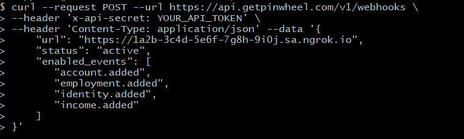

import InspectingRequests from "/snippets/integrations/_inspecting-requests.mdx";
import ReplayingRequests from "/snippets/integrations/_replaying-requests.mdx";

<Tip>
**TL;DR**


To integrate Pinwheel webhooks with ngrok:

1. [Launch your local webhook.](#start-your-app) `npm start`
1. [Launch ngrok.](#start-ngrok) `ngrok http 3000`
1. [Configure Pinwheel webhooks with your ngrok URL.](#setup-webhook)
1. [Secure your webhook requests with verification.](#security)
</Tip>

This guide covers how to use ngrok to integrate your localhost app with Pinwheel by using Webhooks.
Pinwheel webhooks can be used to notify an external application whenever specific events occur in your Pinwheel account.

By integrating ngrok with Pinwheel, you can:

- **Develop and test Pinwheel webhooks locally**, eliminating the time in deploying your development code to a public environment and setting it up in HTTPS.
- **Inspect and troubleshoot requests from Pinwheel** in real-time via the inspection UI and API.
- **Modify and Replay Pinwheel Webhook requests** with a single click and without spending time reproducing events manually in your Pinwheel account.
- **Secure your app with Pinwheel validation provided by ngrok**. Invalid requests are blocked by ngrok before reaching your app.

## **Step 1**: Start your app 

For this tutorial, we'll use the [sample NodeJS app available on GitHub](https://github.com/ngrok/ngrok-webhook-nodejs-sample).

To install this sample, run the following commands in a terminal:

```bash
git clone https://github.com/ngrok/ngrok-webhook-nodejs-sample.git
cd ngrok-webhook-nodejs-sample
npm install
```

This will get the project installed locally.

Now you can launch the app by running the following command:

```bash
npm start
```

The app runs by default on port 3000.

You can validate that the app is up and running by visiting http://localhost:3000. The application logs request headers and body in the terminal and responds with a message in the browser.

## **Step 2**: Launch ngrok 

Once your app is running successfully on localhost, let's get it on the internet securely using ngrok!

1. If you're not an ngrok user yet, just [sign up for ngrok for free](https://ngrok.com/signup).

1. [Download the ngrok agent](https://download.ngrok.com).

1. Go to the [ngrok dashboard](https://dashboard.ngrok.com) and copy your Authtoken. <br />
   **Tip:** The ngrok agent uses the auth token to log into your account when you start a tunnel.
1. Start ngrok by running the following command:

   ```bash
   ngrok http 3000
   ```

1. ngrok will display a URL where your localhost application is exposed to the internet (copy this URL for use with Pinwheel).
   

## **Step 3**: Integrate Pinwheel 

To register a webhook on your Pinwheel account follow the instructions below:

1. Access the [Pinwheel Developer Portal](https://developer.getpinwheel.com/) and sign in using your Pinwheel account.

1. On the **Dashboard** page, click the **API Keys** tab, click **Reveal Secret**, and make note of both the **API Secret** and **Server** values.

1. Open a terminal window and run the following command to create the webhook:

   ```bash
   curl --request POST --url SERVER_URL/v1/webhooks \
   --header 'x-api-secret: API_SECRET' \
   --header 'Content-Type: application/json' --data '{
       "url": "NGROK_URL",
       "status": "active",
       "enabled_events": [
           "account.added",
           "employment.added",
           "identity.added",
           "income.added"
       ]
   }'
   ```

   **Note**: Replace the following with values copied on previous steps:
   - SERVER_URL: The Pinwheel Server URL.
   - NGROK_URL: the URL provided by the ngrok agent to expose your application to the internet (i.e. `https://1a2b-3c4d-5e6f-7g8h-9i0j.ngrok.app`).
   - API_SECRET: The Pinwheel API Secret.

   

1. Make sure the response to the previous command is JSON containing a **status** attribute with `active` as the value.

### Run Webhooks with Pinwheel and ngrok

Pinwheel sends different request body contents depending on the event you enabled during the webhook registration.

Because you subscribed your webhook to the **account.added** event, you can trigger new calls to your localhost application by asking users to log into their payroll accounts by using the Pinwheel API.

Confirm your localhost app receives an event notification and logs both headers and body in the terminal.

<InspectingRequests />

<ReplayingRequests />
## Secure webhook requests 

The ngrok signature webhook verification feature allows ngrok to assert that requests from your Pinwheel webhook are the only traffic allowed to make calls to your localhost app.

**Note:** This ngrok feature is limited to 500 validations per month on free ngrok accounts. For unlimited, upgrade to Pro or Enterprise.

This is a quick step to add extra protection to your application.

1. Create a traffic policy file named `pinwheel_policy.yml`, replacing `{your api secret}` with the value of the API Secret you copied before (See [Integrate Pinwheel](#setup-webhook)):

   ```yaml
   on_http_request:
     - actions:
         - type: verify-webhook
           config:
             provider: pinwheel
             secret: "{your api secret}"
   ```

1. Restart your ngrok agent by running the command:

   ```bash
   ngrok http 3000 --traffic-policy-file pinwheel_policy.yml
   ```

1. Request users to log into their payroll account by using Pinwheel API.

   Confirm your localhost app receives an event notification and logs both headers and body in the terminal.
