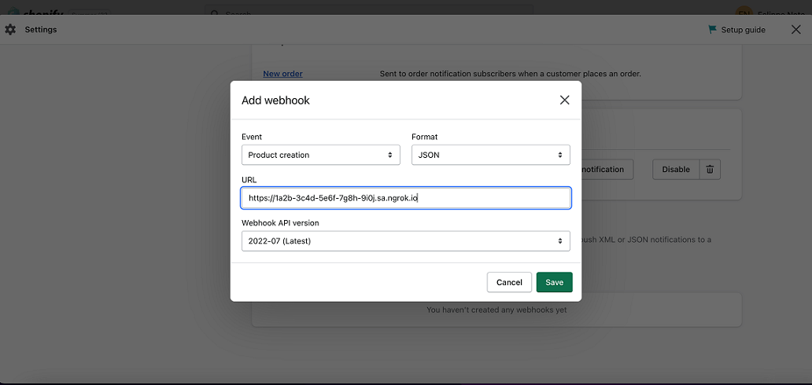

import InspectingRequests from "/snippets/integrations/_inspecting-requests.mdx";
import ReplayingRequests from "/snippets/integrations/_replaying-requests.mdx";

<Tip>
**TL;DR**


To integrate Shopify webhooks with ngrok:

1. [Launch your local webhook.](#start-your-app) `npm start`
1. [Launch ngrok.](#start-ngrok) `ngrok http 3000`
1. [Configure Shopify webhooks with your ngrok URL.](#setup-webhook)
1. [Secure your webhook requests with verification.](#security)
</Tip>

This guide covers how to use ngrok to integrate your localhost app with Shopify by using Webhooks.
Shopify webhooks can be used to notify an external application whenever specific events occur in your Shopify store.

By integrating ngrok with Shopify, you can:

- **Develop and test Shopify webhooks locally**, eliminating the time in deploying your development code to a public environment and setting it up in HTTPS.
- **Inspect and troubleshoot requests from Shopify** in real-time via the inspection UI and API.
- **Modify and Replay Shopify Webhook requests** with a single click and without spending time reproducing events manually in your Shopify store.
- **Secure your app with Shopify validation provided by ngrok**. Invalid requests are blocked by ngrok before reaching your app.
<Tip>
**TL;DR**


1. [Launch your local webhook.](#start-your-app) `npm start`
2. [Launch ngrok.](#start-ngrok) `ngrok http 3000`
3. [Configure Shopify webhooks with your ngrok URL.](#setup-webhook)

4. **Bonus!** [Secure your webhook requests with verification.](#security)
</Tip>

## 1. Start your app 

For this tutorial, we'll use the [sample NodeJS app available on GitHub](https://github.com/ngrok/ngrok-webhook-nodejs-sample).

To install this sample, run the following commands in a terminal:

```bash
git clone https://github.com/ngrok/ngrok-webhook-nodejs-sample.git
cd ngrok-webhook-nodejs-sample
npm install
```

This will get the project installed locally.

Now you can launch the app by running the following command:

```bash
npm start
```

The app runs by default on port 3000.

You can validate that the app is up and running by visiting http://localhost:3000. The application logs request headers and body in the terminal and responds with a message in the browser.

## 2. Launch ngrok 

Once your app is running locally, you're ready to put it online securely using ngrok.

1. If you're not an ngrok user yet, just [sign up for ngrok for free](https://ngrok.com/signup).

1. [Download the ngrok agent](https://download.ngrok.com).

1. Go to the [ngrok dashboard](https://dashboard.ngrok.com) and copy your Authtoken. <br />
   **Tip:** The ngrok agent uses the auth token to log into your account when you start a tunnel.
1. Start ngrok by running the following command:

   ```bash
   ngrok http 3000
   ```

1. ngrok will display a URL where your localhost application is exposed to the internet (copy this URL for use with Shopify).
   

## 3. Integrate Shopify 

To register a webhook to your Shopify store follow the instructions below:

1. Sign in to your Shopify account, select your store, and then click **Settings** at the bottom of the left menu on the admin page.

1. In the **Settings** page, click **Notifications** in the left menu, scroll down to the **Webhooks** section and then click **Create webhook**.

1. In the **Add webhook** popup, select **Product creation** for the **Event** field and make sure **JSON** is selected as the **Format**.

1. In the **URL** field enter the URL provided by the ngrok agent to expose your application to the internet (that is, `https://1a2b-3c4d-5e6f-7g8h-9i0j.ngrok.app`).
   

1. For the **Webhook API version** field, select any value containing the `(Latest)` text and then click **Save**.

1. Optionally, in the **Webhooks** section, Shopify shows a key that will be used to sign all calls to your application. Make a copy of this value for later use.

### Run webhooks with Shopify and ngrok

The **Webhooks** section allows you to test your Webhook by clicking the **Send test notification** button. Use this feature to send a test notification to your application through ngrok.

Because you registered your webhook for the **Product creation** event, any product you create triggers a notification to your application. Create a product following the instructions below:

1. Access your Shopify store admin page, click **Products** in the left menu, and then click **Add product** on the **Products** page.

1. In the **Add product** page, provide a **Title** for the product, a **Price**, an **SKU** value, and then click **Save** at the bottom of the page.

Confirm your localhost app receives notifications about the product you've just created.

**Tip:** Shopify sends different request body contents depending on the event you select during the webhook registration.

<InspectingRequests />

<ReplayingRequests />
## Secure webhook requests 

The ngrok signature webhook verification feature allows ngrok to assert that requests from your Shopify webhook are the only traffic allowed to make calls to your localhost app.

**Note:** This ngrok feature is limited to 500 validations per month on free ngrok accounts. For unlimited, upgrade to Pro or Enterprise.

This is a quick step to add extra protection to your application.

1. In the **Webhooks** section of the **Notifications** page, Shopify shows a value after the **All your webhooks will be signed with** message. Copy this value.

1. Create a traffic policy file named `shopify_policy.yml`:

   ```yaml
   on_http_request:
     - actions:
         - type: verify-webhook
           config:
             provider: shopify
             secret: "{your signing secret}"
   ```

1. Restart your ngrok agent by running the command:

   ```bash
   ngrok http 3000 --traffic-policy-file shopify_policy.yml
   ```

1. Access your Shopify store admin page, click **Products** in the left menu, and then create a new product.

Verify that your local application receives the request and logs information to the terminal.
