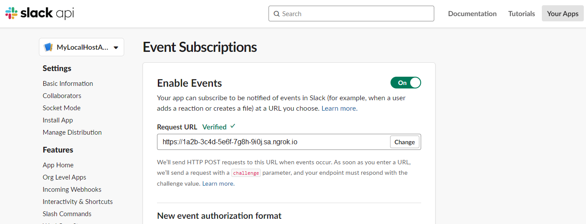

import InspectingRequests from "/snippets/integrations/_inspecting-requests.mdx";
import ReplayingRequests from "/snippets/integrations/_replaying-requests.mdx";

<Tip>
**TL;DR**


To integrate Slack webhooks with ngrok:

1. [Launch your local webhook.](#start-your-app) `npm start`
1. [Launch ngrok.](#start-ngrok) `ngrok http 3000`
1. [Configure Slack webhooks with your ngrok URL.](#setup-webhook)
1. [Secure your webhook requests with verification.](#security)
</Tip>

This guide covers how to use ngrok to integrate your localhost app with Slack using Webhooks.
Slack webhooks can be used to notify an external application whenever specific events occur in your Slack account.
Slack requires your application to be available through an HTTPS endpoint.

By integrating ngrok with Slack, you can:

- **Develop and test Slack webhooks locally**, eliminating the time in deploying your development code to a public environment and setting it up in HTTPS.
- **Inspect and troubleshoot requests from Slack** in real-time via the inspection UI and API.
- **Modify and Replay Slack Webhook requests** with a single click and without spending time reproducing events manually in your Slack account.
- **Secure your app with Slack validation provided by ngrok**. Invalid requests are blocked by ngrok before reaching your app.

## 1. Start your app 

For this tutorial, you can use the [sample Node.js app available on GitHub](https://github.com/ngrok/ngrok-webhook-nodejs-sample).

To install this sample, run the following commands in a terminal:

```bash
git clone https://github.com/ngrok/ngrok-webhook-nodejs-sample.git
cd ngrok-webhook-nodejs-sample
npm install
```

This will get the project installed locally.

Now you can launch the app by running the following command:
`npm run startSlack`

The app runs by default on port 3000.

You can validate that the app is up and running by visiting http://localhost:3000. The application logs request headers and body in the terminal and a message in the browser.

## 2. Launch ngrok 

Once your app is running locally, you're ready to put it online securely using ngrok.

1. If you're not an ngrok user yet, just [sign up for ngrok for free](https://ngrok.com/signup).

1. [Download the ngrok agent](https://download.ngrok.com).

1. Go to the [ngrok dashboard](https://dashboard.ngrok.com) and copy your Authtoken.
   **Tip:** The ngrok agent uses the auth token to log into your account when you start a tunnel.
1. Start ngrok by running the following command:

   ```bash
   ngrok http 3000
   ```

1. ngrok will display a URL where your localhost application is exposed to the internet (copy this URL for use with Slack).
   

## 3. Integrate Slack 

To register a webhook with your Slack account, follow the instructions below:

1. Access the [Slack Web app](https://app.slack.com/) and sign in using your Slack account.
   **Tip**: There is no need to open the slack app on your desktop for now. Continue with the **use Slack in your browser** option.

1. In the same browser tab, access the [Slack API portal](https://api.slack.com/apps) and then click **Create an App**.
   **Tip**: If you already have some apps created, click \*\*\*\*.

1. In the **Create an app** window, click **From scratch**, provide the **App Name**, select a workspace under **Pick a workspace to develop your app in**, and then click **Create App**.

1. In the **Basic Information** page, expand **Add features and functionality** and then click **Event Subscriptions**.

1. In the **Event Subscriptions** page, click the **Enable Events** slider to turn it on. In the **Request URL** field, enter the URL provided by the ngrok agent to expose your application to the internet (for example, `https://1a2b-3c4d-5e6f-7g8h-9i0j.ngrok.app`).
   

   **Note**: Slack makes a one-time call to your app. It sends a challenge parameter as part of the request body and expects the app to respond with this value. See the [Slack documentation](https://api.slack.com/apis/events-api#handshake) for more information.

1. On the same page, expand **Subscribe to events on behalf of users**, click **Add Workspace Event**, select `message.im`, and then click **Save Changes**.
   **Tip**: More about Slack event types [here](https://api.slack.com/events).

1. In the left menu, click **Install App**, click **Install to Workspace**, and then click **Allow** to allow your application to access your workspace.

### Run webhooks with Slack and ngrok

Because you've subscribed to the `message.im` event and installed your app to your slack workspace, you now can direct message any person in the workspace to make Slack call your localhost application:

1. Access the [Slack Web app](https://app.slack.com/) or open the slack app on your desktop, and verify that your application appears under **Apps** in the left menu.

1. Select one person in your workspace and send the person a message. Alternatively, you can select the **Slackbot**, write `Hello Slack bot!` in the message field, and then send it.

Confirm your localhost app receives notifications about the message.

**Tip:** Slack sends different request body contents and headers depending on the trigger event.

<InspectingRequests />

<ReplayingRequests />
## Secure webhook requests 

The ngrok signature webhook verification feature allows ngrok to assert that requests from your Slack webhook are the only traffic allowed to make calls to your localhost app.

**Note:** This ngrok feature is limited to 500 validations per month on free ngrok accounts. For unlimited, upgrade to Pro or Enterprise.

This is a quick step to add extra protection to your application.

1. In the **Basic Information** page for your Slack app, click **Show** for the **Signing Secret** and copy the value that appears.

1. Create a Traffic Policy file named `slack_policy.yml` with the following content, replacing `{your signing secret}` with your **Signing Secret** from Slack:

   ```yaml
   on_http_request:
     - actions:
         - type: verify-webhook
           config:
             provider: slack
             secret: "{your signing secret}"
   ```

1. Restart your ngrok agent by running the command:

   ```bash
   ngrok http 3000 --traffic-policy-file slack_policy.yml
   ```

1. In your Slack app, select the **Slackbot**, write `Hello Slack bot!` in the message field, and then send it.

Verify that your local application receives the request and logs information to the terminal.
