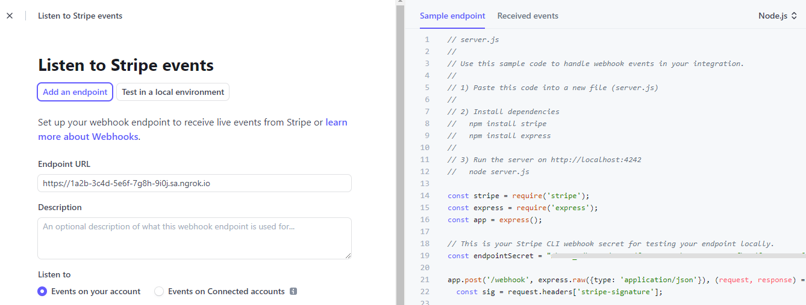
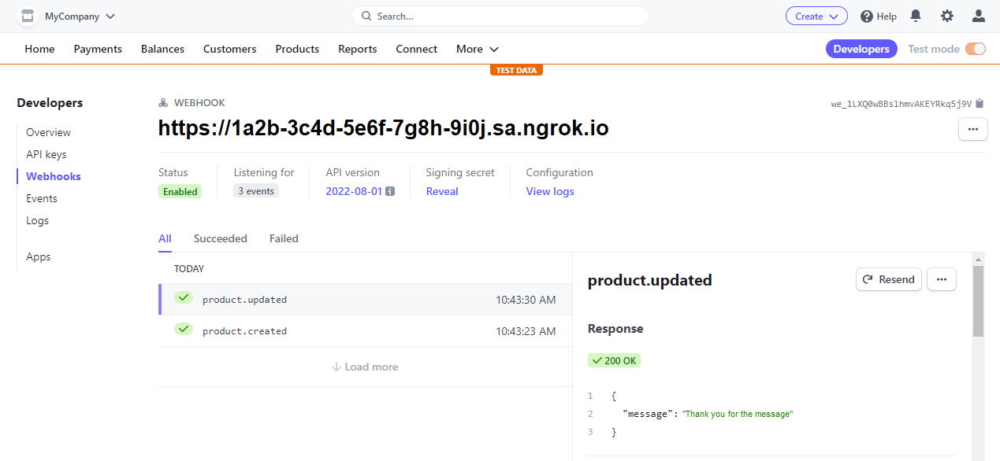

import InspectingRequests from "/snippets/integrations/_inspecting-requests.mdx";
import ReplayingRequests from "/snippets/integrations/_replaying-requests.mdx";

<Tip>
**TL;DR**


To integrate Stripe webhooks with ngrok:

1. [Launch your local webhook.](#start-your-app) `npm start`
1. [Launch ngrok.](#start-ngrok) `ngrok http 3000`
1. [Configure Stripe webhooks with your ngrok URL.](#setup-webhook)
1. [Secure your webhook requests with verification.](#security)
</Tip>

This guide covers how to use ngrok to integrate your localhost app with Stripe webhooks.
Stripe webhooks can be used to notify an external application whenever specific events occur in your Stripe account. Stripe requires your application to be available through an HTTPS endpoint.

By integrating ngrok with Stripe, you can:

- **Develop and test Stripe webhooks locally**, eliminating the time in deploying your development code to a public environment and setting it up in HTTPS.
- **Inspect and troubleshoot requests from Stripe** in real-time via the inspection UI and API.
- **Modify and Replay Stripe Webhook requests** with a single click and without spending time reproducing events manually in your Stripe account.
- **Secure your app with Stripe validation provided by ngrok**. Invalid requests are blocked by ngrok before reaching your app.

## 1. Start your app 

For this tutorial, you can use the [sample Node.js app available on GitHub](https://github.com/ngrok/ngrok-webhook-nodejs-sample).

To install this sample, run the following commands in a terminal:

```bash
git clone https://github.com/ngrok/ngrok-webhook-nodejs-sample.git
cd ngrok-webhook-nodejs-sample
npm install
```

This will get the project installed locally.

Now you can launch the app by running the following command:

```bash
npm start
```

The app runs by default on port 3000.

You can validate that the app is up and running by visiting http://localhost:3000. The application logs request headers and body in the terminal and a message in the browser.

## 2. Launch ngrok 

Once your app is running locally, you're ready to put it online securely using ngrok.

1. If you're not an ngrok user yet, just [sign up for ngrok for free](https://ngrok.com/signup).

1. [Download the ngrok agent](https://download.ngrok.com).

1. Go to the [ngrok dashboard](https://dashboard.ngrok.com) and copy your Authtoken. <br />
   **Tip:** The ngrok agent uses the auth token to log into your account when you start a tunnel.
1. Start ngrok by running the following command:

   ```bash
   ngrok http 3000
   ```

1. ngrok will display a URL where your localhost application is exposed to the internet (copy this URL for use with Stripe).
   

## 3. Integrate Stripe 

To register a Stripe webhook:

1. Access the [Stripe dashboard](https://dashboard.stripe.com/) and sign in using your Stripe account.

1. Click **Developers** on the top-right corner of the dashboard page, and then click **Webhooks** in the left menu.

1. In the **Webhooks** page, click **Add an endpoint**.

1. On the **Listen to Stripe events** page, in the **Endpoint URL** field, enter the URL provided by the ngrok agent to expose your application to the internet (for example, `https://1a2b-3c4d-5e6f-7g8h-9i0j.ngrok.app`).
   

1. Click **+ Select events**.

1. Select the events you want to receive notifications. For this tutorial, expand **Product** and then click **Select all Product events**.
   **Tip**: During the webhook registration, Stripe provides you with a sample code that you can use to deploy and run an application. For this tutorial, ignore this and use the sample app as per [Start your app](#start-your-app) section.

1. Click **Add events**, and then click **Add endpoint**.

The Webhook page shows your webhook details.

### Run webhooks with Stripe and ngrok

Create a product to make Stripe notify your localhost application about the product creation:

1. In the Stripe Dashboard, click **Product** in the top menu, and then click **Add product**.

1. Enter a product **Name** and **Price**, then click **Save product**.

1. Access the **Developers** section, click **Webhooks**, and then select the webhook you have created.

1. Review the last messages sent by Stripe for the product creation event.
   

Confirm your localhost app receives notifications about the created product.

**Tip:** Stripe sends different request body contents and headers depending on the trigger event.

<InspectingRequests />

<ReplayingRequests />

## Secure webhook requests 

The ngrok signature webhook verification feature allows ngrok to assert that requests from your Stripe webhook are the only traffic allowed to make calls to your localhost app.

**Note:** This ngrok feature is limited to 500 validations per month on free ngrok accounts. For unlimited, upgrade to Pro or Enterprise.

This is a quick step to add extra protection to your application.

1. In the Webhook page for your webhook, click **Reveal** under **Signing secret**, and copy the value that appears.

1. Create a Traffic Policy file named `stripe_policy.yml`:

   ```yaml
   on_http_request:
     - actions:
         - type: verify-webhook
           config:
             provider: stripe
             secret: "{your signing secret}"
   ```

1. Restart your ngrok agent by running the command:

   ```bash
   ngrok http 3000 --traffic-policy-file stripe_policy.yml
   ```

1. In your Stripe dashboard, click **Products** in the top menu and then create a new product.

Verify that your local application receives the request and logs information to the terminal.
