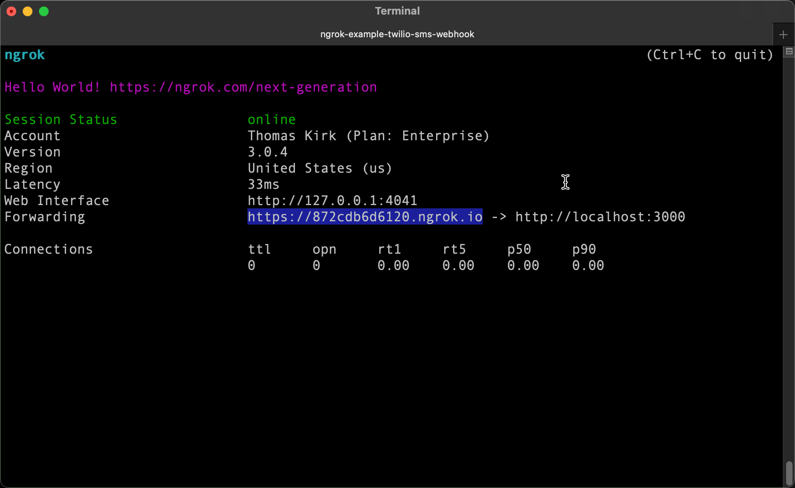

import InspectingRequests from "/snippets/integrations/_inspecting-requests.mdx";
import ReplayingRequests from "/snippets/integrations/_replaying-requests.mdx";

<Tip>
**TL;DR**


To integrate Svix webhooks with ngrok:

1. [Launch your local webhook.](#start-your-app) `npm start`
1. [Launch ngrok.](#start-ngrok) `ngrok http 3000`
1. [Configure Svix webhooks with your ngrok URL.](#setup-webhook)
1. [Secure your webhook requests with verification.](#security)
</Tip>

This guide covers how to use ngrok to integrate your localhost app with Svix by using Webhooks.
Svix incoming webhooks can be used to notify an external application whenever specific events occur in your Svix account.

By integrating ngrok with Svix, you can:

- **Develop and test Svix webhooks locally**, eliminating the time in deploying your development code to a public environment and setting it up in HTTPS.
- **Inspect and troubleshoot requests from Svix** in real-time via the inspection UI and API.
- **Modify and Replay Svix Webhook requests** with a single click and without spending time reproducing events manually in your Svix account.
- **Secure your app with Svix validation provided by ngrok**. Invalid requests are blocked by ngrok before reaching your app.

## 1. Start your app 

For this tutorial, you can use the [sample Node.js app available on GitHub](https://github.com/ngrok/ngrok-webhook-nodejs-sample).

To install this sample, run the following commands in a terminal:

```bash
git clone https://github.com/ngrok/ngrok-webhook-nodejs-sample.git
cd ngrok-webhook-nodejs-sample
npm install
```

This will get the project installed locally.

Now you can launch the app by running the following command:

```bash
npm start
```

The app runs by default on port 3000.

You can validate that the app is up and running by visiting http://localhost:3000. The application logs request headers and body in the terminal and responds with a message in the browser.

## 2. Launch ngrok 

Once your app is running locally, you're ready to put it online securely using ngrok.

1. If you're not an ngrok user yet, just [sign up for ngrok for free](https://ngrok.com/signup).

1. [Download the ngrok agent](https://download.ngrok.com).

1. Go to the [ngrok dashboard](https://dashboard.ngrok.com) and copy your Authtoken. <br />
   **Tip:** The ngrok agent uses the auth token to log into your account when you start a tunnel.
1. Start ngrok by running the following command:

   ```bash
   ngrok http 3000
   ```

1. ngrok will display a URL where your localhost application is exposed to the internet (copy this URL for use with Svix).
   

## 3. Integrate Svix 

To register a webhook on your Svix account follow the instructions below:

1. Access the [Svix Dashboard](https://dashboard.svix.com/) and sign in using your Svix account.

1. On the left menu, click **Incoming Webhooks** and then click **Add Endpoint**.

1. Enter the URL provided by the ngrok agent to expose your application to the internet in the **Endpoint URL** field (for example, `https://1a2b-3c4d-5e6f-7g8h-9i0j.ngrok.app`).
   

1. In the **Message Filtering** section, select all events by clicking the **endpoint** and **message** checkboxes, and then click **Create**.

1. In the webhook page, click the **Testing** tab and then click **Send Example**.

   Confirm your localhost app receives a request and logs both headers and body in the terminal.

### Run webhooks with Svix and ngrok

Svix sends different request body contents depending on the event that is being triggered.
You can trigger new calls from Svix to your application by following the instructions below.

1. On the [Svix Dashboard](https://dashboard.svix.com/), click **Consumer Applications** on the left menu and then click your app.
   **Note**: If you don't have an application, create a new one.

1. On the app page, click **Preview App Portal** and then click **Add Endpoint**.

1. On the **New Endpoint** page, click **use Svix Play** or enter a URL in the **Endpoint URL** field, and then click **Create**.

   Confirm your localhost app receives the request and logs both headers and body in the terminal.

Optionally, you can verify the webhook log in the Svix dashboard:

1. Access the [Svix Dashboard](https://dashboard.svix.com/), click **Incoming Webhooks** on the left menu, click the **Logs** tab, and then click one of the logs.
   

<InspectingRequests />

<ReplayingRequests />
## Secure webhook requests 

The ngrok signature webhook verification feature allows ngrok to assert that requests from your Svix webhook are the only traffic allowed to make calls to your localhost app.

**Note:** This ngrok feature is limited to 500 validations per month on free ngrok accounts. For unlimited, upgrade to Pro or Enterprise.

This is a quick step to add extra protection to your application.

1. Access the [Svix Dashboard](https://dashboard.svix.com/) and sign in using your Svix account.

1. On the left menu, click **Incoming Webhooks**, click the URL of your webhook, click the eye icon under the **Signing Secret** section, and then copy the value of the signing secret.

1. Create a Traffic Policy file named `svix_policy.yml`, replacing `{your webhook secret}` with the value you copied before:

   ```yaml
   on_http_request:
     - actions:
         - type: verify-webhook
           config:
             provider: svix
             secret: "{your webhook secret}"
   ```

1. Restart your ngrok agent by running the following command:

   ```bash
   ngrok http 3000 --traffic-policy-file svix_policy.yml
   ```

1. Access the [Svix Dashboard](https://dashboard.svix.com/) and create a new endpoint.

Verify that your local application receives the request and logs information to the terminal.
