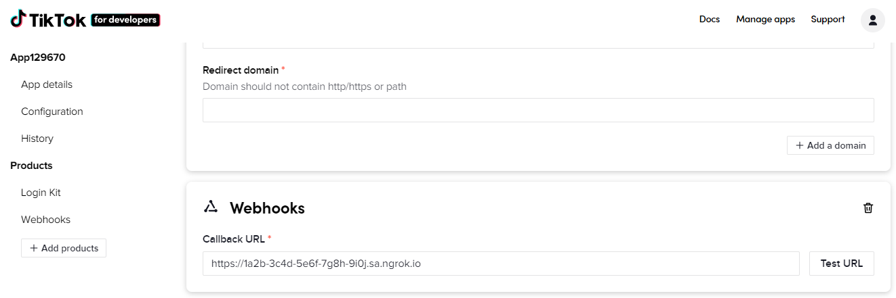

import InspectingRequests from "/snippets/integrations/_inspecting-requests.mdx";
import ReplayingRequests from "/snippets/integrations/_replaying-requests.mdx";

<Tip>
**TL;DR**


To integrate TikTok webhooks with ngrok:

1. [Launch your local webhook.](#start-your-app) `npm start`
1. [Launch ngrok.](#start-ngrok) `ngrok http 3000`
1. [Configure TikTok webhooks with your ngrok URL.](#setup-webhook)
1. [Secure your webhook requests with verification.](#security)
</Tip>

This guide covers how to use ngrok to integrate your localhost app with TikTok by using Webhooks.
TikTok webhooks can be used to notify an external application whenever specific events occur in your TikTok app.

By integrating ngrok with TikTok, you can:

- **Develop and test TikTok webhooks locally**, eliminating the time in deploying your development code to a public environment and setting it up in HTTPS.
- **Inspect and troubleshoot requests from TikTok** in real-time via the inspection UI and API.
- **Modify and Replay TikTok Webhook requests** with a single click and without spending time reproducing events manually in your TikTok account.
- **Secure your app with TikTok validation provided by ngrok**. Invalid requests are blocked by ngrok before reaching your app.

## 1. Start your app 

For this tutorial, you can use the [sample Node.js app available on GitHub](https://github.com/ngrok/ngrok-webhook-nodejs-sample).

To install this sample, run the following commands in a terminal:

```bash
git clone https://github.com/ngrok/ngrok-webhook-nodejs-sample.git
cd ngrok-webhook-nodejs-sample
npm install
```

This will get the project installed locally.

Now you can launch the app by running the following command:

```bash
npm start
```

The app runs by default on port 3000.

You can validate that the app is up and running by visiting http://localhost:3000. The application logs request headers and body in the terminal and responds with a message in the browser.

## 2. Launch ngrok 

Once your app is running locally, you're ready to put it online securely using ngrok.

1. If you're not an ngrok user yet, just [sign up for ngrok for free](https://ngrok.com/signup).

1. [Download the ngrok agent](https://download.ngrok.com).

1. Go to the [ngrok dashboard](https://dashboard.ngrok.com) and copy your Authtoken. <br />
   **Tip:** The ngrok agent uses the auth token to log into your account when you start a tunnel.
1. Start ngrok by running the following command:

   ```bash
   ngrok http 3000
   ```

1. ngrok will display a URL where your localhost application is exposed to the internet (copy this URL for use with TikTok).
   

## 3. Integrate TikTok 

To register a webhook on your TikTok app follow the instructions below:

1. Access the [TikTok Developer Portal](https://developers.tiktok.com/) and sign in using your TikTok account.

1. On the **Welcome** page, click **Manage apps** on the top menu.

1. On the **Manage apps** page, click **Connect an app**, upload an **App icon**, select **Others** in the **Category** field, enter a description in the **Description** field, click the slider icon for **Configure for Web**, enter a URL in the **Website URL** field, and click **Save changes**.

1. On the app page, click **Add products** on the left menu and click **Add** in the **Webhooks** tile.<br />
   **Note**: You may need to add the **Login Kit** before adding **Webhooks**.

1. On the left menu, click **Webhooks** and then enter the URL provided by the ngrok agent to expose your application to the internet in the **Callback URL** field (that is, `https://1a2b-3c4d-5e6f-7g8h-9i0j.ngrok.app`).
   

1. Click **Test URL** and then click **Send**.

   Confirm your localhost app receives a notification and logs both headers and body in the terminal.

1. On the **Test event sent** popup, confirm the message **200 OK** appears and then click **Done**.

1. Click **Save changes**.
   **Note**: You may need to enter values for the **Terms of Service URL**, **Privacy Policy URL**, and **Redirect domain** fields in the **Login Kit** section.

1. If your application isn't published yet, click **Submit for review**.

### Run webhooks with TikTok and ngrok 

By default, you are subscribed to all events that happen in your TikTok app.
TikTok sends different request body contents depending on the event that is being triggered.

After your app is approved, associate a user with your app.

The TikTok app will send a notification to your localhost application when a user's account is deauthorized from your application, a user video fails to upload in TikTok, or a user video has been published in TikTok.

```sh
Confirm your localhost app receives one of these event notifications and logs both headers and body in the terminal.
```

<InspectingRequests />

<ReplayingRequests />
## Secure webhook requests 

The ngrok signature webhook verification feature allows ngrok to assert that requests from your TikTok webhook are the only traffic allowed to make calls to your localhost app.

**Note:** This ngrok feature is limited to 500 validations per month on free ngrok accounts. For unlimited, upgrade to Pro or Enterprise.

This is a quick step to add extra protection to your application.

1. Access the [TikTok Developer Portal](https://developers.tiktok.com/) and sign in using your TikTok account.

1. On the **Manage apps** page, click your app tile, click the eye icon to reveal the **Client secret** value, and then copy this value.

1. Create a traffic policy file named `tiktok_policy.yml`, replacing `{your webhook secret}` with the value you copied before:

   ```yaml
   on_http_request:
     - actions:
         - type: verify-webhook
           config:
             provider: tiktok
             secret: "{your webhook secret}"
   ```

1. Restart your ngrok agent by running the command:

   ```bash
   ngrok http 3000 --traffic-policy-file tiktok_policy.yml
   ```

1. Access your [TikTok](https://www.tiktok.com/) account and use the app. See [Run Webhooks with TikTok and ngrok](#run-webhook).

Verify that your local application receives the request and logs information to the terminal.
