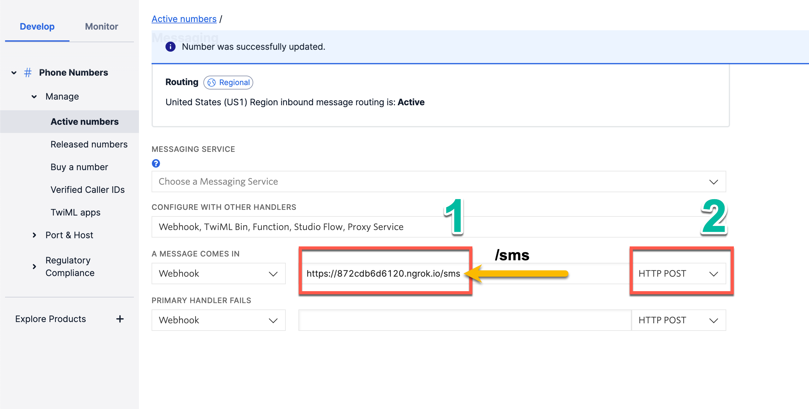

import InspectingRequests from "/snippets/integrations/_inspecting-requests.mdx";
import ReplayingRequests from "/snippets/integrations/_replaying-requests.mdx";

<Tip>
**TL;DR**

To integrate Twilio webhooks with ngrok:

1. [Start your local twillio webhook app.](#start-your-app) `npm start`
1. [Start ngrok.](#start-ngrok) `ngrok http 3000`
1. [Configure Twilio with your ngrok URL and start testing.](#setup-twilio)
</Tip>

This guide covers how to use ngrok to integrate your localhost app with [Twilio SMS Webhooks](https://www.twilio.com/docs/usage/webhooks/sms-webhooks). By integrating ngrok with Twilio, you can:

- **Develop and test Twilio webhooks locally**, eliminating the time in deploying your development code to a public environment
- **Secure your app by validating Twilio webhook using ngrok**, letting ngrok handle security leaving more time for developing what really matters
- **Inspect and troubleshoot requests from Twilio** in real-time via the inspection UI and API
- **Modify and Replay Twilio Webhook requests** with a single click and without spending time reproducing events manually in Twilio

## 1. Start your app 

An example Express app can be found on GitHub here: [https://github.com/thomas-ngrok/ngrok-example-twilio-sms-webhook](https://github.com/thomas-ngrok/ngrok-example-twilio-sms-webhook).

```js
{/* var MessagingResponse = require("twilio").twiml.MessagingResponse; */}

/*** POST /sms listing. ***/
router.post("/", function (req, res, next) {
	const twiml = new MessagingResponse();
	twiml.message("The Robots are coming! Head for the hills!");
	res.writeHead(200, { "Content-Type": "text/xml" });
	res.end(twiml.toString());
});
```

Start your app on port 3000. You can validate it is up and running by visiting [http://localhost:3000](http://localhost:3000).

The part we are going to focus on is http://localhost:3000/sms found under /routes/sms.js in the Express example code.

More information on using Twilio webhooks can be found here: [https://www.twilio.com/blog/parsing-an-incoming-twilio-sms-webhook-with-node-js](https://www.twilio.com/blog/parsing-an-incoming-twilio-sms-webhook-with-node-js)

## 2. Launch ngrok 

Once your app is running locally, you're ready to put it online securely using ngrok.

1. If you're not an ngrok user yet, just [sign up to ngrok for free](https://ngrok.com/signup).

2. [Download the ngrok agent](https://download.ngrok.com).

3. Go to the [ngrok dashboard](https://dashboard.ngrok.com) and copy your Authtoken. <br />
   **Tip:** The ngrok agent uses the authtoken to log into your account when you start a tunnel.
4. Start ngrok by running the following command:

   ```bash
   ngrok http 3000
   ```

5. ngrok will display a URL where your example applicaiton is exposed to the internet (copy this URL for use with Twilio).
   

## 3. Integrate Twilio SMS Webhook 

Now that you have your local environment on the internet, let's configure Twilio to call your code.

1. Sign in to your Twilio account.
2. From the Twilio Console, go to **Develop** > **# Phone Numbers** > **Manage** > **Active Numbers** and select a number to add a webhook to.
3. At the bottom of the page, under Messaging, (1) add your ngrok URL (don't forget to append /sms) under Webhook and (2) change the type to HTTP Post.
   
4. Save the phone number configuration.

Everything is now configured, and you're ready to test.

### Run webhooks with Twilio and ngrok

1. Send an SMS message to your Twilio Phone number that was configured in the steps above.
2. Get excited (and maybe a little scared) when you receive a text back from Twilio about the robots on their way. 🤖

You got an end-to-end example working but there's even more you can do with ngrok that will make development even easier. Check out how to inspect and replay your requests without having to send an SMS. Trust me, you won't regret it.

## Optional next steps 

### Add additional security using ngrok's signature webhook verification

The webhook verification module allows ngrok to assert requests to your endpoint originate from Twillio. This is a quick step to add extra protection to your setup.

**Note:** This ngrok feature is limited to 500 validations per month on free ngrok accounts. For unlimited, upgrade to Pro or Enterprise.

1. Login to [Twilio Console](https://console.twilio.com/) and copy your Auth Token value.<br />
   **Note:** ngrok Webhook Verification ensures traffic from your Twilio account is the **only traffic allowed** to make calls to your app. Because Twilio signs all Webhooks using the Primary Auth Token, ngrok can verifies the signature of every request and only authorizing requests originating from your Twilio account.
2. Create a traffic policy file named `twilio_policy.yml`:

```yaml
on_http_request:
  - actions:
      - type: verify-webhook
        config:
          provider: twilio
          secret: "{your auth token}"
```

3. Restart ngrok by running the command:

```bash
   ngrok http 3000 --traffic-policy-file twilio_policy.yml
```

<InspectingRequests />

<ReplayingRequests />
