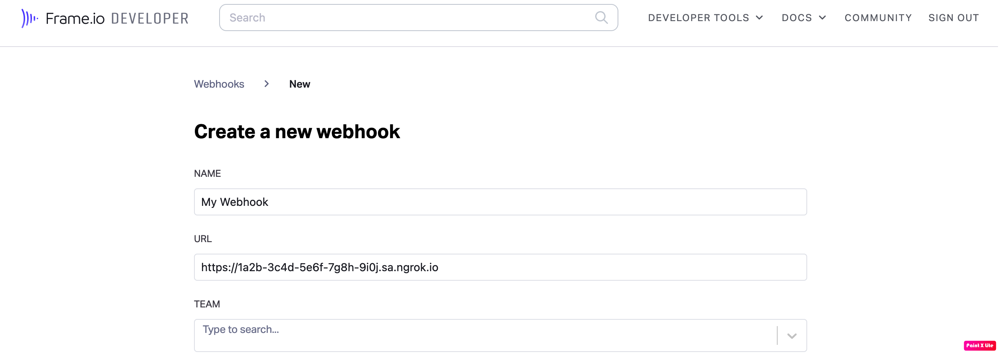

import InspectingRequests from "/snippets/integrations/_inspecting-requests.mdx";
import ReplayingRequests from "/snippets/integrations/_replaying-requests.mdx";

<Tip>
**TL;DR**

To integrate X (formerly Twitter) webhooks with ngrok:

1. [Launch your local webhook.](#start-your-app) `npm start`
1. [Launch ngrok.](#start-ngrok) `ngrok http 3000`
1. [Configure X webhooks with your ngrok URL.](#setup-webhook)
1. [Secure your webhook requests with verification.](#security)
   </Tip>

This guide covers how to use ngrok to integrate your localhost app with X by using Webhooks.
X webhooks can be used to notify an external application whenever specific events occur in your X account.

By integrating ngrok with X, you can:

- **Develop and test X webhooks locally**, eliminating the time in deploying your development code to a public environment and setting it up in HTTPS.
- **Inspect and troubleshoot requests from X** in real-time via the inspection UI and API.
- **Modify and Replay X Webhook requests** with a single click and without spending time reproducing events manually in your X account.
- **Secure your app with X validation provided by ngrok**. Invalid requests are blocked by ngrok before reaching your app.

## 1. Start your app

For this tutorial, we'll use the [sample NodeJS app available on GitHub](https://github.com/ngrok/ngrok-webhook-nodejs-sample).

To install this sample, run the following commands in a terminal:

```bash
git clone https://github.com/ngrok/ngrok-webhook-nodejs-sample.git
cd ngrok-webhook-nodejs-sample
npm install
```

This will get the project installed locally.

Now you can launch the app by running the following command:

```bash
npm start
```

The app runs by default on port 3000.

You can validate that the app is up and running by visiting http://localhost:3000. The application logs request headers and body in the terminal and responds with a message in the browser.

## 2. Launch ngrok

Once your app is running locally, you're ready to put it online securely using ngrok.

1. If you're not an ngrok user yet, just [sign up for ngrok for free](https://ngrok.com/signup).

1. [Download the ngrok agent](https://download.ngrok.com).

1. Go to the [ngrok dashboard](https://dashboard.ngrok.com) and copy your Authtoken. <br />
   **Tip:** The ngrok agent uses the auth token to log into your account when you start a tunnel.
1. Start ngrok by running the following command:

   ```bash
   ngrok http 3000
   ```

1. ngrok will display a URL where your localhost application is exposed to the internet (copy this URL for use with X).
   

## 3. Integrate X

To register a webhook on your X account follow the instructions below:

1. Access the [X Developer Portal](https://developer.twitter.com/), sign in using your X account, and then click **Developer Portal**.<br/>
   **Tip**: In order to continue, you need to have an approved developer account in the X developer portal.

1. On the **Dashboard** page, click **Create Project**, enter `ngrok` in the **Project name** field, and then click **Next**.

1. In the **Use case** tab, select your role as **Student** and then click **Next**.

1. Enter `ngrok webhook docs` in the **Project description** field and click **Next**.

1. On the **Choose an App environment** page, select **Development** as the **App environment**, enter a name for your app in the **App name** field and then click **Next**.

1. On the **Here are your keys & tokens** page, make note of the value of the **API Key**, **API Key Secret**, and **Bearer Token** fields.

1. On the left menu, click **Projects & Apps**, click **ngrok**, and then click your app.

1. On the app page, click the **Keys and tokens** tab, click **Generate** in the **Access Token and Secret** section, and then copy the value of the **Access Token** and **Access Token Secret** fields.

1. On the left menu, click **Products**, click **Premium**, and then click **Dev environments**.

1. On the **Dev environments** page, click **Set up dev environment** in the **Account Activity API** section, enter a name for environment and then select you app in the **App** combobox.

1. In a terminal window, run the following command to register the webhook:

   ```bash
   curl --request POST --url https://api.twitter.com/1.1/account_activity/webhooks.json?url=ENCODED_URL \
   --header 'authorization: OAuth oauth_consumer_key="CONSUMER_KEY", oauth_nonce="GENERATED", oauth_signature="GENERATED", oauth_signature_method="HMAC-SHA1", oauth_timestamp="GENERATED", oauth_token="ACCESS_TOKEN", oauth_version="1.0"'
   ```

   **Note**: Replace the following with values copied on previous steps:
   - APP_NAME: Your app name.
   - ENCODED_URL: the URL provided by the ngrok agent to expose your application to the internet encoded (that is, `https%3A%2F%2F1a2b-3c4d-5e6f-7g8h-9i0j.ngrok.app`).
   - CONSUMER_KEY: the app API Key.
   - ACCESS_TOKEN: The bearer token you copied before.

   

1. Copy the ID of the webhook you created.

1. In a terminal window, run the following command to subscribe a user to this webhook:
   ```bash
    curl --request POST --url https://api.twitter.com/1.1/account_activity/all/APP_NAME/subscriptions.json \
    --header 'authorization: OAuth oauth_consumer_key="CONSUMER_KEY", oauth_nonce="GENERATED", oauth_signature="GENERATED", oauth_signature_method="HMAC-SHA1", oauth_timestamp="GENERATED", oauth_token="SUBSCRIBING_USER_ACCESS_TOKEN", oauth_version="1.0"'
   ```
   **Note**: Replace the following with values copied on previous steps:
   - APP_NAME: Your app name.
   - CONSUMER_KEY: the app API Key.
   - SUBSCRIBING_USER_ACCESS_TOKEN: The access token from a X user.

### Run Webhooks with X and ngrok

X sends different request body contents depending on the event that is being triggered.
You can trigger new calls from X to your application by following the instructions below.

1. Acces [X](https://www.twitter.com/), sign in and post a tweet.

   Confirm your localhost app receives a notification and logs both headers and body in the terminal.

<InspectingRequests />

<ReplayingRequests />
## Secure webhook requests

The ngrok signature webhook verification feature allows ngrok to assert that requests from your X webhook are the only traffic allowed to make calls to your localhost app.

**Note:** This ngrok feature is limited to 500 validations per month on free ngrok accounts. For unlimited, upgrade to Pro or Enterprise.

This is a quick step to add extra protection to your application.

1. During the webhook registration you provide a
1. On the top menu of the developer site, click **DEVELOPER TOOLS** and then click **Webhooks**.

1. On the **Webhooks** page, click **Copy** to copy the **Secret** value.

1. Create a traffic policy file named `twitter_policy.yml`, replacing `{your webhook secret}` with the value you copied before:

   ```yaml
   on_http_request:
     - actions:
         - type: verify-webhook
           config:
             provider: twitter
             secret: "{your webhook secret}"
   ```

1. Restart your ngrok agent by running the command:

   ```bash
   ngrok http 3000 --traffic-policy-file twitter_policy.yml
   ```

1. Access [X](https://www.twitter.com/) and post a new tweet.

Verify that your local application receives the request and logs information to the terminal.
