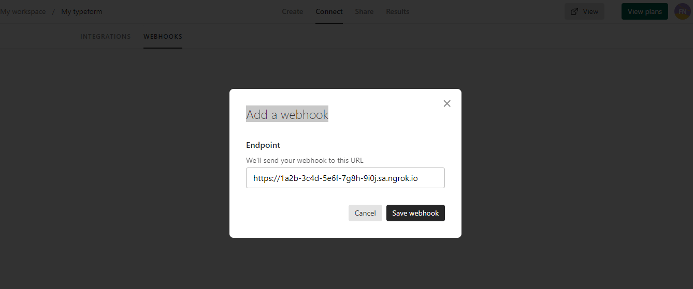
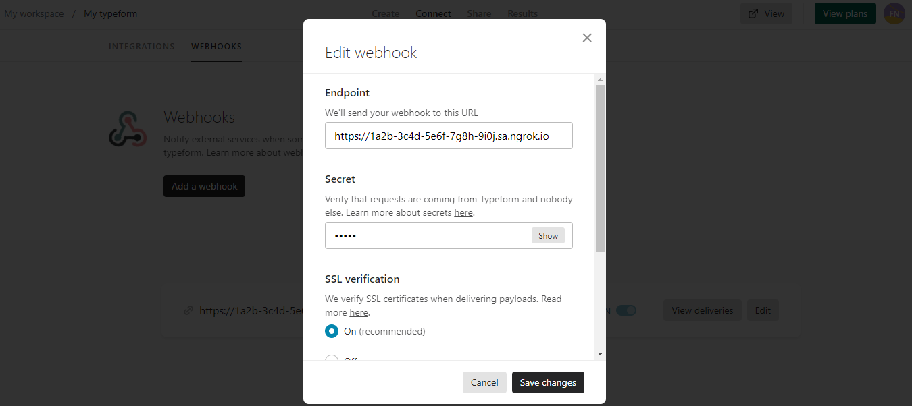
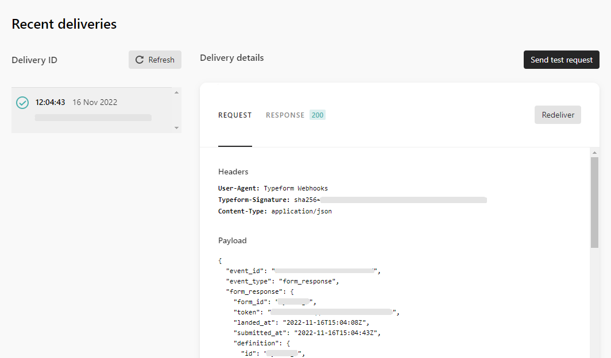

import InspectingRequests from "/snippets/integrations/_inspecting-requests.mdx";
import ReplayingRequests from "/snippets/integrations/_replaying-requests.mdx";

<Tip>
**TL;DR**


To integrate Typeform webhooks with ngrok:

1. [Launch your local webhook.](#start-your-app) `npm start`
1. [Launch ngrok.](#start-ngrok) `ngrok http 3000`
1. [Configure Typeform webhooks with your ngrok URL.](#setup-webhook)
1. [Secure your webhook requests with verification.](#security)
</Tip>

This guide covers how to use ngrok to integrate your localhost app with Typeform by using Webhooks.
Typeform webhooks can be used to notify an external application whenever specific events occur in your Typeform account.

By integrating ngrok with Typeform, you can:

- **Develop and test Typeform webhooks locally**, eliminating the time in deploying your development code to a public environment and setting it up in HTTPS.
- **Inspect and troubleshoot requests from Typeform** in real-time via the inspection UI and API.
- **Modify and Replay Typeform Webhook requests** with a single click and without spending time reproducing events manually in your Typeform account.
- **Secure your app with Typeform validation provided by ngrok**. Invalid requests are blocked by ngrok before reaching your app.

## 1. Start your app 

For this tutorial, you can use the [sample Node.js app available on GitHub](https://github.com/ngrok/ngrok-webhook-nodejs-sample).

To install this sample, run the following commands in a terminal:

```bash
git clone https://github.com/ngrok/ngrok-webhook-nodejs-sample.git
cd ngrok-webhook-nodejs-sample
npm install
```

This will get the project installed locally.

Now you can launch the app by running the following command:

```bash
npm start
```

The app runs by default on port 3000.

You can validate that the app is up and running by visiting http://localhost:3000. The application logs request headers and body in the terminal and responds with a message in the browser.

## 2. Launch ngrok 

Once your app is running locally, you're ready to put it online securely using ngrok.

1. If you're not an ngrok user yet, just [sign up for ngrok for free](https://ngrok.com/signup).

1. [Download the ngrok agent](https://download.ngrok.com).

1. Go to the [ngrok dashboard](https://dashboard.ngrok.com) and copy your Authtoken. <br />
   **Tip:** The ngrok agent uses the auth token to log into your account when you start a tunnel.
1. Start ngrok by running the following command:

   ```bash
   ngrok http 3000
   ```

1. ngrok will display a URL where your localhost application is exposed to the internet (copy this URL for use with Typeform).
   

## 3. Integrate Typeform 

To register a webhook on your Typeform account follow the instructions below:

1. Access [Typeform](https://www.typeform.com/) and sign in using your Typeform account.

1. On your workspace click one of the forms you have listed.
   **Note**: If you don't have a form created, click **Create typeform**, click **Create it for me**, and then click **Publish**.

1. On your form page, click **Connect** on the top menu, click the **WEBHOOKS** tab, and then click **Add a webhook**.

1. On the **Add a webhook** popup, enter the URL provided by the ngrok agent to expose your application to the internet in the **Endpoint** field (for example, `https://1a2b-3c4d-5e6f-7g8h-9i0j.ngrok.app`).
   

1. Click **Save Webhook**.

1. On the **Webhook** page, click the **Webhook** switch to turn it on, click **Edit**, enter `12345` in the **Secret** field, and then click **Save changes**.
   

### Run webhooks with Typeform and ngrok

Typeform sends a post request to your application whenever someone submits a new typeform.
You can trigger new calls from Typeform to your application by following the instructions below.

1. In the same browser, access [Typeform admin console](https://www.typeform.com/), click the name of your typeform, click **Share** on the top menu, click **Copy link** and then open this link in a new web browser tab or window.

1. Answer the questions in your typeform, and then click **Submit** at the end of the form flow.

   Confirm your localhost app receives the create-project event notification and logs both headers and body in the terminal.

Alternatively, you can verify the log of the webhook call in Typeform:

1. Access the [Typeform admin console](https://www.typeform.com/), click the name of your typeform, click **Connect** on the top menu, click the **WEBHOOKS** tab, and then click **View deliveries**.
   

<InspectingRequests />

<ReplayingRequests />
## Secure webhook requests 

The ngrok signature webhook verification feature allows ngrok to assert that requests from your Typeform webhook are the only traffic allowed to make calls to your localhost app.

**Note:** This ngrok feature is limited to 500 validations per month on free ngrok accounts. For unlimited, upgrade to Pro or Enterprise.

This is a quick step to add extra protection to your application.

1. Create a traffic policy file named `typeform_policy.yml`, replacing `{your webhook secret}` with the value of the **secret** attribute you provided in the webhook registration (See [Integrate ngrok and Typeform.](#setup-webhook)):

   ```yaml
   on_http_request:
     - actions:
         - type: verify-webhook
           config:
             provider: typeform
             secret: "{your webhook secret}"
   ```

1. Restart your ngrok agent by running the command:

   ```bash
   ngrok http 3000 --traffic-policy-file typeform_policy.yml
   ```

1. Access your form URL, answer the questions of your typeform, and then click **Submit** at the end of the form flow.

Verify that your local application receives the request and logs information to the terminal.
