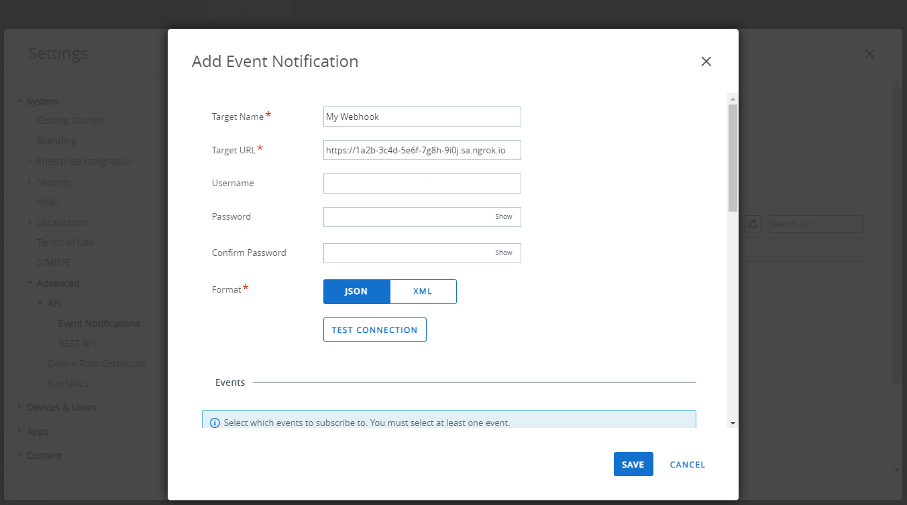

import InspectingRequests from "/snippets/integrations/_inspecting-requests.mdx";
import ReplayingRequests from "/snippets/integrations/_replaying-requests.mdx";

<Tip>
**TL;DR**


To integrate VMware Workspace ONE webhooks with ngrok:

1. [Launch your local webhook.](#start-your-app) `npm start`
1. [Launch ngrok.](#start-ngrok) `ngrok http 3000`
1. [Configure VMware Workspace ONE webhooks with your ngrok URL.](#setup-webhook)
1. [Secure your webhook requests with verification.](#security)
</Tip>

This guide covers how to use ngrok to integrate your localhost app with VMware Workspace ONE by using Webhooks.
VMware Workspace ONE webhooks can be used to notify an external application whenever specific events occur in your VMware Workspace ONE account.

By integrating ngrok with VMware Workspace ONE, you can:

- **Develop and test VMware Workspace ONE webhooks locally**, eliminating the time in deploying your development code to a public environment and setting it up in HTTPS.
- **Inspect and troubleshoot requests from VMware Workspace ONE** in real-time via the inspection UI and API.
- **Modify and Replay VMware Workspace ONE Webhook requests** with a single click and without spending time reproducing events manually in your VMware Workspace ONE account.
- **Secure your app with VMware Workspace ONE validation provided by ngrok**. Invalid requests are blocked by ngrok before reaching your app.

## 1. Start your app 

For this tutorial, we'll use the [sample NodeJS app available on GitHub](https://github.com/ngrok/ngrok-webhook-nodejs-sample).

To install this sample, run the following commands in a terminal:

```bash
git clone https://github.com/ngrok/ngrok-webhook-nodejs-sample.git
cd ngrok-webhook-nodejs-sample
npm install
```

This will get the project installed locally.

Now you can launch the app by running the following command:

```bash
npm start
```

The app runs by default on port 3000.

You can validate that the app is up and running by visiting http://localhost:3000. The application logs request headers and body in the terminal and responds with a message in the browser.

## 2. Launch ngrok 

Once your app is running successfully on localhost, let's get it on the internet securely using ngrok!

1. If you're not an ngrok user yet, just [sign up for ngrok for free](https://ngrok.com/signup).

1. [Download the ngrok agent](https://download.ngrok.com).

1. Go to the [ngrok dashboard](https://dashboard.ngrok.com) and copy your Authtoken. <br />
   **Tip:** The ngrok agent uses the auth token to log into your account when you start a tunnel.
1. Start ngrok by running the following command:

   ```bash
   ngrok http 3000
   ```

1. ngrok will display a URL where your localhost application is exposed to the internet (copy this URL for use with VMware Workspace ONE).
   

## 3. Integrate VMware Workspace ONE 

To register a webhook on your VMware Workspace ONE account follow the instructions below:

1. Access [VMware Workspace ONE](https://console.cloud.vmware.com/) and sign in using your VMware account.

1. On the **Services** page, click **LAUNCH SERVICE** in the **Workspace ONE** tile.

1. On the Workspace ONE **Home** page, click **MANAGE** in the **Unified Endpoint Management** tile.

1. On the **Workspace ONE UEM** page, click **GROUPS & SETTINGS** on the left menu, click **All Settings**, click **Advanced** in the **System** section, click **API**, and then click **Event Notifications**.

1. On the **Event Notifications** page, click the **Override** radio button and then click **ADD RULE**.

1. On the **Add Event Notification** popup, enter `My Webhook` in the **Target Name** field and enter the URL provided by the ngrok agent to expose your application to the internet in the **Target URL** field (that is, `https://1a2b-3c4d-5e6f-7g8h-9i0j.ngrok.app`).
   

1. Click **JSON** as the **Format** and then click **TEST CONNECTION**.

   Confirm your localhost app receives a request and logs both headers and body in the terminal, and the message **Test is successful** appears on the screen.

1. In the **Events** section, click **ENABLED** for all events and then click **SAVE**.

### Run Webhooks with VMware Workspace ONE and ngrok

You can trigger new calls from VMware Workspace ONE to your application by following the instructions below.

1. Access [VMware Workspace ONE](https://console.cloud.vmware.com/), click **LAUNCH SERVICE** in the **Workspace ONE** tile, and then click **MANAGE** in the **Unified Endpoint Management** tile.

1. On the **Workspace ONE UEM** page, click **DEVICES** on the left menu, click **List View** and then click **ADD DEVICE**.

1. On the **Add Device** popup, select a user, enter a valid email address in the **Email address** field in the **Messaging** section, and then click **SAVE**.
   **Note**: If you don't have any users click the **Create New User** link and enter values for all the required fields.

1. The email address you entered in the **Email address** field receives an email with the subject **Workspace ONE UEM Device Activation**. Use a mobile device to open the email and click the link to enroll the device using the **Username** and **Password** of the selected user.

   Confirm your localhost app receives a notification and logs both headers and body in the terminal.

<InspectingRequests />

<ReplayingRequests />

## Secure webhook requests 

The ngrok signature webhook verification feature allows ngrok to assert that requests from your VMware Workspace ONE webhook are the only traffic allowed to make calls to your localhost app.

**Note:** This ngrok feature is limited to 500 validations per month on free ngrok accounts. For unlimited, upgrade to Pro or Enterprise.

This is a quick step to add extra protection to your application.

1. Access [VMware Workspace ONE](https://console.cloud.vmware.com/) and sign in using your VMware account.

1. On the **Services** page, click **LAUNCH SERVICE** in the **Workspace ONE** tile.

1. On the Workspace ONE **Home** page, click **MANAGE** in the **Unified Endpoint Management** tile.

1. On the **Workspace ONE UEM** page, click **GROUPS & SETTINGS** on the left menu, click **All Settings**, click **Advanced** in the **System** section, click **API**, and then click **Event Notifications**.

1. On the **Event Notifications** page, click the radio button of your webhook and then click **EDIT**.

1. On the **Edit Event Notification** page, enter a username in the **Username** field, enter a password in the **Password**, enter the same password in the **Confirm Password** field, and then click **SAVE**.

1. Create a traffic policy file named `vmware_policy.yml`, replacing `{username}` and `{password}` with the corresponding values you provided before:

   ```yaml
   on_http_request:
     - actions:
         - type: verify-webhook
           config:
             provider: vmware_workspace
             secret: "{username}::{password}"
   ```

1. Restart your ngrok agent by running the command:

   ```bash
   ngrok http 3000 --traffic-policy-file vmware_policy.yml
   ```

1. Access [VMware Workspace ONE](https://console.cloud.vmware.com/), register a new user to your device, and ask the user to enroll the device.

Verify that your local application receives the request and logs information to the terminal.
