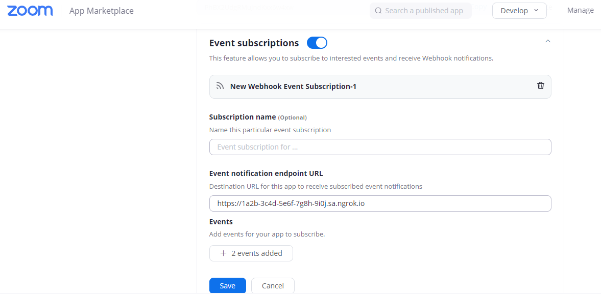
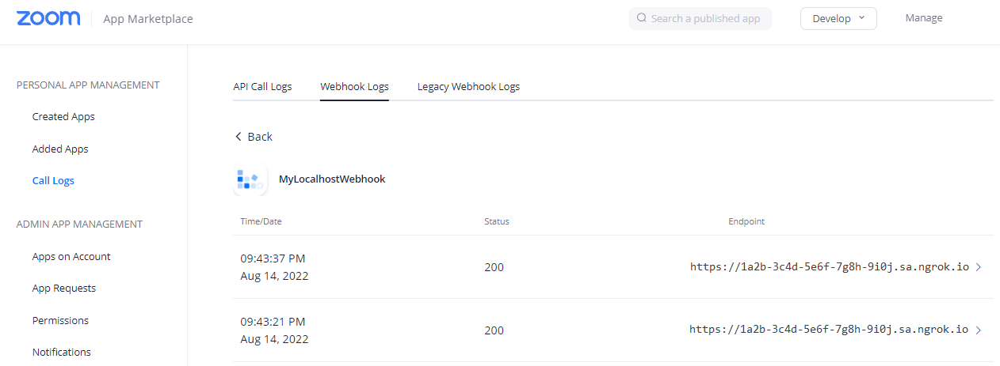

import InspectingRequests from "/snippets/integrations/_inspecting-requests.mdx";
import ReplayingRequests from "/snippets/integrations/_replaying-requests.mdx";

<Tip>
**TL;DR**


To integrate Zoom webhooks with ngrok:

1. [Launch your local webhook.](#start-your-app) `npm start`
1. [Launch ngrok.](#start-ngrok) `ngrok http 3000`
1. [Configure Zoom webhooks with your ngrok URL.](#setup-webhook)
1. [Secure your webhook requests with verification.](#security)
</Tip>

This guide covers how to use ngrok to integrate your localhost app with Zoom using webhooks.
Zoom webhooks can send notifications to external apps whenever specific events occur in your Zoom account.

By integrating ngrok with Zoom, you can:

- **Develop and test Zoom webhooks locally**, eliminating the time in deploying your development code to a public environment and setting it up in HTTPS.
- **Inspect and troubleshoot requests from Zoom** in real-time via the inspection UI and API.
- **Modify and Replay Zoom Webhook requests** with a single click and without spending time reproducing events manually in your Zoom account.
- **Secure your app with Zoom validation provided by ngrok**. Invalid requests are blocked by ngrok before reaching your app.

## 1. Start your app 

For this tutorial, we'll use the [sample NodeJS app available on GitHub](https://github.com/ngrok/ngrok-webhook-nodejs-sample).

To install this sample, run the following commands in a terminal:

```bash
git clone https://github.com/ngrok/ngrok-webhook-nodejs-sample.git
cd ngrok-webhook-nodejs-sample
npm install
```

Now you can launch the app by running the following command:

```bash
npm start
```

The app runs by default on port 3000.

You can validate that the app is up and running by visiting http://localhost:3000. The application logs request headers and body in the terminal and a message in the browser.

## 2. Launch ngrok 

Once your app is running locally, you're ready to put it online securely using ngrok.

1. If you're not an ngrok user yet, just [sign up for ngrok for free](https://ngrok.com/signup).

1. [Download the ngrok agent](https://download.ngrok.com).

1. Go to the [ngrok dashboard](https://dashboard.ngrok.com) and copy your Authtoken. <br />
   **Tip:** The ngrok agent uses the auth token to log into your account when you start a tunnel.
1. Start ngrok by running the following command:

   ```bash
   ngrok http 3000
   ```

1. ngrok will display a URL where your localhost application is exposed to the internet (copy this URL for use with Zoom).
   

## 3. Integrate Zoom 

There are multiple ways you can integrate your application with Zoom. This guide covers the Webhook-only feature, which can be set up using a free Zoom account.

To register for webhook events:

1. Access [Zoom Marketplace](https://marketplace.Zoom.us/) and sign in using your Zoom account.

1. Click **Develop** > **Build App**.

1. Select the **Webhook Only** app.

1. Enter a **Name** for the app and click **Create**.

1. Complete the registration with your **Company Name**, developer **Name**, and **Email address** and click **Continue**.

1. On the **Feature** page, click the **Event subscriptions** slider, click **Add Event Subscriptions**, and for the **Event notification endpoint URL** field use the URL provided by the ngrok agent to expose your application to the internet (that is, `https://1a2b-3c4d-5e6f-7g8h-9i0j.ngrok.app`).
   

   **Tip**: For security purposes, copy the **Secret Token** for later use.

1. Click **Add Events**. and select the events for notification. For this tutorial, select **Start Meeting** and **End Meeting**, and then click **Done**.

1. Finally, back to the **Feature** page, click **Save**, and then click **Continue**.
   The message **Your app is activated on the account** indicates Zoom is ready to send events to your app.

You can review your Webhook by clicking **Manage** in the top-right corner of the Marketplace page.

### Run webhooks with Zoom and ngrok

After you add a webhook to your Zoom account, access your Zoom account, start a meeting, and after a few seconds, end the meeting.
The localhost app receives notifications about both events.

To review the content of these requests in Zoom:

1. Click **Manage** on the top-right corner of the Marketplace page.

1. In the action column click **Call Logs** in the left menu, and then click the **Webhook Logs** tab.

1. Click your Webhook app.
   

1. Expand the last two log entries, compare the **requestBody** attribute with the body of the request received by your application for each event, and then confirm they contain the same data.
   **Note:** Zoom sends different request body contents and headers depending on the trigger event.

## Optional next steps 

Each post request sent by Zoom to your local application contains an **authorization** header with the value of the **Secret Token** provided during the registration of the Webhook.
This information is used to secure your application to make sure it will only process information from the Webhook registered to your Zoom account.

You can either modify the sample app to validate this header information or use the ngrok signature webhook verification feature. See [Add additional security using ngrok signature webhook verification](#security).

<InspectingRequests />

<ReplayingRequests />
## Secure webhook requests 

The verification feature allows ngrok to assert that requests from your Zoom webhook are the only traffic allowed to make calls to your localhost app.

**Note:** This ngrok feature is limited to 500 validations per month on free ngrok accounts. For unlimited, upgrade to Pro or Enterprise.

This is a quick step to add extra protection to your application.

1. Make sure you have copied the **Secret Token** value when you were configuring your Webhook app in Zoom.

1. Create a traffic policy file named `zoom_policy.yml`:

   ```yaml
   on_http_request:
     - actions:
         - type: verify-webhook
           config:
             provider: zoom
             secret: "{your secret token}"
   ```

   **Note**: Replace `{your secret token}` with your **Secret Token** from Zoom.

1. Restart your ngrok agent by running the command:

   ```bash
   ngrok http 3000 --traffic-policy-file zoom_policy.yml
   ```

1. In your Zoom dashboard, start a new meeting, and after a few seconds end the meeting.

Verify that your local application receives the request and logs information to the terminal.
