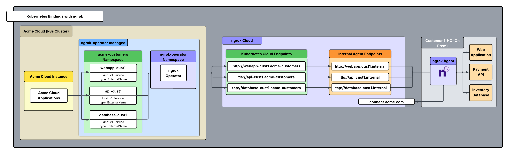
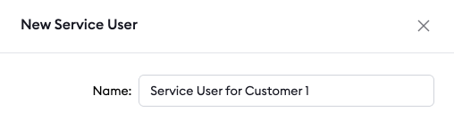
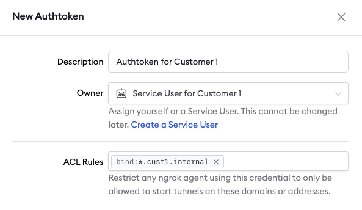
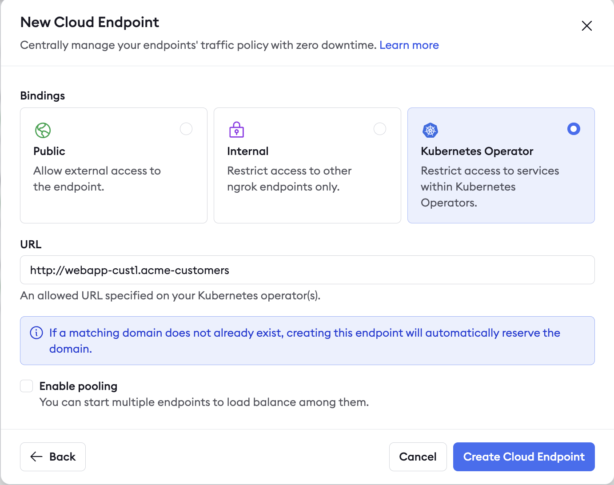

ngrok is a universal gateway, which means it allows you to securely connect to any app, IoT device, or service running in a private environment.

This guide walks you through a practical example of using the [**ngrok Kubernetes Operator**](/k8s/) to establish secure, remote access to services running inside a protected customer network which is not k8s native—all managed seamlessly from within your Kubernetes cluster in your cloud instance. 

While a traditional site-to-site VPN topology can achieve similar connectivity, this approach takes ngrok's secure ingress capabilities to the next level. Connect critical systems without any risk of public addressability or wrestling with the complexity, fragility, and operational overhead of conventional VPN solutions. The result is a privatized, streamlined way to enable secure access.

## Example scenario

You run Acme Corp, a managed service provider (MSP) serving several nationwide retail chains. Each of your customers operates an on-premises retail headquarters with essential back-office systems locked behind strict firewalls. Among these critical services are inventory databases, payment APIs (requiring end-to-end encryption through the ngrok cloud to maintain PCI compliance), and store management web portals. 

To keep operations running smoothly, you need a secure, controlled way to reach these resources directly from your Kubernetes cluster—without exposing them to the public internet or maintaining complex VPN infrastructure. 

In this guide, we'll walk through setting up remote access to the systems in a single customer HQ (Customer 1) using the ngrok Kubernetes Operator, with a repeatable workflow you can apply across your entire retail network.

## Architectural Reference



### What you'll need

- An ngrok account. If you don't have one, [sign up](https://dashboard.ngrok.com/signup).
- An ngrok agent configured on a server within customer 1's network. See the [getting started guide](/getting-started/) for instructions on how to install the ngrok agent.
- The ngrok operator installed on your local Kubernetes cluster.
- [An ngrok API Key](https://dashboard.ngrok.com/api/new). You'll need an account first.

### 1. Create a bot user and authtoken for Customer 1

First, you will create a bot user + associated authtoken for each of your customers.

A bot user is intended for automated systems that programmatically interact with your ngrok account (other platforms sometimes call this concept a Service Account).

We create a separate bot user + associated authtoken for each of your customers so that:

1. Their usage of your ngrok account is isolated and scoped with a specific permission set
2. If a customer is compromised you can revoke their access independently
3. Agent start/stop audit events are properly attributed to each customer
4. Your ngrok agents don't stop working if the human user who set them up leaves your ngrok account.

Navigate to the [service users](https://dashboard.ngrok.com/service-users) section of your dashboard and click on “new service user”.



Create an authtoken for that service user and assign it an ACL rule. By assigning an ACL rule, you can restrict what endpoints the service user with this authtoken can create. Navigate to the authtokens section on your dashboard and click “new authtoken”. Assign it an ACL rule as shown below to restrict any agent using it with permission to only create internal endpoints with a URL matching `*.cust1.internal`.



### 2. Install the ngrok agent within Customer 1's network and configure internal agent endpoints in ngrok.yml

You're now going to configure the agent to create internal agent endpoints that point to the services you want to remotely access. This will connect the services to your ngrok account but nothing will be able to connect to them until we complete the subsequent steps. Additionally, for our TLS  endpoint, we need to configure it so that mTLS is terminated at the ngrok agent and data remains encrypted through the ngrok cloud edge. The configuration to achieve this is shown below in the example agent configuration file.

**Internal Endpoints** are private endpoints that only receive traffic when forwarded through the [forward-internal traffic policy action](/traffic-policy/actions/forward-internal/). This allows you to route traffic to an application through ngrok without making it publicly addressable. Internal endpoint URL hostnames must end with  .internal.

After installing the ngrok agent, define internal endpoints for each service you want to remotely access inside the ngrok configuration file. You can install ngrok and its configuration file in `/path/to/ngrok/ngrok.yml` and the executable in `/path/to/ngrok/ngrok`.

```yaml
version: 3
agent: 
  authtoken: <AUTHTOKEN_FROM_STEP_1>
endpoints:
  - name: Internal Endpoint for Cust 1 Web Application
    url: http://webapp.cust1.internal
    upstream:
      url: 8080
      
  - name: Internal Endpoint for Cust 1 Payment API
    url: tls://api.cust1.internal
    upstream:
      url: 443
    agent_tls_termination:
      server_certificate: "/path/to/app-example-com-crt.pem"
      server_private_key: "/path/to/app-example-com-crt.key"
      mutual_tls_certificate_authorities: "/path/to/app-example-com-ca"
      
  - name: Internal Endpoint for Cust 1 Inventory Database
    url: tcp://database.cust1.internal
    upstream:
      url: 5432
```

### 3. Install the ngrok operator within your Kubernetes cluster

Now we're going to enable applications in your cluster to connect to the remote services. To do this, we'll need to install the ngrok Kubernetes operator into your cluster. The operator will create v1.Service objects that your apps can connect to in order to access the remote services in your customer's network.

First, create a separate bot user with an associated authtoken **and** API key specifically for the operator.

Then install the operator:

```bash
helm install ngrok-operator ngrok/ngrok-operator \
--namespace ngrok-operator \
--create-namespace \
--set description="acme ngrok operator" \
--set bindings.enabled=true \
--set credentials.apiKey=$NGROK_API_KEY \ # api key created for the operator
--set credentials.authtoken=$NGROK_AUTHTOKEN # authtoken created for the operator
```

Lastly, create a namespace for your customer fleet where the Service objects in the next step will be created.

```bash
kubectl create ns acme-customers
```

### 4. Create Kubernetes bound cloud endpoints and attach traffic policy

We are going to create a **Cloud Endpoint** with a [**Kubernetes binding](/universal-gateway/bindings/).** This will create a privately addressable way to access the remote services. These endpoints will only be accessible within Kubernetes clusters where you install the ngrok operator.

Endpoints with a kubernetes binding are secure, private endpoints that are only addressable inside of Kubernetes clusters where you install the ngrok operator. They enable you to connect to ngrok endpoints without making them publicly addressable. In this case, we will create cloud endpoints with a binding of kubernetes.

Cloud Endpoints are persistent, always-on endpoints whose creation, deletion and configuration is managed centrally via the Dashboard or API. They exist permanently until they are explicitly deleted. Cloud Endpoints do not forward their traffic to an agent by default and instead only use their attached Traffic Policy to handle connections.

Create a kubernetes bound cloud endpoint in the ngrok dashboard by navigating to endpoints and clicking “new”. Configure it as shown in the screenshot below:



Additionally, create a cloud endpoint for the other two services: *“tls://api-cust1.acme-customers”* and *“tcp://database-cust1.acme-customers:5432”*. A v1.Service object is created in the namespace determined by the second part of the kubernetes endpoint URL's hostname (acme-customers). The name of the service is denoted by the first part of the endpoint URL's hostname .

Once you've created these endpoints, check your acme-customers namespace in your kubernetes cluster, and you should see three v1.Service objects created named webapp-cust1, api-cust1, and database-cust1.

Click on your newly created web app cloud endpoint and replace the default traffic policy with:

```yaml
on_http_request:
  - actions:
      - type: forward-internal
        config:
          url: http://webapp.cust1.internal
```

Click on your newly created API cloud endpoint and replace the default traffic policy with:

```yaml
on_tcp_connect:
  - actions:
      - type: forward-internal
        config:
          url: tls://api.cust1.internal
```

Click on your newly created database cloud endpoint and replace the default traffic policy with:

```yaml
on_tcp_connect:
  - actions:
      - type: forward-internal
        config:
          url: tcp://database.cust1.internal:5432
```

The [CloudEndpoint Kubernetes custom resource](/k8s/crds/cloudendpoint/) offers another way to create cluster-addressable endpoints. This infrastructure-as-code approach integrates naturally with Kubernetes workflows while maintaining the same automation capabilities as the ngrok API. By using custom resources, you can manage cloud endpoints declaratively—making them accessible only within your cluster while leveraging standard Kubernetes tooling for deployment and lifecycle management. Here's the CloudEndpoint custom resource config with the required traffic policy for the web app cloud endpoint:

```yaml
apiVersion: ngrok.k8s.ngrok.com/v1alpha1
kind: CloudEndpoint
metadata:
  name: acme-k8s-resource
  namespace: acme-customers
spec:
  url: http://webapp-cust1.acme-customers
  trafficPolicy:
    policy:
      on_http_request:
        - actions:
            - type: forward-internal
              config:
              url: http://webapp.cust1.internal
bindings:
- kubernetes
```

## Additional ngrok Features

### Set up a custom connect URL

When the ngrok agent starts, it makes an outbound connection via TLS over port 443 to the ngrok cloud service. This connection is made to the “agent connect URL”. By default, [this connect URL](/agent/connect-url/) is *connect.ngrok-agent.com*, but it can be white-labeled so that your ngrok agents will connect to *connect.acme.com* instead of the default connection hostname. 

This is highly recommended because your customers may need to whitelist egress traffic out of their networks and customers will see this traffic in their network logs. You can also request dedicated IPs for your connect URL that are unique to your account.

```bash
curl \
-X POST \
-H "Authorization: Bearer {API_KEY}" \
-H "Content-Type: application/json" \
-H "Ngrok-Version: 2" \
-d '{"description":"Custom connect URL","domain":"connect.acme.com"}' \
https://api.ngrok.com/agent_ingresses
```

Once we have created the custom connect url, we need to specify this field within the agent configuration file. Add this section to your agent configuration file to specify the custom connect url:

```yaml
version: 3
agent:
  connect_url: connect.acme.com:443
```

### Install ngrok as a background service

You can install ngrok in your customer's network as a native background system service. This ensures the ngrok agent starts on boot and that it will be restarted if it crashes for any reason. This helps ensure that you recover connectivity in the case of unexpected software or hardware failures.

When you do so, ngrok will start all endpoints defined in the configuration file.

```bash
ngrok service install --config /etc/ngrok.yml
ngrok service start
```

<Note>
In most cases, installing ngrok as a service requires administrator privileges.
</Note>

### Eliminate Single Points of Failure with Redundant Agents

Running a single agent in your customer's network is a single point of failure. If that agent or the hardware it runs on fails for any reason, you can no longer connect to the remote services in your customer's network. You can run multiple agents to achieve redundancy and high availability in the case of these failures.

To do this, you will run a separate, second ngrok agent in the customer's network (ideally on a different machine) with an identical configuration file with one small tweak: on each endpoint definition you must specify `pooling_enabled: true`.

This is ngrok's Endpoint Pooling feature. When two endpoints start with the same URL and have pooling enabled, they form an endpoint pool. Incoming traffic to the pooled URL is automatically distributed among all healthy endpoints in the pool. If one endpoint goes offline, traffic is seamlessly routed to the remaining endpoints, ensuring redundancy and failover.

```yaml
# Server 1 (agent1.yml)
version: 3
agent:
  authtoken: <YOUR_NGROK_AUTHTOKEN>
endpoints:
  - name: my-service
    url: 'https://service.internal'
    pooling_enabled: true
    upstream:
      url: http://localhost:8080
---
# Server 2 (agent2.yml)
version: 3
agent:
  authtoken: <YOUR_NGROK_AUTHTOKEN>
endpoints:
  - name: my-service
    url: 'https://service.internal'  # Same URL as Server 1
    pooling_enabled: true
    upstream:
      url: http://localhost:8080
```

### Customize Agent Connection Resiliency

By default, the ngrok agent is already configured for maximum resiliency and built for persistent connectivity. There are some additional measures you can take to ensure control over this.

### Connect Timeout Config Variable

There also exists a config variable (connect_timeout) to specify how long to wait when establishing an agent session connection to the ngrok service. This is specified as a duration, with the default being 10s.

```yaml
version: 3
agent: 
  authtoken: <YOUR_NGROK_AUTHTOKEN>
  connect_timeout: 5s
endpoints:
  - name: my-service 
    url: 'https://app.example.com'
    upstream:
      url: http://localhost:8080
```

### Agent Heartbeat

The agent heartbeat mechanism is crucial for maintaining endpoint stability and ensuring fast reconnections when agents become unhealthy. The ngrok agents send periodic heartbeat signals to the ngrok edge servers where the default interval is 10 seconds. This enables rapid detection of failed agents. Heartbeat interval and tolerance values can be specified in the agent configuration file allowing for flexibility in detection strategy.

```yaml
version: 3
agent:
  authtoken: <YOUR_NGROK_AUTHTOKEN>
  heartbeat_interval: 10s   # How often to send heartbeat
  heartbeat_tolerance: 15s  # How long before considering connection dead
endpoints:
  - name: my-service
    url: 'https://app.example.com'
    upstream:
      url: http://localhost:8080
```

## Recap

Congrats! You have now integrated a system that allows you to seamlessly and granularly access your remote resources within your customer's network directly from your Kubernetes cluster. Let's recap what you've built:

1. Singular ngrok operator installed in your k8s cluster to create service objects using k8s cloud endpoints.
2. One ngrok agent per customer network, with multiple installs/endpoint pooling available for resiliency failover and reliability.
3. Private, kubernetes bound cloud endpoints used in service projection, forwarded traffic to internal agent endpoints for e2e connectivity.
4. E2E encryption with agent mTLS termination and TLS endpoints
