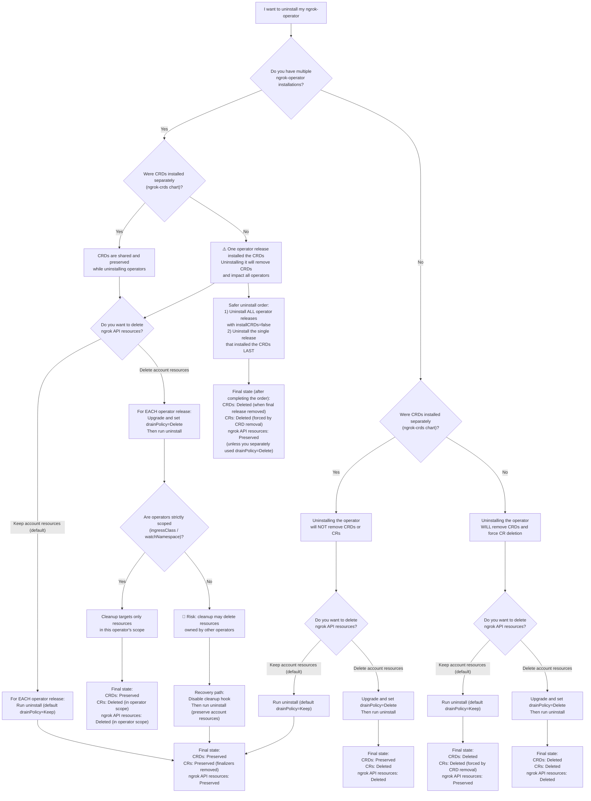

The `ngrok-operator` helm chart includes multiple `CRDs` that get installed in your kubernetes cluster. These CRDs are resources users can create directly (Such as directly creating a `CloudEndpoint`) and the `ngrok-operator` will also use these by creating resources that are derived from user created `Ingress` objects.

The `Ingress` objects and ngrok `CRDs` use [finalizers](https://kubernetes.io/docs/concepts/overview/working-with-objects/finalizers/). These prevent Kubernetes from removing the objects when a delete is initiated until the Operator can do some task (such as removing them from the ngrok API) before letting them be cleaned up.

If the operator is not running, it can block deleting these resources, the CRDs, or namespaces resources live in.

## Recommended setup and steps

The following are recommendations that will make uninstalling the operator much simpler and error proof to avoid stuck situations.

### Install the Operator in its own namespace

Its recommended to install the operator in its own namespace such as `ngrok-operator`. This should be separate from the namespace you create `Ingress` objects or `CRs` in. This would let you delete a namespace filled with `Ingress` objects and the operator won't get torn down during the process allowing them to be cleaned up.

### Delete resources before uninstalling

By default, the operator will NOT delete API resources from your ngrok account such as CloudEndpoints when its simply helm uninstalled. This prevents an uninstall from taking down Cloud Infrastructure that may be supporting a production site.

If you would like to delete everything as well, its highly recommended to delete all the kubernetes resources like `Ingress` and crds like `CloudEndpoints` BEFORE uninstalling the operator. This allows it to handle those delete events and clean them up from your account

## Uninstalling: default behavior (preserve account resources)

By default, the `ngrok-operator` helm chart installs the CRDs as a part of the same helm release. So uninstalling the operator will uninstall the CRDs forcing all CRs into deletion.

To avoid tearing down the operator and having all those `CRs` get stuck with their finalizer, by default running

`helm uninstall ngrok-operator -n ngrok-operator`

runs a helm `pre-delete hook` job. This:
- job toggles the operator so it will stop reconciling its resources
- patches every resources finalizer removing them

Once done, it allows the helm uninstall to progress, uninstalling the `CRDs` and tearing down the operator deployment.

NOTE: By default, the `ngrok-operator` is built with production usecases and safety in mind. Uninstalling the chart leaves ngrok api cloud resources in your account.

## Uninstalling: clean up account resources

By default, uninstalling the chart keeps resources like `CloudEndpoints` and `Domains` created in your ngrok account.

If you want these to be deleted, first do a helm upgrade and set the `drainPolicy` value to `Delete`

```sh
helm upgrade ngrok-operator ngrok/ngrok-operator \
  --namespace=ngrok-operator \
	--reuse-values \
	--set drainPolicy="Delete"
```

Now, when you run `helm uninstall ngrok-operator -n ngrok-operator` it will run the same `pre-delete helm hook` job. However instead of simply patching finalizers, it will delete each `CR` and wait for them to be deleted.

It will NOT delete user created `Ingress` objects. It will just remove their finalizers so they can be deleted afterwards if desired.

## Separate CRD installation

Instead of installing the `CRDs` with the same helm release as the `ngrok-operator` you can install them separately first


```
helm repo add ngrok https://charts.ngrok.com
helm repo update

helm install ngrok-crds ngrok/ngrok-crds

helm install ngrok-operator ngrok/ngrok-operator \
--namespace=ngrok-operator \
--create-namespace \
--set credentials.apiKey=$NGROK_API_KEY \
--set credentials.authtoken=$NGROK_AUTHTOKEN \
--set installCRDs=false  # IMPORTANT
```

This means that when uninstalling the operator, it will NOT force an uninstall of the CRDs forcing a deletion of the CRs

### Default behavior

Similar to before, by default the `pre-delete helm hook` job will run and remove finalizers from all the resources and tear down the Operator.

HOWEVER, now instead of all the CRs being deleted because their `CRDs` were deleted, instead they are preserved and don't have finalizers. This would allow you to:
- delete those resources without having them hung by finalizers
- delete namespaces those resources are in without having them hung by finalizers
- uninstall the CRDs separately without having the CRs hung by finalizers

### Clean up account resources

Again, similar to above, you can use `helm upgrade` to set the `drainPolicy` flag. This will cause the CRs to actually be deleted and have the corresponding resources deleted from your ngrok account.

## Multiple Installations

If you have multiple operators installed (see [Multiple Installs](./multiple-installs.mdx)) the behavior depends heavily on:
- how they were installed
- which one you are uninstalling

:warning: It is Highly recommended to install the `CRDs` separately. If 1 ngrok-operator chart install includes the `CRDs`, all running operators rely on these so uninstalling that one would break them all.

If you are in this situation:
- first helm uninstall ALL operators that have `installCRDs` set to `False`
- lastly, you can uninstall the single installation that includes the `CRDs`

This results in preserving all the ngrok api resources in your account, but fully cleans up the operators, `CRDs`, and `CRs`

### Clean up account resources

Similar to a single installation, you can also `helm upgrade` an existing install and set its `drainPolicy` to `Delete`. This again causes the `helm uninstall` to run a `pre-delete helm hook` job that deletes resources before proceeding.

In a multi-install scenario, you MUST have configured your different operators to reconcile different resources like `Ingress` and `CRDs` via some combination of:
- specifying an `ingress.ingressClass.name` for each scoping them to watch separate Ingress objects
- specifying an `ingress.watchNamespace` field for each scoping them to watch separate namespaces

The `pre-delete helm hook` job that deletes resources will use these same filters.

:warning: DANGEROUS :warning:

If you have multiple operators watching the same resources, you may have a bad time. For example if you had an operator scoped to watch 1 namespace and another without a namespace filter, then uninstalling the one without a namespace filter will delete ALL resources it can see across all namespaces. Its recommended to:
- Not do this
- If you did this, disable the cleanup job and uninstall it without cleanup

## Disabling the cleanup job

If you prefer manual cleanup or have a custom uninstall process:

```yaml
cleanupHook:
  enabled: false
```

## Triggering cleanup without Helm

If you are not using a system that lets you use helm hooks, you can trigger the process yourself manually. Simply issue a delete on the `KubernetesOperator` resource in the namespace you installed the operator

`kubectl delete kubernetesoperator <release-name> -n <namespace> --wait=true`

This will cause the operator to stop reconciling objects and begin draining the `CRs` from the system respecting the `drainPolicy` set when installed.

Once the `KubernetesOperator` CRD is deleted, you can proceed uninstalling the actual operator and/or CRDs how you see fit.

## ReInstalling

After uninstalling, your cluster and its resources may be left in 1 of various different states depending on how the install and uninstall was done:

- Ingress objects should still exist but won't have finalizers and aren't being used
- CRs
  - May be completely deleted
  - May still exist in cluster without finalizers but still have their Status information
- ngrok API resources may still exist or may have been deleted due to the `drainPolicy`

In scenarios where the resources were cleaned up from the ngrok api, then re-installing should just recreate them.

If you previously had manually created a CRD like a `CloudEndpoint`, and uninstalling did not delete the CRDs, your user created `CRs` would still exist with their status information and no finalizer. Re-installing the operator will have it just re-add the finalizer and no-op.

If however, uninstalling removes the CRDs forcing a delete of the CRs, then you will need to re-apply your manifest to recreate the CRs after re-installing. :Warning: If it preserved resources in your ngrok account as well, this may result in duplicate CloudEndpoints to be created in a pool. You should

For Ingress objects though, the new operator will see them and create the corresponding resources for you automatically.

:Warning: If you uninstall with the default setting of `drainPolicy=Keep` and have an Ingress Object, re-installing may create duplicate resources. TODO: If the change is undone so the store doesn't reap CRs, this could avoid the duplicate API resources in the scenario where CRDs are installed separately so uninstalling doesn't force deleting them all.


## Troubleshooting
- how to get job pod logs
- how to get cleanup logs from operator
- configuring the job's timeouts and such
- link to ./finalizers.mdx for how to just delete hung finalizers


