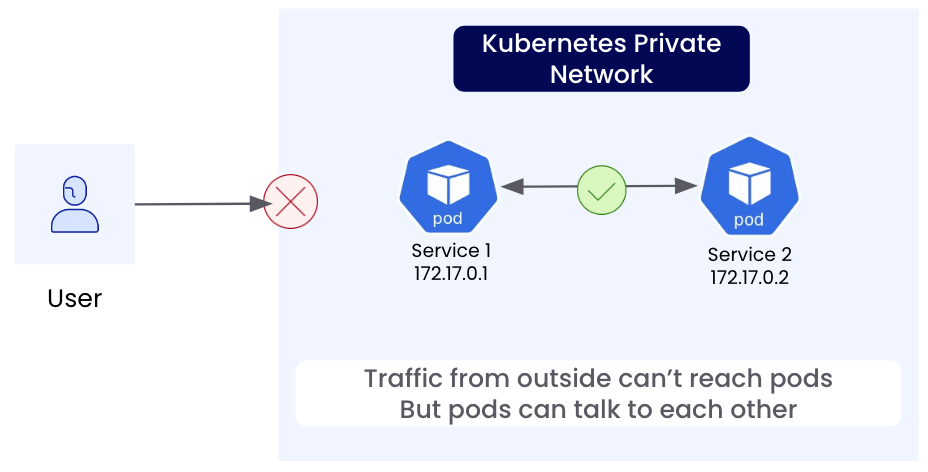

A Kubernetes cluster has its own private network internally that pods get IP addresses from.
This network is not accessible to the outside world, similar to how your home network is usually not accessible by anyone on the internet.

By default, Kubernetes offers similar types of approaches to exposing traffic as you'd expect at home:

- You can port forward: In Kubernetes, this is a temporary solution using `kubectl`.
  At home, you can configure your router. Both may be disrupted if your public IP address changes.
- You can use an external load balancer of some sort that still needs access to the internal network somehow.

In this case below, the user cannot access the pod directly in the k8s private network without some sort of entry point.

In Kubernetes, operators (like the ngrok Kubernetes Operator) provide configuration options such as the existing Kubernetes Ingress and Gateway resources, and sometimes define their own configuration resources.
These configuration resources provide a standard way of defining what traffic should be accepted, what operations should happen to the traffic (such as enforcing authentication or editing headers), and finally where the traffic should go.

This follows the declarative nature of Kubernetes since the developer describes what they need and the Operator figures out how to provide it.

With ngrok, the Operator establishes a secure outbound connection to the ngrok service which creates a public endpoint for your Kubernetes service.
When someone hits the public endpoint, that traffic is sent down to the ngrok Kubernetes Operator and is forwarded to the services in the cluster.

Once installed, the wide variety of configuration options make it easy to separate concerns and responsibilities.
For example, an operations/infrastructure team can manage the resources like `Gateway` from Gateway API that define what hostnames/protocols/ports to accept traffic on while other developers or teams can create, update, and manage configuration resources such as `HTTPRoute`, which define which services the traffic should be sent to.
This allows your operations/infrastructure team to focus on the higher-level policy about what kinds of traffic to accept while allowing other teams to self-service deploying their services/applications and routing traffic to them without needing to put in a request for the operations/infrastructure team to do that for them.

