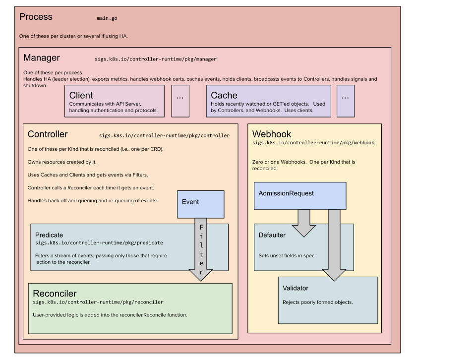

The ngrok Kubernetes Operator is a series of Kubernetes style control loops that watch Ingress and other k8s resources and manage tunnels in your cluster and the ngrok API to provide public endpoints for your Kubernetes services leveraging ngrok's endpoints features.
This page is meant to be a living document detailing noteworthy architecture notes and design decisions. This document should help:

- Consumers of the operator understand how it works
- Contributors to the operator understand how to make changes to the operator and plan for future changes
- Integration partners can understand how it works to see how to integrate together.

Before jumping directly into the ngrok operator's specific architecture, first go over some core concepts about what controllers are and how they are built.

## What is a controller

The word _controller_ can sometimes be used in ways that can be confusing.
While the whole thing is commonly referred to as the operator or an ingress _controller_, in reality, many _controllers_ are actually a Controller Runtime Manager which runs multiple individual [Controllers](https://kubernetes.io/docs/concepts/architecture/controller/) and provides common things to them like shared Kubernetes client caches and leader election.

> From: https://book.kubebuilder.io/architecture.html

Individual controllers and the overall operator are built using the kubernetes controller-runtime library which k8s itself leverages for its internal controllers (such as Deployment or StatefulSet controllers).
Its Go-docs explain each concept fairly well starting here https://pkg.go.dev/sigs.k8s.io/controller-runtime#hdr-Managers

## Controllers

Internally, the ngrok Kubernetes Operator is made up of many different controllers working in concert with each other, communicating via the Kubernetes API to interpret Ingress objects, Gateway API resources, and custom resources to create ngrok infrastructure that provides the specified functionality.
Each of these controllers uses the same basic workflow to manage its resources.

## Deployments

The ngrok Kubernetes Operator comes with two primary `Deployments` and one third optional `Deployment`

### The manager deployment

The manager deployment is primarily responsible for synchronizing the state of your resources with the ngrok API.
It will perform actions such as creating/updating/deleting Cloud Endpoints, Domains, etc. as needed.
It also has the responsibility of watching `Ingress` and Gateway API resources and translating them into ngrok native custom resources.

It runs Controllers that watch and manage the following resources

- `Ingress`
- `Service`
- `Namespace`
- `Secret`
- `Domain`
- `NgrokTrafficPolicy`
- `KubernetesOperator`
- `CloudEndpoint`
- `IPPolicy`
- `BoundEndpoint` (only enabled if the bindings feature is enabled )
- `GatewayClass` (only enabled when Gateway API CRDs are detected)
- `Gateway` (only enabled when Gateway API CRDs are detected)
- `HTTPRoute` (only enabled when Gateway API CRDs are detected)
- `ReferenceGrant` (only enabled when Gateway API CRDs are detected)
- `TCPEdge` (deprecated, will be removed soon)
- `TLSEdge` (deprecated, will be removed soon)
- `HTTPSEdge` (deprecated, will be removed soon)
- `NgrokModuleSet` (deprecated, will be removed soon)

### The Agent deployment

The Agent deployment is responsible for handling the connections to your upstream services.
It starts controllers to watch the following resources related to upstream services.

- `AgentEndpoint`
- `Secret`
- `Tunnel`

### The bindings forwarder deployment

The bindings forwarder deployment is responsible for forwarding requests to and from Kubernetes bound endpoints that are projected into the cluster as `Service` resources.
It starts a controller that watches `BoundEndpoint` resources to know what it needs to forward and where it needs to forward to/from.
For more information about bindings, see [the bindings guide](/k8s/guides/bindings)
