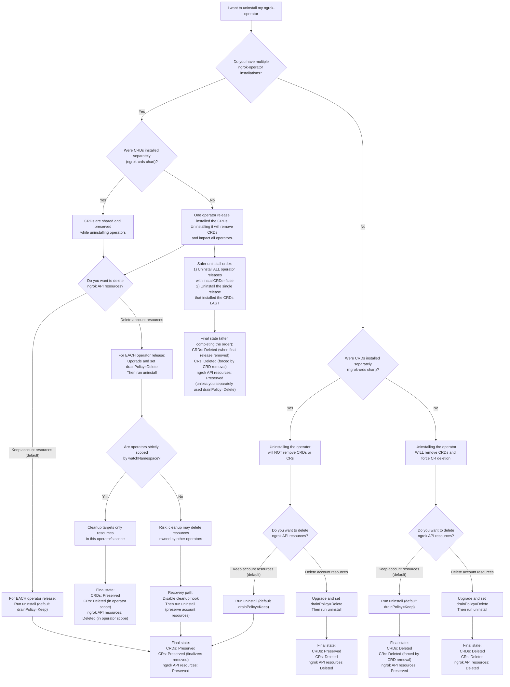

The `ngrok-operator` helm chart uses [finalizers](/k8s/guides/finalizers) on its custom resources to ensure proper cleanup of ngrok API resources before deletion. The chart includes a `pre-delete` helm hook that automates removing these finalizers and optionally deleting resources during uninstall.

## Quick uninstall (preserves ngrok account resources)

By default, uninstalling the operator **preserves** resources in your ngrok account such as CloudEndpoints and Domains. This prevents an uninstall from taking down cloud infrastructure that may be supporting a production site.

```bash
helm uninstall ngrok-operator -n ngrok-operator
```

When you run this command, a `pre-delete` helm hook job automatically:

1. Signals the operator to stop reconciling resources
2. Patches every custom resource to remove its finalizer
3. Allows the helm uninstall to proceed, tearing down the operator deployment and CRDs

Your ngrok API resources remain in your account and can be managed through the [ngrok Dashboard](https://dashboard.ngrok.com) or API.

## Cleaning up ngrok account resources

If you want to also **delete** ngrok API resources (CloudEndpoints, Domains, etc.) from your account during uninstall, first upgrade your release to set the `drainPolicy` to `Delete`:

```bash
helm upgrade ngrok-operator ngrok/ngrok-operator \
  --namespace=ngrok-operator \
  --reuse-values \
  --set drainPolicy="Delete"
```

Now when you run `helm uninstall ngrok-operator -n ngrok-operator`, the `pre-delete` hook job will:

1. Delete each custom resource and wait for the operator to clean up the corresponding ngrok API resource
2. Remove finalizers from `Ingress` objects (but does NOT delete them)
3. Allow the helm uninstall to proceed

<Warning title="Ingress objects are not deleted">
The cleanup job removes finalizers from user-created `Ingress` objects but does not delete them. You can delete them manually afterwards if desired.
</Warning>

## Recommended setup

The following recommendations make uninstalling simpler and help avoid stuck resources:

- **Install the operator in its own namespace** (e.g. `ngrok-operator`). Keep it separate from the namespace where you create `Ingress` objects or custom resources. This way, if you delete a namespace full of resources, the operator stays running and can process the deletions.

- **Install CRDs separately** using the `ngrok-crds` chart. This decouples CRD lifecycle from the operator. See [Separate CRD installation](#separate-crd-installation) below.

- **Delete resources before uninstalling** if you want to clean up your ngrok account. Deleting `Ingress` objects and custom resources like `CloudEndpoint` while the operator is still running gives it time to properly clean up the corresponding ngrok API resources.

## How the uninstall process works

The ngrok-operator uses [finalizers](/k8s/guides/finalizers) on its custom resources. These prevent Kubernetes from removing objects until the operator has performed cleanup tasks, such as deleting the corresponding resource from the ngrok API.

When you `helm uninstall`, the chart's `pre-delete` hook job handles these finalizers so you don't have to. What happens depends on two factors:

1. **How CRDs were installed** — bundled with the operator chart (default) or separately via the `ngrok-crds` chart
2. **The `drainPolicy` value** — `Keep` (default) or `Delete`

### CRDs bundled with operator (default)

When CRDs are part of the same helm release, uninstalling the operator also uninstalls the CRDs, which forces all custom resources into deletion.

| drainPolicy | Behavior |
|---|---|
| `Keep` (default) | Hook removes all finalizers. Helm then deletes CRDs, forcing CR deletion. ngrok API resources are **preserved**. |
| `Delete` | Hook deletes each CR and waits for cleanup. Helm then deletes CRDs. ngrok API resources are **deleted**. |

### CRDs installed separately

When CRDs are installed via the `ngrok-crds` chart with `installCRDs=false` on the operator, uninstalling the operator does **not** remove the CRDs or force CR deletion.

| drainPolicy | Behavior |
|---|---|
| `Keep` (default) | Hook removes all finalizers. CRDs and CRs remain in the cluster (without finalizers). ngrok API resources are **preserved**. |
| `Delete` | Hook deletes each CR and waits for cleanup. CRDs remain in the cluster. ngrok API resources are **deleted**. |

With separate CRDs and `drainPolicy=Keep`, the remaining CRs are left without finalizers, which means you can:
- Delete those resources without them getting stuck
- Delete namespaces containing those resources without them getting stuck
- Uninstall the CRDs separately whenever you're ready

## Separate CRD installation

Instead of bundling CRDs with the operator, you can install them separately. This is **strongly recommended** for production and **required** for [multiple installations](/k8s/guides/multiple-installs).

```bash
helm repo add ngrok https://charts.ngrok.com
helm repo update

helm install ngrok-crds ngrok/ngrok-crds

helm install ngrok-operator ngrok/ngrok-operator \
  --namespace=ngrok-operator \
  --create-namespace \
  --set credentials.apiKey=$NGROK_API_KEY \
  --set credentials.authtoken=$NGROK_AUTHTOKEN \
  --set installCRDs=false
```

When you're ready to remove the CRDs (after uninstalling all operators that depend on them):

```bash
helm uninstall ngrok-crds
```

## Multiple installations

If you have multiple operators installed (see [Multiple Installations](/k8s/guides/multiple-installs)), the uninstall behavior depends on how they were installed and which one you are uninstalling.

<Warning title="Install CRDs separately with multiple operators">
If one operator release includes the CRDs, all running operators rely on them. Uninstalling that release removes the CRDs and breaks every other operator.
</Warning>

When uninstalling one of multiple operators:

1. First uninstall operators that have `installCRDs=false`
2. Last, uninstall the single installation that includes the CRDs (if applicable)

### Cleaning up account resources with multiple operators

You can `helm upgrade` a specific operator to set `drainPolicy=Delete` before uninstalling it. The cleanup job uses the same `ingress.watchNamespace` filter that the operator uses, so it only deletes resources within that operator's scope.

<Warning title="Overlapping watch scopes are dangerous">
If you have multiple operators watching the same resources (for example, one scoped to a namespace and another without a namespace filter), uninstalling the unscoped operator with `drainPolicy=Delete` will delete **all** resources it can see across all namespaces. If you're in this situation, disable the cleanup job and uninstall without automated cleanup.
</Warning>

## Disabling the cleanup job

If you prefer manual cleanup or have a custom uninstall process, disable the helm hook:

```yaml
# values.yaml
cleanupHook:
  enabled: false
```

With the cleanup job disabled, you are responsible for removing finalizers and cleaning up resources before uninstalling. See [Manually removing finalizers](/k8s/guides/finalizers#manually-removing-finalizers) for instructions.

## Triggering cleanup without Helm

If you are not using a system that supports helm hooks (e.g. some GitOps tools), you can trigger the cleanup process manually by deleting the `KubernetesOperator` resource:

```bash
kubectl delete kubernetesoperator <release-name> -n <namespace> --wait=true
```

This causes the operator to stop reconciling objects and begin draining custom resources, respecting the `drainPolicy` set during installation. Once the `KubernetesOperator` resource is deleted, you can proceed to uninstall the operator and CRDs however you see fit.

## Reinstalling after uninstall

After uninstalling, your cluster may be in different states depending on how the install and uninstall were done:

- **Ingress objects**: Still exist but without finalizers and aren't being reconciled
- **Custom resources**: May be fully deleted, or may still exist without finalizers but with their Status information intact
- **ngrok API resources**: May still exist in your account or may have been deleted (depending on `drainPolicy`)

**If ngrok API resources were cleaned up** (`drainPolicy=Delete`): Reinstalling the operator will recreate them from your existing Kubernetes resources.

**If ngrok API resources were preserved** (`drainPolicy=Keep`):
- If CRDs were installed separately and CRs still exist in the cluster, reinstalling the operator will re-add finalizers and resume managing them with no duplication.
- If CRDs were bundled and were deleted (forcing CR deletion), you'll need to reapply your manifests. This may create duplicate resources (e.g. a second CloudEndpoint in a pool) if the originals still exist in your ngrok account. Check the [ngrok Dashboard](https://dashboard.ngrok.com) and clean up any duplicates.
- For `Ingress` objects, the new operator will see them and automatically create the corresponding resources.

## Troubleshooting

### Viewing cleanup job logs

The `pre-delete` helm hook runs as a Kubernetes Job. To view its logs:

```bash
# List jobs in the operator namespace (the cleanup job will have a name like <release>-cleanup)
kubectl get jobs -n ngrok-operator

# View the job's pod logs
kubectl logs -n ngrok-operator job/<release-name>-cleanup
```

### Viewing operator drain logs

If you triggered cleanup via the `KubernetesOperator` resource, the drain process runs inside the operator pod:

```bash
kubectl logs -n ngrok-operator deploy/ngrok-operator-manager | grep -i "drain\|cleanup\|finalizer"
```

### Resources stuck in Terminating state

If resources are stuck with unresolved finalizers (for example, because the operator was removed before it could clean them up), see [Manually removing finalizers](/k8s/guides/finalizers#manually-removing-finalizers) for how to patch individual resources or [bulk remove finalizers](/k8s/guides/finalizers#removing-finalizers-from-all-ngrok-resources) from all ngrok resources.

### Namespace stuck in Terminating state

A namespace will not delete if it contains resources with unresolved finalizers. Resolve the stuck resources first using the methods above, then the namespace deletion will complete.

### Cleanup job timeout

If the cleanup job is taking too long (for example, waiting for many resources to be deleted from the ngrok API), you can configure the job's timeout in your helm values. If the job times out, you may need to [manually remove finalizers](/k8s/guides/finalizers#manually-removing-finalizers) from any remaining resources.

## Decision flowchart

The following diagram walks you through the uninstall process based on your setup:


