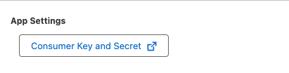

This guide walks you through enabling Salesforce as an Identity Provider to allow single sign-on (SSO) into your ngrok dashboard.
This should not be confused with securing your ngrok edge to allow your application users to log in using Salesforce.

## What you'll need

- Administrative access to create new applications in Salesforce
- Admin access to edit your ngrok account settings
- An ngrok Enterprise account or an SSO/Account Governance license

You may also want to consult the Saleforce documentation on [configuring an authentication provider using OpenID Connect](https://help.salesforce.com/s/articleView?id=xcloud.sso_provider_openid_connect.htm&type=5).

:::note
The OIDC flow is initiated from your Applications login page.
(OIDC Service Provider flow is not supported.)
:::

## 1. Configure Salesforce

Begin by creating a new External Client App in Salesforce:

Configure your new external app according to the following criteria:

1.  In the **Policies** tab:
    - Go to **App Policies**
      - Set Start Page to Custom
      - Set Custom Start URL to `https://dashboard.ngrok.com/login/sso`
2.  In the **Settings** tab:
    - Go to **Basic Information** and set the External Client App Name
    - Go to **OAuth Settings > App Settings**:
      - Set the OAuth Scopes:
        - Access the Identity URL Service (id, profile, email, address, phone)
        - Access unique identifiers (openid)
        - Access custom permissions (custom_permissions)
      - Set Configure ID Token:
        - Set ID Token Audience to: `https://idp.ngrok.com`
        - Set Include Standard Claims
        - Set Custom Attributes
      - Flow Enablement:
        - Set Enable Authorization Code and Credentials Flow
      - Security:
        - Set Require Secret for Web Server Flow
        - Set Require Secret for Refresh Token Flow

Finally, note your Client ID (Consumer Key) and Secret—these can be found in **OAuth Settings > App Settings**:

## 2. Configure ngrok

Now, configure SSO for your ngrok account:

1. Log into your ngrok dashboard and navigate to **Settings > Account**.
2. Click **+ New Identity Provider** and select **New OpenID Connect Provider**.
   
3. Add a description and set the following details:

   - Issuer URL, in the format `[yourdomain]-dev-ed.develop.lightning.force.com`
   - Client ID (from Salesforce)
   - Client Secret (from Salesforce)

You should now be configured properly to log into your ngrok account using Salesforce.

By default, users will still be able to log into ngrok with their existing credentials as well as through Salesforce—this is known as "mixed mode."
Once you verify that everything is working properly with your integration, you can enforce SSO in the ngrok dashboard and require all new users to log in through Salesforce for their ngrok account.
