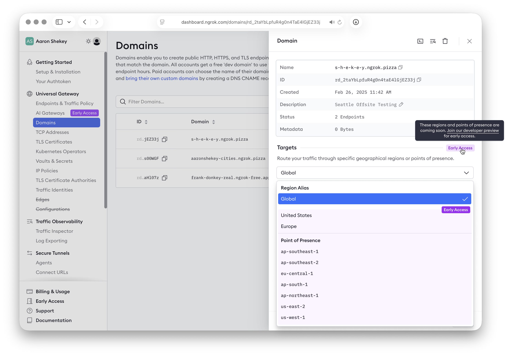

<Info>
This feature is under active development. Behavior, supported fields, and limits may change before General Availability (GA). This guide is provided as forward-looking context for evaluation and feedback.
<br /><br />
[Visit this page](https://dashboard.ngrok.com/developer-preview) to sign up for Early Access, or to send input ('Let us know' link at the bottom).
</Info>


Region Pinning allows you to control the physical location of where your ngrok traffic is handled. 

You can control traffic into your [ngrok Domains](https://ngrok.com/docs/universal-gateway/domains), restricting it to a subset of our globally distributed physical [Points of Presence](https://ngrok.com/docs/universal-gateway/points-of-presence). 

- Coming soon, you can also restrict to your own [Dedicated IPs](#dedicated-ips).
- You can *combine* these restrictions for maximum flexibility.

This feature is designed for customers with **data residency** and **compliance requirements** who need to ensure traffic is only processed in specific geographical boundaries.

# How it works:

1. Define which ngrok [Points of Presence](https://ngrok.com/docs/universal-gateway/points-of-presence) your [Domain](https://ngrok.com/docs/universal-gateway/domains) is allowed to use. 
2. All requests to [Endpoints](https://ngrok.com/docs/universal-gateway/endpoints) on that Domain will ***only*** be routed through your chosen Points of Presence. 


# How to configure region pinning

To start using region pinning: update your [Domain resource](https://ngrok.com/docs/universal-gateway/domains) with your preferred set of target regions.

You can do this through our **API** or **dashboard**. 

## Using the API

When using the API, you’ll setup Region Pinning by defining which [Points of Presence](https://ngrok.com/docs/universal-gateway/points-of-presence) (PoPs) or Region aliases should serve your requests. 

Just add the `ips` property when *creating* or *modifying* ****a Domain.

### Option 1: Create a pinned domain

Use the `POST /reserved_domains` endpoint ([documentation](https://ngrok.com/docs/api-reference/reserveddomains/create)).

Add a list of `ips` that will resolve your request — today, these are the ngrok [physical Points of Presence](https://ngrok.com/docs/universal-gateway/points-of-presence) (like “Frankfurt” or “California”) that are allowed to resolve handle your traffic.

```json
curl --request POST \
 --url https://api.ngrok.com/reserved_domains \
 --header "Authorization: Bearer <token>" \
 --header "Content-Type: application/json" \
 --header "ngrok-version: 2" \
 --data '{
    "domain": "api.example.com",
    "description": "Pinned to US and Europe for compliance reasons",
    "certificate_management_policy": {
      "authority": "letsencrypt",
      "private_key_type": "ecdsa"
    },
    "ips": [
      { "value": "us-ohio-1"},  
      { "value": "de-fra-1"}
    ]
  }'
```

### Option 2: Update an existing domain

You can update existing Domains to *add* Region Pinning, *remove* it, or *modify* your set of pinned Regions. 

No DNS changes are required; just update the `ips` property in your Domain. 

Use `PATCH` to update the list of pinned regions (see [API docs](https://ngrok.com/docs/api-reference/reserveddomains/update)).

```json
curl --request PATCH \
 --url https://api.ngrok.com/reserved_domains/{domain_id} \
 --header "Authorization: Bearer <token>" \
 --header "Content-Type: application/json" \
 --header "ngrok-version: 2" \
 --data '{
    "domain": "api.example.com",
    "description": "Pinned to US and Europe for compliance reasons",
    "certificate_management_policy": {
      "authority": "letsencrypt",
      "private_key_type": "ecdsa"
    },
    "ips": [
      { "value": "us-ohio-1"},  
      { "value": "de-fra-1"}
    ]
  }'
```

### Un-pin a Domain

To “un-pin” a Domain — change it back to the default **Global** routing — set the `ips` property to an empty list `[]` or to the alias `global`.

  1) Remove pinned regions by setting an empty list:

```json
# Revert to Global Routing
curl --request PATCH \
 --url https://api.ngrok.com/reserved_domains/{id}  \
 --header "Authorization: Bearer <token>" \
 --header "Content-Type: application/json" \
 --header "ngrok-version: 2" \
 --data '{
   "ips": [] 
 }'  
```

 2) Remove pinned regions by setting the `global` alias.

```json
# Only change the last property. The rest is same as above.

 --data '{
   "ips": [
     { "value": "global" }
   ]
 }'  
```

### API error handling

If a request has invalid syntax or a non-existent region code, the API request will fail.

The request returns **HTTP 400 Bad Request** with a structured error body, similar to this:

```json
HTTP/1.1 400 Bad Request
Content-Type: application/json; charset=utf-8

{
 "status_code": 400,
 "error_code": "invalid_region_target",
	 "msg": "Invalid region target 'banana': must be a valid Point of Presence or Regional Alias.",
 "details": {}
}
```

## Using the Dashboard

You can also make these changes through the [ngrok dashboard](https://dashboard.ngrok.com/domains). 

*[Preview — these designs are subject to change]*

To configure your “pinned” regions: 

1. View your existing Domains at dashboard.ngrok.com/domains
2. Click into the Domain you wish to modify. 
3. Choose your target regions from the dropdown menu. 
    1. Select a set of [Points of Presence](https://ngrok.com/docs/universal-gateway/points-of-presence), or choose a “Region alias” that covers multiple PoPs — or both!



# Dedicated IPs
<Info>
Another Preview feature -- related to Region Pinning, but will be released separately. [Sign up for Early Access](https://dashboard.ngrok.com/developer-preview).
</Info>

Dedicated IPs let you configure a Domain’s matching endpoints to receive traffic on IP addresses that are **dedicated only to your account** — rather than using ngrok’s default range of multi-tenant IP addresses shared across our customers.

When a Domain uses dedicated IPs, you can create matching endpoints on any inbound port (not just 80/443).

### How to use it

Dedicated IPs and Region Pinning share the same `ips` field on the Domain:

- Region Pinning: `ips: [{ "value": "<region-code>" }]`
- Dedicated IPs: `ips: [{ "value": "<ip-address>" }]`

You can include both (example below).

```json
{
  "ips": [
    { "value": "us-ohio-1"" },
    { "value": "203.0.113.10" }
  ]
}

```

# FAQs (Frequently Asked Questions)

1. **Does this affect TCP endpoints?**
    - Region pinning: no, only HTTP/HTTPS traffic, because TCP addresses are inherently region-pinned based on the address assignment.
    - Dedicated IPs: yes, Dedicated IPs are available for *any* [ngrok-supported protocol](https://ngrok.com/docs/universal-gateway/protocols):  HTTP, HTTPS, TCP, TLS
2. **What happens if I omit the `targets` field when creating a Domain?**
    1. A: it defaults back to standard **GLOBAL** routing, where we automatically route traffic through the *best option* from our physical [Points of Presence](https://ngrok.com/docs/universal-gateway/points-of-presence). This is the baseline behavior for Domains, and is used by the vast majority of customers. 
3. **Do I have to specify every region manually?** 
    1. No: we support regional aliases as a “shortcut” to select *multiple* ngrok Points of Presence within a geographical area. 
    2. Currently, the only supported alias is `global`. 
    3. *We may add other aliases like `european_union` or `united_states` , depending on customer needs.*

# Reference: Points of Presence

The `targets` parameter uses these new, clearer PoP names:

| **Geographical 
region** | **Location** | **Code (use in API)** |
| --- | --- | --- |
| **United States** | Ohio | `us-ohio-1` |
|  | California | `us-cal-1` |
| **Europe** | Frankfurt | `de-fra-1` |
| **Asia/Pacific** | Singapore | `sg-sin-1` |
|  | Sydney | `au-syd-1` |
|  | Mumbai | `in-mum-1` |
|  | Tokyo | `jp-tokyo-1` |
| **South America** | São Paulo | `br-sao-1` |
| **Regional Alias** | Global | `global` |

(see existing public [Points of Presence](https://ngrok.com/docs/universal-gateway/points-of-presence) names)


============


When using ngrok's API, you can add the `filter` query parameter to `GET` requests to return only those results which match a provided criteria. This makes automated management of resources easier while eliminating the need to download large collections and filter client-side.

To use API Filtering, you pass a subset of CEL expressions to the `filter` query parameter, as demonstrated in the following example.

This example request fetches a list of all your Cloud and Agent endpoints.

```http
GET /endpoints?filter=obj.type == "cloud" || obj.type == "agent"
```

## Request shape

```http
GET /{resource}?filter={CEL_EXPRESSION}
```

### cURL usage

```
curl --location 'https://api.ngrok.com/endpoints' \
  --get \
  --data-urlencode '<filter>' \
  --header 'Ngrok-Version: 2' \
  --header 'Authorization: Bearer <token>'
```

## Supported CEL (subset)

These core operators and helpers are supported:

- Logical operators: `!`, `&&`, `||`
- Comparative operators: `<`, `<=`, `==`, `!=`, `>=`, `>`
- Parentheses for grouping
- List membership using the `in` keyword
- [Coming soon] String substring checks: `startsWith()`, `contains()`, `endsWith()`
- Length / emptiness checks: `size()`, `== ""`, `== null`
- Date and time helpers: `timestamp(RFC-3339)`, `timestamp(time.now)`, `timestamp(time.now).subtract(<duration>)`, `timestamp(time.now).add(<duration>)`

### Instance inspection (versus list comprehension)

Expressions are evaluated against a single **resource instance** exposed as `obj`. Compare fields **on the instance** rather than attempting list-wise checks on fields.

✅ Valid

```http
GET /endpoints?filter=obj.type == "cloud" || obj.type == "agent"
GET /endpoints?filter=obj.type in ["agent", "cloud"]
GET /endpoints?filter="public" in obj.bindings || "internal" in obj.bindings
```

❌ Not valid

```http
GET /endpoints?filter=["agent","cloud"] in obj.types
GET /endpoints?filter=obj.bindings in ["public", "internal"]
```

## Dates and time helpers

- **Treat timestamps as numerics** by using `<`, `<=`, `==`, `>=`, `>` directly on `timestamp()` fields, for example:
  ```http
  GET /vaults?filter=obj.created_at < timestamp("2025-10-31T09:23:45-07:00")
  ```
- **Relative helpers based on the current time:** Use `timestamp(time.now)` for the current time, then chain `.subtract(<duration>)` or `.add(<duration>)` with a duration string such as `"7d"`, `"24h"`, or `"15m"`. For example:
  ```http
  # resources created in the last 7 days
  GET /endpoints?filter=obj.created_at >= timestamp(time.now).subtract("7d")

  # resources that will expire within the next 24 hours
  GET /tls_certificates?filter=obj.not_after <= timestamp(time.now).add("24h")
  ```

## Query restrictions and limitations

### Unsupported CEL features

To keep filter evaluation small and predictable, the following CEL features are not supported.

- **No index access** (for example, `a[0]`)
- **No arithmetic** (for example, `a + b`)
- **No ternary** (for example, `cond ? x : y`)
- **No type checks** (for example, `type(a) == string`)
- **No regexes**
- **No fuzzy matching**

These exclusions intentionally keep evaluation small and predictable.

### High-entropy fields and substring checks

**High entropy** fields are fields with values that are effectively random, usually because they're generated. The `id` field on a response object, such as `obj.id`, is a common example.

[Substring functions](https://github.com/google/cel-spec/blob/master/doc/langdef.md#string-functions), such as `startsWith()`, `contains()`, and `endsWith()`, are **disallowed** on high entropy fields. Check for equality on these fields instead. For example:

```
obj.id == "ep_123"
```

### Query complexity (budgeting/limits)

Very large expressions can stress the query engine. The service may enforce **limits on the number of conditions per query** or similar throttles in the future.

## Filterable resources and fields

The initial release prioritizes the resource types and fields below. CEL filtering is not supported on deprecated endpoints. Field coverage is evolving and may change before GA.

| Resource Type                   | Filterable Fields                                                                                                                                                                                          |
| ------------------------------- | ---------------------------------------------------------------------------------------------------------------------------------------------------------------------------------------------------------- |
| **Endpoints**                   | - `id`<br />- `created_at`<br />- `description`<br />- `metadata`<br />- `principal.id`<br />- `type`<br />- `binding`<br />- `url`<br />- `pooling_enabled`<br />- `scheme`<br />- `region`<br />- `name` |
| **Reserved Addresses**          | - `id`<br />- `created_at`<br />- `description`<br />- `metadata`<br />- `addr`<br />- `region`                                                                                                            |
| **Reserved Domains**            | - `id`<br />- `created_at`<br />- `description`<br />- `metadata`<br />- `domain`<br />- `region`<br />- `cname_target`<br />- `certificate.id`<br />- `acme_challenge_cname_target`                       |
| **TLS Certificates**            | - `id`<br />- `created_at`<br />- `description`<br />- `metadata`<br />- `subject_common_name`<br />- `not_after`<br />- `not_before`<br />- `serial_number`                                               |
| **Certificate Authorities**     | - `id`<br />- `created_at`<br />- `description`<br />- `metadata`<br />- `subject_common_name`<br />- `not_before`<br />- `not_after`                                                                      |
| **IP Policies**                 | - `id`<br />- `created_at`<br />- `description`<br />- `metadata`                                                                                                                                          |
| **IP Policy Rules**             | - `id`<br />- `created_at`<br />- `description`<br />- `metadata`<br />- `ip_policy`<br />- `cidr`<br />- `action`                                                                                         |
| **Agent Ingress**               | - `id`<br />- `created_at`<br />- `description`<br />- `metadata`<br />- `domain`                                                                                                                          |
| **Tunnel Sessions**             | - `id`<br />- `metadata`<br />- `agent_version`<br />- `ip`<br />- `os`<br />- `region`<br />- `started_at`<br />- `credential`                                                                            |
| **Event Destinations**          | - `id`<br />- `created_at`<br />- `description`<br />- `metadata`                                                                                                                                          |
| **Event Subscriptions**         | - `id`<br />- `created_at`<br />- `description`<br />- `metadata`                                                                                                                                          |
| **IP Restrictions**             | - `id`<br />- `created_at`<br />- `description`<br />- `metadata`                                                                                                                                          |
| **API Keys**                    | - `id`<br />- `created_at`<br />- `description`<br />- `metadata`<br />- `owner_id`                                                                                                                        |
| **SSH Credentials**             | - `id`<br />- `created_at`<br />- `description`<br />- `metadata`<br />- `owner_id`<br />- `acl`                                                                                                           |
| **Credentials**                 | - `id`<br />- `created_at`<br />- `description`<br />- `metadata`<br />- `owner_id`<br />- `acl`                                                                                                           |
| **Service Users**               | - `id`<br />- `created_at`                                                                                                                                                                                 |
| **SSH Certificate Authorities** | - `id`<br />- `created_at`<br />- `description`<br />- `metadata`                                                                                                                                          |
| **Vaults**                      | - `id`<br />- `created_at`<br />- `description`<br />- `metadata`<br />- `name`                                                                                                                            |
| **Secrets**                     | - `id`<br />- `created_at`<br />- `description`<br />- `metadata`<br />- `name`                                                                                                                            |

## Usage examples

### **Filter endpoints by type and creation time**

```http
GET /endpoints?filter=obj.type == "cloud" && obj.created_at < timestamp("2025-10-31T09:23:45-07:00")
# or using helpers
GET /endpoints?filter=obj.type == "cloud" && obj.created_at >= timestamp(time.now).subtract("6d")
```

Reference:

- [`LIST /endpoints`](/api-reference/endpoints/list)

### **Reserved domains by prefix**

```http
GET /reserved_domains?filter=obj.domain.startsWith("myapi.ngrok")
```

Reference:

- [`LIST /reserved_domains`](/api-reference/reserveddomains/list)

### **IP policy rules by CIDR and action**

```http
GET /ip_policy_rules?filter=obj.cidr.contains("1.1.0.0/16") && obj.action == "deny"
```

Reference:

- [`LIST /ip_policy_rules`](/api-reference/ippolicyrules/list)

### **Credentials by owner with optional empty ACL**

```http
GET /credentials?filter=obj.owner_id == "usr_2tEpN0yrxDI4j8jVnhVRoTNN2Tx" && (obj.acl == null || obj.acl == "")
```

Reference:

- [`LIST /credentials`](/api-reference/credentials/list)

### **Complex nesting**

```http
GET /agent_ingresses?filter=obj.domain in ["foo.com","bar.com","baz.com"] || (obj.created_at < timestamp("2025-05-10Z") && obj.description.contains("cowbell"))
```

Reference:

- [`LIST /agent_ingresses`](/api-reference/agentingresses/list)

## Error handling

Invalid filters return **HTTP 400** with a structured error body (`category`, `status_code`, `message`, `details`). Example:

```http
HTTP/1.1 400 Bad Request
Content-Type: application/json; charset=utf-8
Cache-Control: no-store

{
  "error_code": "invalid_cel_expression",
  "status_code": 400,
  "msg": "Invalid CEL query: unsupported field: endpoint.idk (must be endpoint.url, endpoint.id, endpoint.type, or endpoint.bindings).",
  "details": {
    "operation_id": "op_k23j45n134jkasdfk34jkjnlkjuhasdf"
  }
}
```
