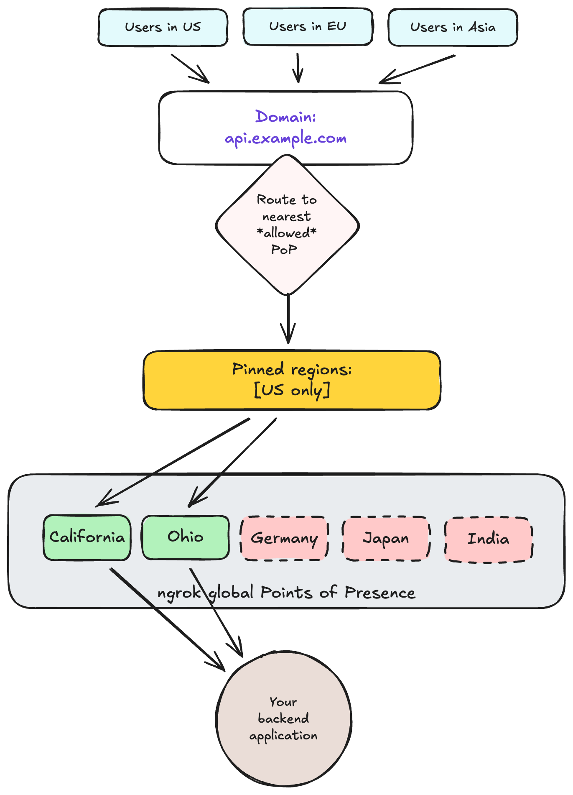

<Warning>
This feature is under active development. 
Behavior, supported fields, and limits may change before General Availability (GA). 
This guide is provided as forward-looking context for evaluation and feedback.

[Visit your dashboard](https://dashboard.ngrok.com/developer-preview) to sign up for Early Access, or to send feedback through the link at the bottom.
</Warning>

Region pinning restricts which ngrok regions may handle traffic for a domain. 

Control traffic into your [domains](/universal-gateway/domains) by choosing a subset of ngrok's globally distributed physical [points of presence](/universal-gateway/points-of-presence) (PoPs). 
ngrok will only route to the set of regions you choose—not outside it.

<Info>
The same configuration will soon support [dedicated IP addresses](#dedicated-ips-preview).
</Info>

This feature is designed for customers with data residency and compliance requirements who need to ensure traffic is only processed in specific geographical boundaries.

## How it works

1. Define which ngrok PoPs your domain is allowed to use. 
2. All requests to [endpoints](/universal-gateway/endpoints) on that domain will only be routed through your chosen points of presence. 



## How to configure region pinning

To start using region pinning, update your domain resource with your preferred set of target regions.
You can do this through the API or the dashboard, both described below. 

### Using the API

When using the API, set up region pinning by defining which PoPs or region aliases should serve your requests. 
Add the `ips` property when creating or modifying a domain.

The sections that follow describe how to create, update, and un-pin a domain in detail.

#### Create a pinned domain

Use the [`POST /reserved_domains` endpoint](/api-reference/reserveddomains/create).

Add a list of `ips` that are allowed to resolve your requests, which can be a set of ngrok physical PoPs (like "Frankfurt" or "California"), [dedicated IPs](#dedicated-ips-preview), or both. 

```json
curl --request POST \
 --url https://api.ngrok.com/reserved_domains \
 --header "Authorization: Bearer <token>" \
 --header "Content-Type: application/json" \
 --header "ngrok-version: 2" \
 --data '{
    "domain": "api.example.com",
    "description": "Pinned to US and Europe for compliance reasons",
    "certificate_management_policy": {
      "authority": "letsencrypt",
      "private_key_type": "ecdsa"
    },
    "ips": [
      { "value": "us-ohio-1"},  
      { "value": "de-fra-1"}
    ]
  }'
```

#### Update an existing domain

You can update existing domains to add or remove region pinning, or modify your set of pinned regions, using the `ips` property.
No DNS changes are required.

Use `PATCH` to [update the list of pinned regions](/api-reference/reserveddomains/update).

```json
curl --request PATCH \
 --url https://api.ngrok.com/reserved_domains/{domain_id} \
 --header "Authorization: Bearer <token>" \
 --header "Content-Type: application/json" \
 --header "ngrok-version: 2" \
 --data '{
    "domain": "api.example.com",
    "description": "Pinned to US and Europe for compliance reasons",
    "certificate_management_policy": {
      "authority": "letsencrypt",
      "private_key_type": "ecdsa"
    },
    "ips": [
      { "value": "us-ohio-1"},  
      { "value": "de-fra-1"}
    ]
  }'
```

#### Un-pin a domain

You can un-pin a domain, which changes it back to the default global routing behavior using the best available PoP. 

To do this, set the `ips` property to an empty list `[]`, or to the region alias `global`.

1. Remove pinned regions by setting an empty list:

```json
# Revert to Global Routing
curl --request PATCH \
 --url https://api.ngrok.com/reserved_domains/{id}  \
 --header "Authorization: Bearer <token>" \
 --header "Content-Type: application/json" \
 --header "ngrok-version: 2" \
 --data '{
   "ips": [] 
 }'  
```

2. Remove pinned regions by setting the `global` alias.

```json
# Only change the last property. The rest is the same as in the previous example.

 --data '{
   "ips": [
     { "value": "global" }
   ]
 }'  
```

#### API error handling

If a request has invalid syntax or a non-existent region code, the API request fails.
The request returns **HTTP 400 Bad Request** with a structured error body, as shown in the example below:

```json
HTTP/1.1 400 Bad Request
Content-Type: application/json; charset=utf-8

{
 "status_code": 400,
 "error_code": "invalid_region_target",
	 "msg": "Invalid region target 'banana': must be a valid Point of Presence or Regional Alias.",
 "details": {}
}
```

### Using the dashboard

You can also make these changes through the [ngrok dashboard](https://dashboard.ngrok.com/domains). 

To configure your pinned regions: 

1. View [your existing domains in the dashboard](https://dashboard.ngrok.com/domains).
2. Click the domain you wish to modify. 
3. Choose your target regions from the dropdown menu. You can select a set of PoPs, choose a region alias that covers multiple PoPs, or do both.

## Dedicated IPs (preview)

<Warning>
As a preview feature, details are subject to change. 
This is related to region pinning, but will be released separately. 
[Visit your dashboard](https://dashboard.ngrok.com/developer-preview) to sign up for Early Access.
</Warning>

Dedicated IPs let you configure a domain's matching endpoints to receive traffic on IP addresses that are dedicated only to your account, rather than using ngrok's default range of multi-tenant IP addresses shared across customers.

When a domain uses dedicated IPs, you can create matching endpoints on any inbound port (not just 80/443).

### How to use dedicated IPs

Dedicated IPs and region pinning share the same `ips` field on the domain:

- Region pinning: `ips: [{ "value": "<region-code>" }]`
- Dedicated IPs: `ips: [{ "value": "<ip-address>" }]`

You can include both, as shown in the example below.

```json
{
  "ips": [
    { "value": "us-ohio-1"" },
    { "value": "203.0.113.10" }
  ]
}

```

## Frequently asked questions

### Does this affect TCP endpoints?

- Region pinning: no. In this preview, region pinning applies to HTTP/HTTPS matching endpoints. TCP uses [reserved addresses](/api-reference/reservedaddrs), which already include a region.
- Dedicated IPs: yes, dedicated IPs are available for any [ngrok-supported protocol](/universal-gateway/protocols), including HTTP/S, TCP, and TLS.

### What happens if the `ips` field isn't added when creating a domain?

If the `ips` field is not added when creating a domain, it defaults back to standard global routing, where traffic is automatically routed through the best option from ngrok's physical PoPs. 
This is the baseline behavior for domains, and is used by the vast majority of customers. 

### Is it necessary to specify every region manually?

No, ngrok provides regional aliases as a shortcut to select multiple PoPs within a geographical area. 
Currently the only supported alias is `global`. 
ngrok may add other aliases such as `european_union` or `united_states`, depending on customer needs.

## Points of presence reference

The `ips` parameter uses the following PoP names:

| **Geographical region** | **Location** | **Code (to use in API)** |
| --- | --- | --- |
| **United States** | Ohio | `us-ohio-1` |
|  | California | `us-cal-1` |
| **Europe** | Frankfurt | `de-fra-1` |
| **Asia/Pacific** | Singapore | `sg-sin-1` |
|  | Sydney | `au-syd-1` |
|  | Mumbai | `in-mum-1` |
|  | Tokyo | `jp-tokyo-1` |
| **South America** | São Paulo | `br-sao-1` |
| **Regional Aliases** | Global | `global` |
| | Europe _[proposed]_ | `european_union` |
| | United States _[proposed]_ | `united_states` |

