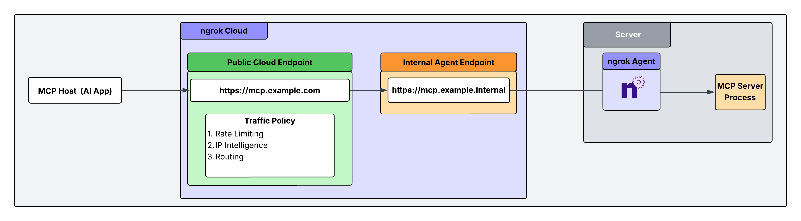

This guide shows you how to use ngrok as your MCP gateway to securely expose your local development environment to AI platforms like OpenAI and Claude.

Wherever your MCP framework is built, ngrok lets you place a secure, policy-driven gateway in front of it without changing your application code.
Using ngrok's identity, Traffic Policy, and observability features, you can ensure every MCP request is authenticated, authorized, and fully auditable before it reaches your server.

## Architectural reference



## What you'll need

- An [ngrok account](https://dashboard.ngrok.com/signup).
- An MCP server process running on a local server, VM, or container.
- The [ngrok agent](https://ngrok.com/downloads/) installed directly on the machine (VM, server, or container) running your local MCP server.

## 1. Install the ngrok Agent and configure internal Agent Endpoints

Configure the agent to declare an internal Agent Endpoint that points to the port running your MCP server process.
This connects the server to your ngrok account, but nothing can connect to it until you complete the subsequent steps.

Internal endpoints are private endpoints that only receive traffic when forwarded through the [forward-internal Traffic Policy action](../traffic-policy/actions/forward-internal/).
This allows you to route traffic to an application through ngrok without making it publicly addressable.
Internal endpoint URL hostnames must end with `.internal`.

After installing the ngrok agent, define an internal endpoint inside the ngrok configuration file for the MCP server you want to make accessible from your AI tools.
You can install ngrok and its configuration file in `/path/to/ngrok/ngrok.yml` and the executable in `/path/to/ngrok/ngrok`.

```yaml
version: 3
agent:
  authtoken: <your_ngrok_authtoken>
endpoints:
  - name: Internal Endpoint for MCP Server
    url: https://mcp.example.internal
    upstream:
      url: <MCP port/addr here>
```

## 2. Create a public Cloud Endpoint

[Cloud Endpoints](../universal-gateway/cloud-endpoints/) are persistent, always-on endpoints whose creation, deletion and configuration is managed centrally via the Dashboard or API.
They exist permanently until they are explicitly deleted.
Cloud Endpoints do not forward their traffic to an agent by default and instead only use their attached Traffic Policy to handle connections.

Create a Cloud Endpoint for the MCP server you need to route traffic to.
In your ngrok dashboard, go to **Endpoints** and click **New**.

This Cloud Endpoint forwards traffic to the MCP server via the internal endpoint you created in step 1.

## 3. Attach Traffic Policy to your Cloud Endpoint

Navigate to the `https://mcp.example.com` Cloud Endpoint and replace the default Traffic Policy with:

```yaml
on_http_request:
  - actions:
      - type: forward-internal
        config:
          url: https://mcp.example.internal
```

Use ngrok's Traffic Policy to handle routing rules (forward-internal action above), rate limiting, and authentication via IP Intel.
A full list of available Traffic Policy actions can be seen [here](../traffic-policy/actions/).
These actions can be used singularly or layered on top of each other (executed sequentially from top to bottom).

The following Traffic Policy example restricts incoming traffic to Claude's MCP host, requires an API key, and rate limits based on that API key:

```yaml
on_http_request:
  # Allow only Anthropic IPs
  - expressions:
      - "!('com.anthropic.api' in conn.client_ip.categories)"
    actions:
      - type: deny
        config:
          status_code: 403

  # Require Auth Header
  - expressions:
      - "!hasReqHeader('Authorization')"
    actions:
      - type: deny
        config:
          status_code: 401
          body: "Authorization required"

  # Rate limit per API Key
  - actions:
      - type: rate-limit
        config:
          name: 100 requests per minute per token
          algorithm: sliding_window
          capacity: 100
          rate: 60s
          bucket_key:
            - "getReqHeader('Authorization')[0]"

      - type: forward-internal
        config:
          url: https://mcp.example.internal
```

## 4. Test your MCP gateway

In your Claude configuration file where you've defined your MCP server, replace the `url` field with your ngrok Cloud Endpoint and add an authorization header with your bearer token.
Ensure your ngrok agent and the internal Agent Endpoint are active.
Any prompt you send from Claude's MCP host is routed through your ngrok MCP gateway endpoint.

Run these tests to verify it's functioning correctly:

Remove the authtoken from the Claude desktop config.
The request should be blocked and return a 401 status code with a message saying `Authorization required`.

Curl the URL or POST to it directly.
The request should be blocked and return a 403 status code since it didn't originate from an Anthropic source IP.

Send a prompt through Claude and ensure the Auth key is present in the Claude config.
The request should return the expected response.

You've now successfully set up ngrok as your MCP gateway to audit, transform, and authenticate all incoming traffic to your MCP server.

## What's next?

- To learn more, see the [Traffic Policy](../traffic-policy/) documentation.
- Optimize your setup by placing ngrok's [AI Gateway](../ai-gateway/overview/) in front of your inference providers for dynamic routing and failover.
